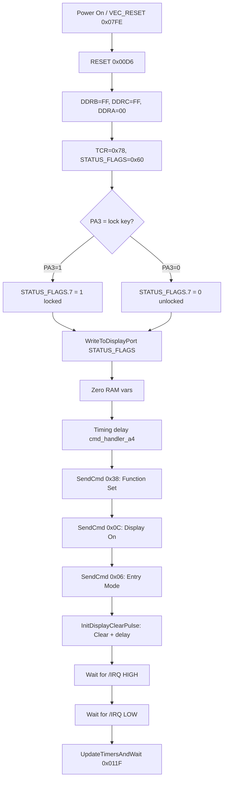
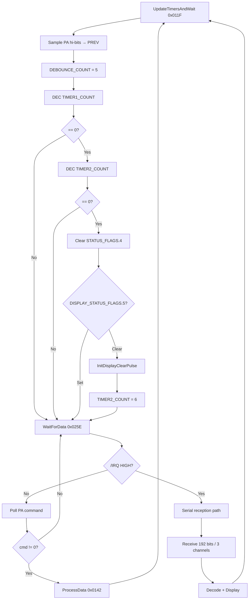
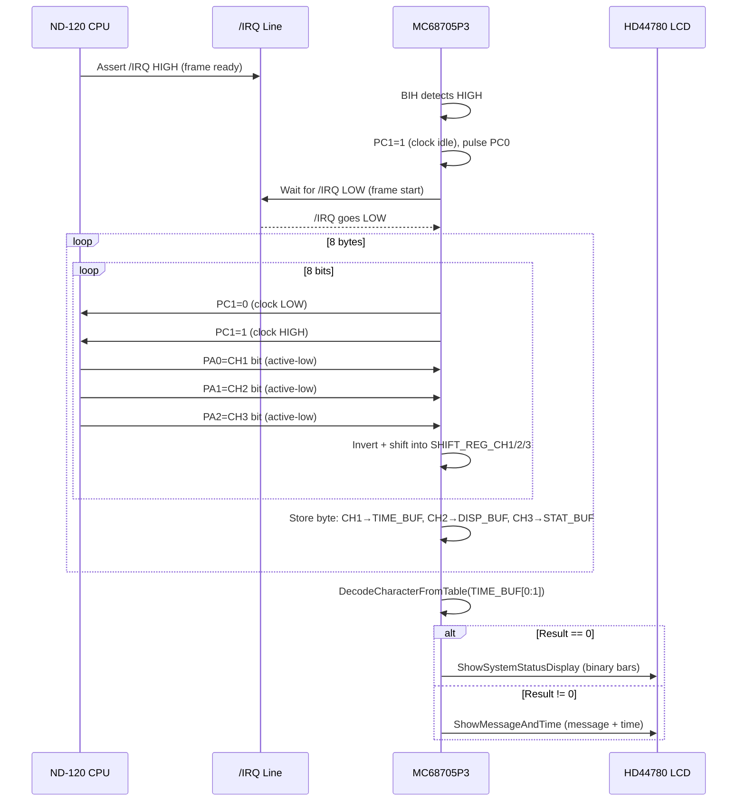
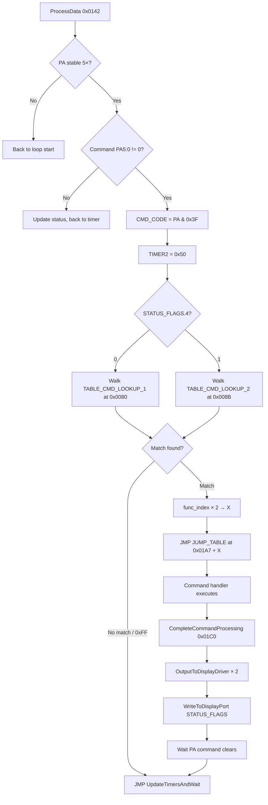
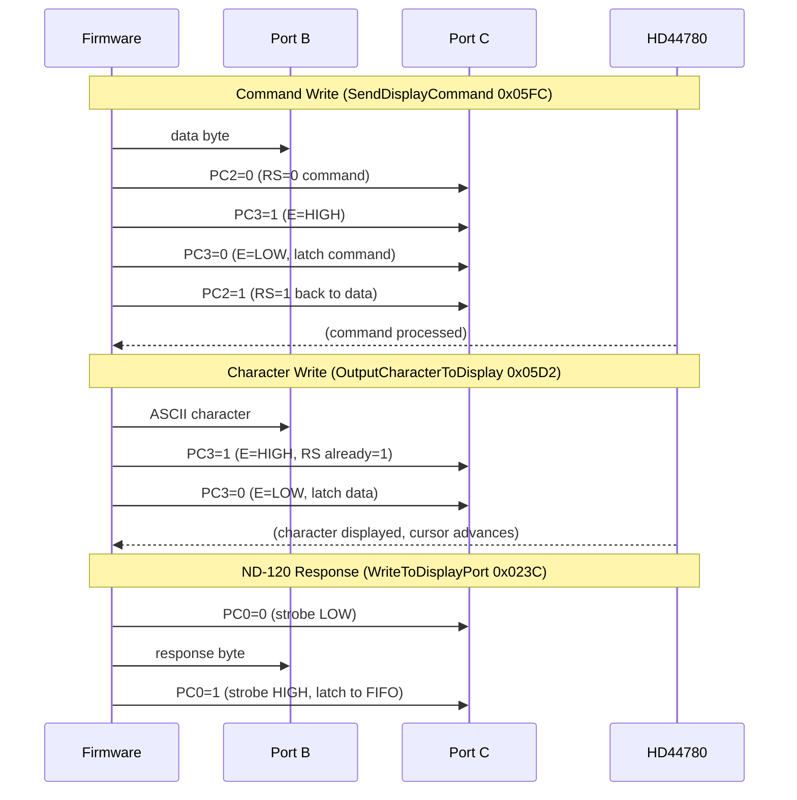

# MC68705P3 ND-5000 External Panel Controller — Complete Firmware Analysis

**File:** `E:\Dev\Repos\Ronny\nd-120\Code\68705\P3\ND-5000C-MC68705P3.BIN`  
**Chip:** Motorola MC68705P3 (28-pin DIP, 2KB ROM)  
**Language:** 6805:BE:16:default  
**Role:** ND-5000C external operator panel controller — HD44780 LCD display, physical buttons, bidirectional CY7C401 FIFO interface to ND-120 main CPU  
**Analysis date:** April 2026  

---

## Table of Contents

1. [Hardware Overview](#1-hardware-overview)
2. [Memory Map](#2-memory-map)
3. [Port Assignment](#3-port-assignment)
4. [RAM Variable Map](#4-ram-variable-map)
5. [Boot Sequence (RESET 0x00D6)](#5-boot-sequence)
6. [Main Loop (UpdateTimersAndWait 0x011F)](#6-main-loop)
7. [Command Processing (ProcessData 0x0142)](#7-command-processing)
8. [Serial Data Reception (WaitForData 0x025E)](#8-serial-data-reception)
9. [LCD Display System](#9-lcd-display-system)
10. [Character Decoding](#10-character-decoding)
11. [Display Modes](#11-display-modes)
12. [ROM Data Tables](#12-rom-data-tables)
13. [Interrupt Vectors](#13-interrupt-vectors)
14. [Function Reference](#14-function-reference)
15. [Mermaid Diagrams](#15-mermaid-diagrams)
16. [Key Differences from U3 Chip](#16-key-differences-from-u3-chip)
17. [Corrections to Existing Analysis Files](#17-corrections-to-existing-analysis-files)

---

## 1. Hardware Overview

The MC68705P3 is the controller for the **ND-5000C external operator panel** — a separate physical unit from the main ND-120 chassis. It differs fundamentally from the U3 chip (which drives the built-in front panel):

| Feature | MC68705P3 (external panel) | MC68705U3 (built-in panel) |
|---------|---------------------------|---------------------------|
| Package | 28-pin DIP | 40-pin DIP |
| ROM | 2KB (0x0000-0x07FF) | 4KB (0x0000-0x0FFF) |
| RAM | 64 bytes (0x0010-0x004F) | 128 bytes |
| Display | HD44780 LCD (2×40 chars) | 7-segment shift register chain |
| Input | Physical buttons via Port A | None (display-only U3 side) |
| Protocol | 192-bit serial + command poll | FIFO command only |
| Crystal | 2 MHz | ~8 MHz |

### System Connection

```
ND-120 CPU
    │
    ├──► PANC register ──► CY7C401 FIFO ──► PA[5:0] (commands)
    │                                         PA7 = /IRQ (serial frame ready)
    │
    ├──► Serial transmitter ──► PA0 (CH1: time data)
    │                       ──► PA1 (CH2: display data)
    │                       ──► PA2 (CH3: status data)
    │                       PC1 (clock, generated by P3)
    │
    └──◄ PB[6:0] ◄── response byte (with STATUS_FLAGS ORed in)
                  PC0 = output strobe to ND-120 FIFO
```

### Physical Panel Hardware

- **HD44780 LCD**: 2-line × 40-character alphanumeric display
  - PB[7:0] → LCD data bus (D7-D0)
  - PC2 → RS (Register Select: 0=command, 1=data)
  - PC3 → E (Enable strobe)
- **Panel lock key**: PA3 — locks panel from software modification
- **Buttons**: PA[5:0] combined with command lines (multiplexed)
- **CY7C401 FIFO**: 512×9-bit — buffers commands from ND-120

---

## 2. Memory Map

### Registers (hardware, 0x0000-0x000B)

| Address | Name | Init Value | Description |
|---------|------|-----------|-------------|
| 0x0000 | PORT_A | — | **Input**: PA[5:0]=command, PA3=lock, PA6=button, PA7=/IRQ |
| 0x0001 | PORT_B | — | **Output**: LCD data / ND-120 response byte |
| 0x0002 | PORT_C | — | **Output**: PC0=ND120_STROBE, PC1=SERIAL_CLK, PC2=LCD_RS, PC3=LCD_E |
| 0x0004 | DDRA | 0x00 | Direction A: all inputs |
| 0x0005 | DDRB | 0xFF | Direction B: all outputs |
| 0x0006 | DDRC | 0xFF | Direction C: all outputs |
| 0x0009 | TCR | 0x78 | Timer Control: prescaler /128, internal clock |

### RAM (0x0010-0x004F, initialized to 0xFF at power-on)

See [Section 4](#4-ram-variable-map) for full variable map.

### ROM (0x0050-0x07F7)

| Range | Contents |
|-------|---------|
| 0x0050-0x007F | (unused / padding) |
| 0x0080-0x008A | TABLE_CMD_LOOKUP_1 (5 entries + 0xFF) |
| 0x008B-0x0096 | TABLE_CMD_LOOKUP_2 (6 entries + 0xFF) |
| 0x0098-0x00D5 | ROM_DISPLAY_STRINGS (quote-terminated LCD strings) |
| 0x00D6-0x011E | RESET / Boot entry point |
| 0x011F-0x0141 | UpdateTimersAndWait (main loop head) |
| 0x0142-0x025D | ProcessData + command handlers |
| 0x025E-0x03CE | WaitForData + serial reception + decode entry |
| 0x03CF-0x03F3 | DisplayTimeData |
| 0x03F4-0x041C | ShowMessageAndTime |
| 0x041D-0x057B | ShowSystemStatusDisplay |
| 0x057C-0x0596 | DisplayBinaryBars |
| 0x0597-0x05C7 | DisplayBinaryDigits |
| 0x05C8-0x05D1 | DisplayDecimalPoint |
| 0x05D2-0x05FB | OutputCharacterToDisplay |
| 0x05FC-0x060B | SendDisplayCommand |
| 0x060C-0x0617 | DisplayStringUntilQuote |
| 0x0618-0x0622 | InitDisplayClearPulse |
| 0x0623-0x0640 | LookupCharacterCode |
| 0x0641-0x068F | DecodeCharacterFromTable |
| 0x0690-0x06AF | CalculateDisplayPosition |
| 0x06B0-0x06BB | SetDisplayAddressAndWrite |
| 0x06BC-0x06FC | TABLE_CHAR_DECODE (level-1) |
| 0x06FD-0x0758 | TABLE_CHAR_SUBKEYS (level-2) |
| 0x0759-0x077F | TABLE_7SEG_TO_ASCII |
| 0x0780-0x07F7 | (unused, 0xFF) |
| 0x07F8-0x07FF | Interrupt vectors |

---

## 3. Port Assignment

### Port A — ALL INPUTS (DDRA = 0x00)

| Bit | Signal | Direction | Description |
|-----|--------|-----------|-------------|
| PA0 | CH1_DATA | Input | Serial channel 1: time data (active-low, MSB first) |
| PA1 | CH2_DATA | Input | Serial channel 2: display data (active-low) |
| PA2 | CH3_DATA | Input | Serial channel 3: status data (active-low) |
| PA3 | /LOCK_KEY | Input | Panel lock key (1=locked). Read at boot and each command. |
| PA4 | (unused) | Input | — |
| PA5 | CMD[5] | Input | Command code bit 5 (MSB of 6-bit command) |
| PA6 | BTN_CHANGE | Input | Button state change flag |
| PA7 | /IRQ | Input | Serial frame available (used by BIH/BIL, NOT as hardware interrupt) |

**Note:** PA[5:0] together form the 6-bit command code sent from the ND-120 via PANC register and CY7C401 FIFO. The firmware polls PA rather than using the hardware interrupt mechanism.

### Port B — ALL OUTPUTS (DDRB = 0xFF)

| Bits | Signal | Description |
|------|--------|-------------|
| PB[7:0] | LCD_D[7:0] | LCD data bus — shared for LCD data writes AND ND-120 response bytes |
| PB[6:0] | ND120_RESP | ND-120 response (bits[6:0] with STATUS_FLAGS ORed in, bit7 masked off) |

Port B is dual-use: the same 8 lines drive both the HD44780 LCD data bus and carry response data back to the ND-120. The PC signal strobes determine which function is active.

### Port C — ALL OUTPUTS (DDRC = 0xFF)

| Bit | Signal | Direction | Description |
|-----|--------|-----------|-------------|
| PC0 | ND120_STROBE | Output | Rising edge latches PB data into CY7C401 FIFO for ND-120 |
| PC1 | SERIAL_CLK | Output | Serial bit clock — toggled to clock each data bit from PA0/PA1/PA2 |
| PC2 | LCD_RS | Output | HD44780 RS: 0=command register, 1=data register |
| PC3 | LCD_E | Output | HD44780 Enable strobe (data valid on falling edge) |
| PC4-PC7 | (unused) | Output | Not connected / undefined |

**Important:** PC0 is for ND-120 output; PC1 is for serial input clock; PC2/PC3 are LCD control. These are mutually exclusive in timing.

---

## 4. RAM Variable Map

All RAM at 0x0010-0x004F. Initialized to 0xFF at power-on; zeroed selectively during RESET.

| Address | Name | Size | Initial | Description |
|---------|------|------|---------|-------------|
| 0x0010 | TIMER1_COUNT | 1 | 0xFF | Primary countdown timer — decremented each main loop |
| 0x0011 | TIMER2_COUNT | 1 | 0x06 | Secondary timer — display refresh control; reload=0x50 on command |
| 0x0012 | PORT_A_SNAPSHOT | 1 | 0x00 | Last sampled PA value for debounce comparison |
| 0x0013 | DEBOUNCE_COUNT | 1 | 0x05 | Counts down from 5; stable reading required to confirm input |
| 0x0014 | STATUS_FLAGS | 1 | 0x60 | System status (see bit map below) |
| 0x0015 | PA_PREV_HIGH_BITS | 1 | 0x00 | Previous PA[7:6] for edge detection via EOR |
| 0x0016 | CMD_CODE | 1 | — | Current 6-bit command code (PA[5:0] & 0x3F) |
| 0x0017 | PA_CHANGE_FLAGS | 1 | — | EOR result: bit6=state-change detected |
| 0x0018 | PREV_DISPLAY_STATUS | 1 | 0x00 | Previous display mode — compared to detect mode changes |
| 0x0019 | DISPLAY_STATUS_FLAGS | 1 | 0x00 | Current display state flags (see bit map below) |
| 0x001A | SERIAL_BIT_COUNT | 1 | 0x00 | Bit counter during serial reception (0-7) |
| 0x001B | SERIAL_TEMP_CH1 | 1 | — | Shift register CH1 / char decode low byte |
| 0x001C | SERIAL_TEMP_CH2 | 1 | — | Shift register CH2 / char decode high byte |
| 0x001D | CHAR_DECODE_RESULT | 1 | — | Result from DecodeCharacterFromTable |
| 0x001E | LOOP_COUNTER | 1 | — | General loop/timeout counter |
| 0x001F | X_SAVE | 1 | — | Saved X register across JSR calls |
| 0x0020 | PA_SAMPLE | 1 | — | Raw PA sample during serial reception |
| 0x0021 | SHIFT_REG_CH1 | 1 | — | MSB-first accumulator for time channel |
| 0x0022 | SHIFT_REG_CH2 | 1 | — | MSB-first accumulator for display channel |
| 0x0023 | SHIFT_REG_CH3 | 1 | — | MSB-first accumulator for status channel |
| 0x0024 | DECIMAL_PT_COUNT | 1 | 0x00 | Count of chars since last decimal point (0-3) |
| 0x0025-0x0028 | MSG_BUFFER[4] | 4 | — | 4-char decoded message buffer (current) |
| 0x0029-0x002C | MSG_BUFFER_PREV[4] | 4 | — | Previous message buffer (change detection) |
| 0x002D-0x0034 | TIME_DATA_BUF[8] | 8 | — | Serial CH1 bytes: 7-seg encoded time digits |
| 0x0035-0x003C | DISP_DATA_BUF[8] | 8 | — | Serial CH2 bytes: display mode + label chars |
| 0x003D-0x0044 | STAT_DATA_BUF[8] | 8 | — | Serial CH3 bytes: CPU/system status bits |
| 0x0045 | DISPLAY_LINE2_OFFSET | 1 | 0x00 | Line 2 display start position offset |
| 0x0046 | LCD_CURSOR_POS | 1 | — | Current HD44780 DDRAM address |
| 0x0047 | SCROLL_COUNTER | 1 | 0x00 | Message scroll position (reset on mode change) |
| 0x0048 | LCD_COLUMN_COUNT | 1 | — | Character counter (0x28=line1 end, 0x68=line2 end) |
| 0x0049 | CHAR_TEMP | 1 | — | Char temp in OutputCharacterToDisplay |
| 0x004A-0x004B | (unused) | 2 | — | |
| 0x004C | SERIAL_TIMEOUT | 1 | 0x30 | Countdown for serial frame timeout |

### STATUS_FLAGS (0x0014) Bit Map

| Bit | Meaning | Set/Clear |
|-----|---------|-----------|
| 7 | LOCK_KEY_STATE | 1=panel locked (PA3=1); 0=unlocked |
| 6 | DISPLAY_MODE_FLAG | Set/cleared by cmd_handler_6c |
| 5 | ON_FLAG | Tracks ON/OFF display state |
| 4 | REFRESH_INHIBIT | Cleared on timer expiry, inhibits LCD clear |
| 3-1 | (unused) | |
| 0 | (unused in flags) | |

**Initial value 0x60 = bits 6+5 set.**

### DISPLAY_STATUS_FLAGS (0x0019) Bit Map

| Bit | Meaning |
|-----|---------|
| 5 | MESSAGE_STABLE — current message matches previous (no redraw needed) |
| 4 | TIME_SHOWN — time section has been displayed this frame |
| 2 | BINARY_MODE — using binary digit display (not 7-seg decode) |
| 1 | LAYOUT_SET — display layout has been initialized |

---

## 5. Boot Sequence

**Entry:** 0x00D6 (RESET), called from VEC_RESET at 0x07FE.

```
RESET (0x00D6)
├── Configure ports
│   ├── DDRB = 0xFF  (Port B all outputs)
│   ├── DDRC = 0xFF  (Port C all outputs)
│   └── DDRA = 0x00  (Port A all inputs)
├── TCR = 0x78       (timer: prescaler /128, internal clock)
├── STATUS_FLAGS = 0x60
├── Read PA3 (panel lock key)
│   ├── PA3=0 → clear STATUS_FLAGS bit7 (unlocked)
│   └── PA3=1 → set STATUS_FLAGS bit7 (locked)
├── WriteToDisplayPort(STATUS_FLAGS) → output status to ND-120
├── Zero: DISPLAY_LINE2_OFFSET, PREV_DISPLAY_STATUS, PORT_A_SNAPSHOT, button_state
├── cmd_handler_a4() → timing calibration delay
├── SendDisplayCommand(0x38) → LCD: Function Set (8-bit, 2-line, 5×7)
├── SendDisplayCommand(0x0C) → LCD: Display On, cursor off
├── SendDisplayCommand(0x06) → LCD: Entry Mode (increment, no shift)
├── InitDisplayClearPulse() → LCD Clear + 180-cycle delay
├── Wait for IRQ HIGH (BIH loop)
├── Wait for IRQ LOW  (BIL loop)   ← synchronize with ND-120 20ms cycle
└── Fall through to UpdateTimersAndWait (0x011F)
```

**Key boot facts:**
- PC1 is set HIGH during boot (serial clock idle state)
- All four interrupt vectors point to RESET — any interrupt or timer expiry re-initializes the chip
- The IRQ sync step waits for one complete rising+falling edge on the /IRQ pin before entering the main loop, ensuring frame alignment with the ND-120

---

## 6. Main Loop

**Entry:** 0x011F (UpdateTimersAndWait), tail-jumps to WaitForData (0x025E).

```
UpdateTimersAndWait (0x011F):
    PA_PREV_HIGH_BITS = PORT_A_SNAPSHOT & 0xC0
    PORT_A_SNAPSHOT = PA_PREV_HIGH_BITS
    DEBOUNCE_COUNT = 5
    DEC TIMER1_COUNT
    if TIMER1_COUNT != 0: goto WaitForData
    DEC TIMER2_COUNT
    if TIMER2_COUNT != 0: goto WaitForData
    BCLR STATUS_FLAGS.4    ← clear refresh inhibit
    if DISPLAY_STATUS_FLAGS.5 == 0:
        InitDisplayClearPulse()
        TIMER2_COUNT = 6
    goto WaitForData (0x025E)
```

The two-stage timer creates a hierarchical timebase. TIMER1 is decremented on every loop iteration (which occurs approximately every 20ms in sync with the ND-120). When TIMER1 reaches zero it decrements TIMER2. When TIMER2 also reaches zero the display is refreshed. The reload value of TIMER2 is normally 6, but extended to 0x50 when a command is being processed.

---

## 7. Command Processing

**Entry:** 0x0142 (ProcessData), reached via JMP from WaitForData.

### Debounce Logic

The firmware requires the Port A value to remain **stable for 5 consecutive reads** before accepting it as a valid command or button state:

```
ProcessData (0x0142):
    Update STATUS_FLAGS.7 from PA_SAMPLE.3 (lock key)
    PC1 = 0 (serial clock idle)
    Read PA
    if PA != PORT_A_SNAPSHOT: goto UpdateTimersAndWait.start (re-sample)
    DEC DEBOUNCE_COUNT
    if DEBOUNCE_COUNT != 0: goto timer decrement
    // stable reading confirmed
    ...
```

### Command Dispatch

Two lookup tables are used, selected by STATUS_FLAGS bit4:

```
TABLE_CMD_LOOKUP_1 (0x0080) — default mode:
    [0x01, 1]  → cmd_conditional_update
    [0x02, 0]  → cmd_display_update
    [0x10, 5]  → cmd_handler_5e
    [0x20, 6]  → cmd_handler_6c
    [0x05, 7]  → direct path
    [0xFF]     → end

TABLE_CMD_LOOKUP_2 (0x008B) — alternate mode (STATUS_FLAGS.4=1):
    [0x01, 1]  → cmd_conditional_update
    [0x02, 2]  → cmd_multi_stage_update
    [0x04, 3]  → cmd_handler_56
    [0x08, 4]  → cmd_handler_5a
    [0x10, 5]  → cmd_handler_5e
    [0x20, 6]  → cmd_handler_6c
    [0xFF]     → end
```

**Dispatch:** `func_index × 2` → offset into JUMP_TABLE_CMD_DISPATCH (0x01A7):

| func_index | Handler | Address | Description |
|-----------|---------|---------|-------------|
| 0 | cmd_display_update | 0x01DB | Check PA7 → conditional display + ND-120 response |
| 1 | cmd_conditional_update | 0x01D1 | Conditional update based on STATUS_FLAGS.4 |
| 2 | cmd_multi_stage_update | 0x01ED | Two-phase output + timing delay |
| 3 | cmd_handler_56 | 0x01FD | LDA #4 → CompleteCommandProcessing |
| 4 | cmd_handler_5a | 0x0201 | LDA #8 → CompleteCommandProcessing |
| 5 | cmd_handler_5e | 0x0205 | Toggle STATUS_FLAGS.5 if STATUS_FLAGS.6+PA_PREV bit6 set |
| 6 | cmd_handler_6c | 0x0213 | Wait for cmd 0x21 → toggle STATUS_FLAGS.4/6 |
| 7 | direct path | 0x01D7 | LDA #1 → CompleteCommandProcessing |

### CompleteCommandProcessing (0x01C0)

Sends two ND-120 response strobes (OutputToDisplayDriver twice), reads STATUS_FLAGS, calls WriteToDisplayPort, then waits for PA command to clear (WaitForCmdClear at 0x01B7).

---

## 8. Serial Data Reception

**Entry:** 0x025E (WaitForData). The 192-bit serial protocol is the primary data path from the ND-120 to the panel.

### Protocol Overview

The ND-120 sends a **192-bit serial frame** consisting of 8 bytes × 3 parallel channels:
- **Channel 1 (PA0):** Time data — 8 bytes of 7-segment encoded time digits
- **Channel 2 (PA1):** Display data — 8 bytes of display mode + label characters
- **Channel 3 (PA2):** Status data — 8 bytes of CPU/system status bits

All three channels are clocked **simultaneously** by PC1 (generated by the P3 chip), with data arriving **MSB first** and **active-low** on the PA inputs.

### Trigger Mechanism

The P3 polls the /IRQ pin using BIH/BIL instructions (NOT as a hardware interrupt):
- **BIH (Branch if IRQ High):** Branches when /IRQ line = 1 (frame available)
- **BIL (Branch if IRQ Low):** Branches when /IRQ line = 0 (frame start confirmed)

This is different from the U3 chip which uses /EMP (PD7) for FIFO-ready detection.

### Reception Loop (0x0295-0x02DC)

```
WaitForData — Serial Path (0x0272):
    SERIAL_BIT_COUNT = 0
    PC1 = 1  (clock idle HIGH)
    pulse PC0 (ND-120 output strobe)
    LOOP_COUNTER = SERIAL_TIMEOUT (0x30)

    while /IRQ still HIGH:   ← wait for frame start
        delay...
        if timeout → reset SERIAL_TIMEOUT=1 → goto ProcessData

    // /IRQ went LOW: frame starting
    LDX #8  (8 bytes to receive)

    byte_loop:
        Read PA → PA_SAMPLE
        PC1 = 0  (clock LOW)
        PC1 = 1  (clock HIGH) ← data valid on rising edge

        Shift SHIFT_REG_CH1 right by 1
        Shift SHIFT_REG_CH2 right by 1
        Shift SHIFT_REG_CH3 right by 1

        // active-low inversion:
        if PA_SAMPLE.0 == 1: BCLR SHIFT_REG_CH1.7  (PA0=1 → bit=0)
        if PA_SAMPLE.0 == 0: BSET SHIFT_REG_CH1.7  (PA0=0 → bit=1)
        (same for CH2/CH3 from PA1/PA2)

        INC SERIAL_BIT_COUNT
        if SERIAL_BIT_COUNT != 8: goto byte_loop

        // 8 bits complete: store byte
        SERIAL_BIT_COUNT = 0
        DECX  (X goes 8→7→6→5→4→3→2→1→0)
        TIME_DATA_BUF[X] = SHIFT_REG_CH1  → 0x2D+X
        DISP_DATA_BUF[X] = SHIFT_REG_CH2  → 0x35+X
        STAT_DATA_BUF[X] = SHIFT_REG_CH3  → 0x3D+X
        if X != 0: goto byte_loop (receive next byte)

    // All 8 bytes received → decode and display
    ...
```

**Buffer fill order:** Bytes stored from high index down to 0 (most recent byte first).

| Buffer | Addresses | Content |
|--------|-----------|---------|
| TIME_DATA_BUF | 0x002D-0x0034 | Channel 1: 7-seg time digits (8 bytes) |
| DISP_DATA_BUF | 0x0035-0x003C | Channel 2: display mode + label (8 bytes) |
| STAT_DATA_BUF | 0x003D-0x0044 | Channel 3: CPU/system status flags (8 bytes) |

### Post-Reception Decode

After receiving all 8 bytes:

```
if DISPLAY_STATUS_FLAGS(0x0019) != PREV_DISPLAY_STATUS(0x0018):
    PREV_DISPLAY_STATUS = DISPLAY_STATUS_FLAGS
    InitDisplayClearPulse()      ← clear LCD on mode change
    SCROLL_COUNTER = 0           ← reset scroll position

DISPLAY_STATUS_FLAGS = 0

// Decode time_data[0:1] as display mode indicator
SERIAL_TEMP_CH1 = TIME_DATA_BUF[0]  (0x002D)
SERIAL_TEMP_CH2 = TIME_DATA_BUF[1]  (0x002E)
DecodeCharacterFromTable()
CHAR_DECODE_RESULT = A

if CHAR_DECODE_RESULT == 0: goto ShowSystemStatusDisplay (0x041D)
else: goto ShowMessageAndTime (0x03F4)   ← via message decode path
```

---

## 9. LCD Display System

The panel uses an **HD44780-compatible LCD controller** in 8-bit bus mode.

### Initialization Sequence (from RESET)

| Command | Value | Meaning |
|---------|-------|---------|
| Function Set | 0x38 | 8-bit bus, 2-line display, 5×7 font |
| Display On | 0x0C | Display on, cursor hidden, no blink |
| Entry Mode | 0x06 | Cursor increment, display no shift |
| Clear Display | 0x01 | Clear + return home (via InitDisplayClearPulse) |

### SendDisplayCommand (0x05FC) — RS=0 path

```
Port B ← command byte
PC2 = 0  (RS=0: command register)
PC3 = 1  (E=1: enable)
PC3 = 0  (E=0: latch command on falling edge)
PC2 = 1  (RS=1: return to data mode for subsequent character writes)
delay (5 DECA loops)
```

### OutputCharacterToDisplay (0x05D2) — RS=1 path (data mode)

```
CHAR_TEMP = character
if LCD_COLUMN_COUNT == 0x28 (40): SetDisplayAddress(0x00)  ← line 1 start
if LCD_COLUMN_COUNT == 0x68 (104): SetDisplayAddress(0x40) ← line 2 start
Port B ← CHAR_TEMP
PC3 = 1  (E=1)
PC3 = 0  (E=0: latch data)
INC LCD_COLUMN_COUNT
delay (5 DECA loops)
return 0x5F in A
```

Note: RS=1 (data mode) remains set from the previous SendDisplayCommand call, so characters are written directly without toggling RS.

### SetDisplayAddressAndWrite (0x06B0)

Sends HD44780 "Set DDRAM Address" command: `0x80 | address`. This positions the cursor before writing characters. Called automatically when LCD_COLUMN_COUNT wraps at 40 or 104.

### CalculateDisplayPosition (0x0690)

Computes the HD44780 DDRAM address from a logical position, adding the scroll offset (SCROLL_COUNTER) and wrapping to the 2-line layout:

```
Line 1: DDRAM 0x00-0x27 (positions 0-39)
Line 2: DDRAM 0x40-0x67 (positions 40-79)
```

### ND-120 Response Path — WriteToDisplayPort (0x023C)

When responding to ND-120 commands (NOT writing to LCD):
```
PC0 = 0  (strobe LOW)
Port B ← response byte
PC0 = 1  (strobe HIGH → rising edge latches data into CY7C401)
```
OutputToDisplayDriver (0x0238) first ORs the byte with STATUS_FLAGS and masks to 7 bits before calling WriteToDisplayPort.

---

## 10. Character Decoding

The firmware uses two separate character lookup mechanisms:

### 7-Segment to ASCII: LookupCharacterCode (0x0623)

The ND-120 sends time data as **7-segment display patterns** (the same encoding used by the U3 built-in panel). The P3 reverses this to ASCII for the HD44780 LCD.

**TABLE_7SEG_TO_ASCII (0x0759)** — format: [seg_pattern, ascii_char] pairs, 0xFF terminated:

| 7-seg Pattern | ASCII | Digit |
|--------------|-------|-------|
| 0x00 | ' ' | blank |
| 0x77 | '0' | 0 |
| 0x11 | '1' | 1 |
| 0x6B | '2' | 2 |
| 0x3B | '3' | 3 |
| 0x1D | '4' | 4 |
| 0x3E | '5' | 5 |
| 0x7E | '6' | 6 |
| 0x13 | '7' | 7 |
| 0x7F | '8' | 8 |
| 0x3F | '9' | 9 |
| 0x4F | ' ' | blank variant |
| 0x66 | ' ' | blank variant |

If a pattern is not found, returns ' ' (0x20). This is the same 7-segment encoding as the U3 chip's TABLE_7SEG_PATTERNS, confirming the two chips use a compatible encoding system.

### Display Mode Decode: DecodeCharacterFromTable (0x0641)

The display channel bytes encode both the **display mode** (what type of information to show) and associated character data using a two-level lookup:

**Level 1 — TABLE_CHAR_DECODE (0x06BC):**
- Format: [key, value] pairs, terminated by 0xFE
- key matched against SERIAL_TEMP_CH2 (high byte of char pair)
- If value has bit7 set → strip bit7, return directly as character
- If value bit7=0 → use value as offset into level-2 table

**Level 2 — TABLE_CHAR_SUBKEYS (0x06FD):**
- Format: subgroups of [key, result] pairs, 0xFF separates subgroups
- key matched against SERIAL_TEMP_CH1 (low byte of char pair)
- result = final decoded character

**Return value meanings:**
- 0x00 → ShowSystemStatusDisplay (binary status bars mode)
- Non-zero → ShowMessageAndTime (message + time display mode)

---

## 11. Display Modes

### Mode Selection

After each 192-bit serial packet, the first byte pair from TIME_DATA_BUF is decoded:

```
if DecodeCharacterFromTable(TIME_DATA_BUF[0:1]) == 0:
    → ShowSystemStatusDisplay (binary bar graph mode)
else:
    → decode 4-char message from DISP_DATA_BUF → ShowMessageAndTime
```

### Mode A: ShowMessageAndTime (0x03F4)

Displays a scrolling 4-character message on line 1, followed by time data on line 2.

```
Line 1: [MSG_BUFFER[0..3]]    ← 4 decoded ASCII chars, scrolling
         + status label string (from ROM_DISPLAY_STRINGS)
         + [DISP_DATA_BUF decoded chars]
Line 2: [TIME_DATA_BUF decoded time digits]
         + ':' separators
         + colon or space based on DISP_DATA_BUF[7].7
```

**Scroll logic:** SCROLL_COUNTER increments each frame. When a message character matches the previous frame, it is not redrawn. At SCROLL_COUNTER=0x28, counter resets to 0.

**Label selection (from ROM_DISPLAY_STRINGS):**
- MSG_BUFFER[0] != ' ': display "ADDRESS:" label (0x00B5)
- MSG_BUFFER[0] == ' ': display "P COUNT:" label (0x00BE)

**Time format:**  
Depending on DISP_DATA_BUF[0].7 (UTC flag):
- Bit7=1: "  TIME:" prefix, then HH:MM:SS
- Bit7=0: "   UTC:" prefix, then HH:MM:SS

### Mode B: ShowSystemStatusDisplay (0x041D)

Displays binary status bar graph when the decoded display character is 0:

```
Line 1: [8 bar pairs from STAT_DATA_BUF]  ← '|' (0xDB) or '.' (0x2E) per bit
         + decimal status values (bit patterns 0-3)
         + YEAR:/  MONTH: label based on DISP_DATA_BUF.7
Line 2: [TIME_DATA_BUF decoded time]
```

Each status byte pair is displayed as a combination of bar characters:
- Bit set: '|' (0xDB — full block character on HD44780)
- Bit clear: '.' or '_' (0x5F)
- Decimal values for 4 pairs of status bytes
- Then "YEAR:" or "  MONTH:" label depending on display flag

### DisplayTimeData (0x03CF)

Used by both display modes to render the time digits. Iterates 8 bytes from the specified buffer, converting each via LookupCharacterCode. If lookup returns 0xFF (no 7-seg match), falls back to DisplayBinaryDigits.

---

## 12. ROM Data Tables

### TABLE_CMD_LOOKUP_1 (0x0080) — 11 bytes

Command dispatch table for normal operation mode. See [Section 7](#7-command-processing).

### TABLE_CMD_LOOKUP_2 (0x008B) — 13 bytes

Command dispatch table for alternate mode. See [Section 7](#7-command-processing).

### ROM_DISPLAY_STRINGS (0x0098-0x00D5) — 62 bytes

Quote-terminated strings for LCD label output:

| Address | String | Purpose |
|---------|--------|---------|
| 0x0098 | `ON "` | ON status label |
| 0x009C | `OFF"` | OFF status label |
| 0x00A0 | `DAY:"` | Day label |
| 0x00A5 | `  TIME:"` | Time label |
| 0x00AD | `   UTC:"` | UTC label |
| 0x00B5 | `ADDRESS:"` | Address display label |
| 0x00BE | `P COUNT:"` | Performance counter label |
| 0x00C7 | `YEAR:"` | Year label |
| 0x00CD | `  MONTH:"` | Month label |

### JUMP_TABLE_CMD_DISPATCH (0x01A7) — 16 bytes

8-entry BRA jump table. See [Section 7](#7-command-processing).

### TABLE_CHAR_DECODE (0x06BC-0x06FC) — 65 bytes

Level-1 two-level character decode table. See [Section 10](#10-character-decoding).

### TABLE_CHAR_SUBKEYS (0x06FD-0x0758) — 92 bytes

Level-2 character decode subkeys. See [Section 10](#10-character-decoding).

### TABLE_7SEG_TO_ASCII (0x0759-0x077F) — 39 bytes

7-segment pattern to ASCII reverse lookup. See [Section 10](#10-character-decoding).

---

## 13. Interrupt Vectors

Located at 0x07F8-0x07FF (end of ROM).

| Address | Name | Value | Notes |
|---------|------|-------|-------|
| 0x07F8 | VEC_TIMER | 0x00D6 | Timer ISR → RESET |
| 0x07FA | VEC_INT | 0x00D6 | External /IRQ → RESET |
| 0x07FC | VEC_SWI | 0x00D6 | Software interrupt → RESET |
| 0x07FE | VEC_RESET | 0x00D6 | Power-on reset → RESET |

**All four vectors point to RESET (0x00D6).** This is a deliberate design choice:
- The hardware timer is not used as a periodic ISR
- The /IRQ pin is polled via BIH/BIL rather than used as an interrupt
- Any unintended interrupt causes a full re-initialization (safe fallback)

This differs from the U3 chip which has a distinct Timer ISR at 0x08C8 for the software RTC.

---

## 14. Function Reference

| Address | Name | Description |
|---------|------|-------------|
| 0x00D6 | RESET | Boot: port config, LCD init, IRQ sync |
| 0x011F | UpdateTimersAndWait | Main loop head: timer chain, → WaitForData |
| 0x0142 | ProcessData | Command debounce + dispatch |
| 0x01A7 | JUMP_TABLE_CMD_DISPATCH | 8-entry BRA dispatch table |
| 0x01B7 | cmd_handler_10 | Wait for PA command=0 (WaitForCmdClear) |
| 0x01C0 | CompleteCommandProcessing | Send two ND-120 responses + wait clear |
| 0x01D1 | cmd_conditional_update | Conditional update: check STATUS_FLAGS.4 |
| 0x01DB | cmd_display_update | Check PA7 → update display + respond |
| 0x01ED | cmd_multi_stage_update | Two-phase output + timing delay |
| 0x01FD | cmd_handler_56 | LDA #4 → CompleteCommandProcessing |
| 0x0201 | cmd_handler_5a | LDA #8 → CompleteCommandProcessing |
| 0x0205 | cmd_handler_5e | Toggle STATUS_FLAGS.5 if conditions met |
| 0x0213 | cmd_handler_6c | Wait for cmd 0x21 → toggle STATUS_FLAGS bits |
| 0x0238 | OutputToDisplayDriver | OR with STATUS_FLAGS, AND 0x7F, → WriteToDisplayPort |
| 0x023C | WriteToDisplayPort | PC0 strobe: latch PB to ND-120 |
| 0x024B | cmd_handler_a4 | Multi-level delay / timing calibration |
| 0x025E | WaitForData | Serial reception + command poll |
| 0x03CF | DisplayTimeData | Display 8-byte time buffer via 7-seg lookup |
| 0x03F4 | ShowMessageAndTime | Display 4-char message + time (mode A) |
| 0x041D | ShowSystemStatusDisplay | Display binary status bars + time (mode B) |
| 0x057C | DisplayBinaryBars | Output 2 bar chars from status byte bits |
| 0x0597 | DisplayBinaryDigits | Output binary digit pair with decimal points |
| 0x05C8 | DisplayDecimalPoint | Output '.' and reset decimal point counter |
| 0x05D2 | OutputCharacterToDisplay | Write char to LCD with line-wrap |
| 0x05FC | SendDisplayCommand | HD44780 command (RS=0, E strobe) |
| 0x060C | DisplayStringUntilQuote | Output ROM string until '"' terminator |
| 0x0618 | InitDisplayClearPulse | LCD Clear (0x01) + delay |
| 0x0623 | LookupCharacterCode | 7-seg pattern → ASCII via TABLE_7SEG_TO_ASCII |
| 0x0641 | DecodeCharacterFromTable | Two-level display mode decode |
| 0x0690 | CalculateDisplayPosition | Logical pos + scroll → DDRAM address |
| 0x06B0 | SetDisplayAddressAndWrite | Send HD44780 Set DDRAM Address (0x80\|addr) |

---

## 15. Mermaid Diagrams

### Boot Flow



### Main Loop



### 192-bit Serial Reception



### Command Dispatch



### LCD Write Paths



---

## 16. Key Differences from U3 Chip

The U3 (built-in panel) and P3 (external panel) serve different physical hardware and implement substantially different firmware despite both being 6805-family chips.

| Feature | U3 (built-in) | P3 (external) |
|---------|--------------|--------------|
| **ROM size** | 4KB | 2KB |
| **Display** | 7-segment shift register (PC3-PC7) | HD44780 LCD 2×40 |
| **Display output** | Bit-serial shift chain via Port C | Parallel 8-bit bus via Port B |
| **Display commands** | No — custom shift protocol | Yes — HD44780 command set (0x38, 0x0C, 0x06, 0x01) |
| **Input path** | FIFO (CY7C401) via Port A/B + PB3 gate | Dual: FIFO command (PA[5:0]) + serial 3-channel (PA0-PA2) |
| **Serial protocol** | None — PANC FIFO only | 192-bit × 3 channel serial reception |
| **IRQ usage** | /EMP (PD7) for FIFO-empty detection | /IRQ pin (PA7) polled via BIH/BIL for serial frame |
| **Timer ISR** | Distinct ISR at 0x08C8 (~247Hz software RTC) | All vectors → RESET (no timer ISR) |
| **Software RTC** | Yes — full year/month/day/hour/min/sec | No — receives time from ND-120 via serial |
| **MM58274 RTC** | Yes — hardware RTC chip init + read | No hardware RTC |
| **Physical buttons** | None (display-only side) | Yes — PA3=lock key, PA[5:0]=button/command |
| **Character decode** | 7-seg → shift out directly | 7-seg → ASCII (TABLE_7SEG_TO_ASCII reverse lookup) |
| **Display strings** | None | ROM_DISPLAY_STRINGS (DAY:, TIME:, UTC:, etc.) |
| **Port B role** | IDB bus (ND-120 read/write) | LCD data + ND-120 response |
| **Port C role** | Display shift register serial out | LCD RS/E control signals |
| **Lock key** | Not present | PA3 hardware lock key; affects STATUS_FLAGS.7 |

### Why Different Serial Protocols?

The U3 chip **generates** 7-segment patterns and writes them to its own shift-register display chain. The ND-120 commands the U3 via the PANC FIFO.

The P3 chip **receives** 7-segment patterns sent by the ND-120 over a dedicated 3-channel serial link, converts them back to ASCII, and writes them to an HD44780 text LCD. The ND-120 sends the same data format it would send to a 7-segment display (compatible with the U3 protocol), and the P3 performs the necessary translation.

---

## 17. Corrections to Existing Analysis Files

### `E:\Dev\Repos\Ronny\nd-120\Code\68705\P3\C-code-p3.md`

**Correct:**
- PA[5:0] = 6-bit command code ✓
- CY7C401 FIFO ✓
- 192-bit serial packet ✓
- PC1 = serial clock ✓
- HD44780 LCD commands (0x38, 0x0C, 0x06) ✓

**Incorrect or incomplete:**

1. **Serial channels described wrongly:** "Channel 1 (PA0): Time data, Channel 2 (PA1): Display data, Channel 3 (PA2): Status data" — the channel labels are correct but the document says "active low inputs with MSB-first reception." This is confirmed correct.

2. **"PC0 = Display strobe signals"** — WRONG. PC0 is the **ND-120 output strobe** (WriteToDisplayPort → CY7C401). The display strobe for LCD is PC3 (E). PC0 has nothing to do with the LCD.

3. **PORTA description "Serial sampling clock (PC1)"** — PC1 is on **Port C**, not Port A. Port A has no clock function; it is the data INPUT.

4. **"7-bit data with status integration" on PORTB** — the data is output on 8 bits of Port B; the upper bit is masked to 0x7F before sending to ND-120 (AND #0x7F in OutputToDisplayDriver). So effectively 7 data bits with STATUS_FLAGS[6:0] ORed in.

5. **Timer described as "1200Hz"** — There is **no timer ISR**. All interrupt vectors point to RESET. The timer is configured (TCR=0x78) but the firmware uses the /IRQ pin for serial frame detection via polled BIH/BIL, not a periodic interrupt.

6. **RAM layout "0x0080-0x008D: Command lookup tables"** — these are in ROM, not RAM.

7. **"128+ dispatch codes"** — the actual dispatch has **8 function indices** via the jump table; the lookup tables contain only 5-6 entries each. The "128+" figure from the C emulation is incorrect.

### `E:\Dev\Repos\Ronny\nd-120\Code\68705\P3\P3\command_analysis.md` (assumed)

The dual lookup table structure (TABLE_CMD_LOOKUP_1 vs TABLE_CMD_LOOKUP_2 selected by STATUS_FLAGS.4) means the same command byte (e.g., 0x02) can dispatch to **different handlers** depending on system state. This mode-switching behavior was likely not captured in earlier analysis.

---

*Analysis performed April 2026 via Ghidra MCP on MC68705P3.BIN.*  
*All findings based on direct disassembly — no assumptions.*
