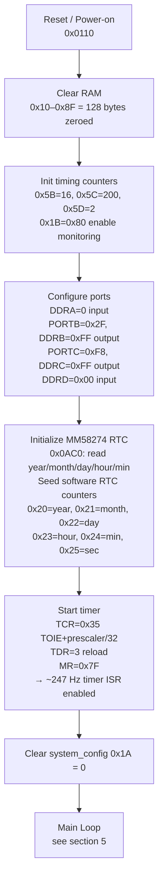
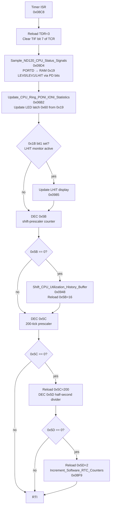
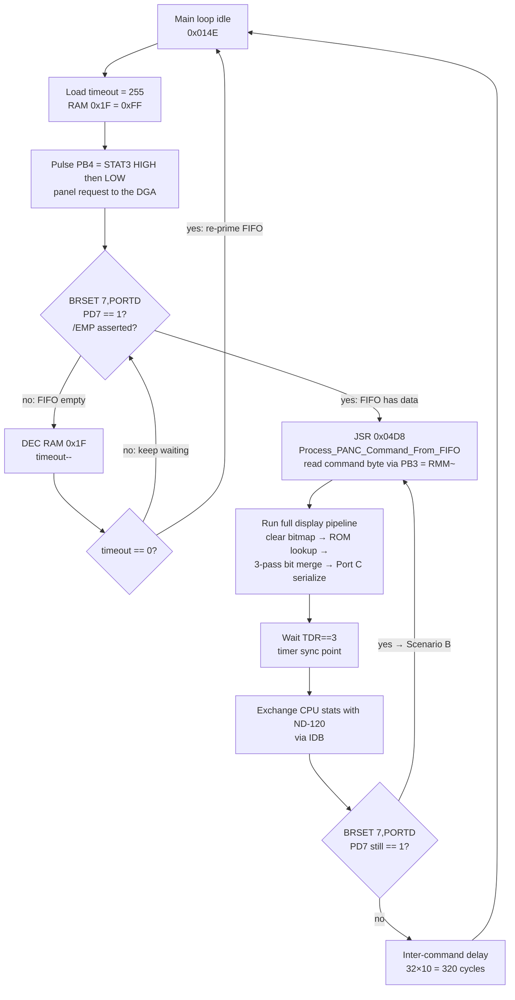
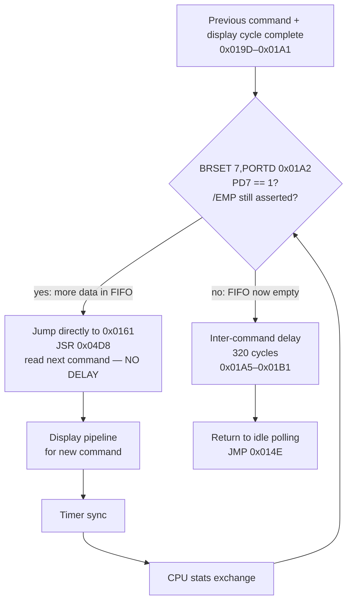
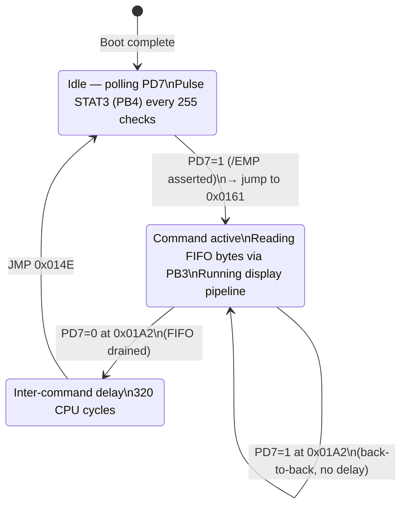
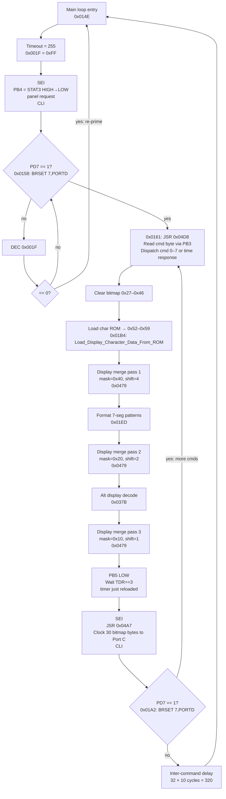
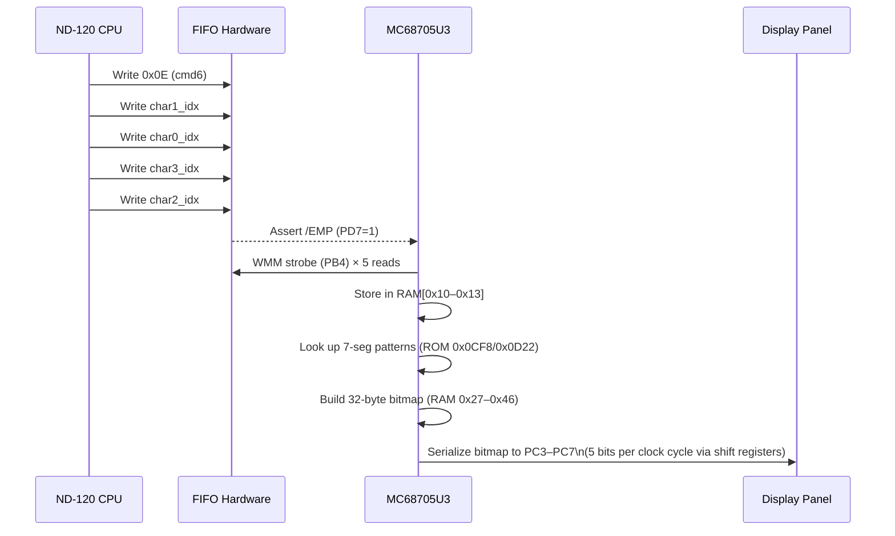
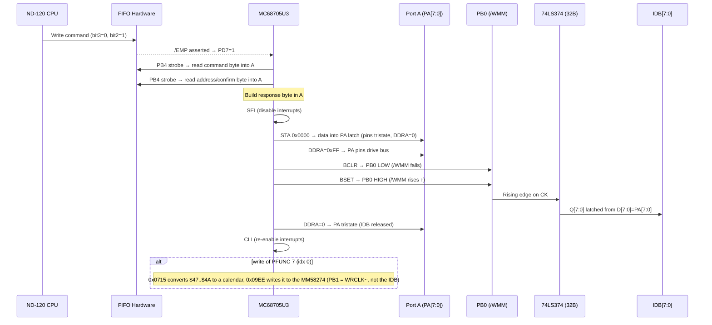
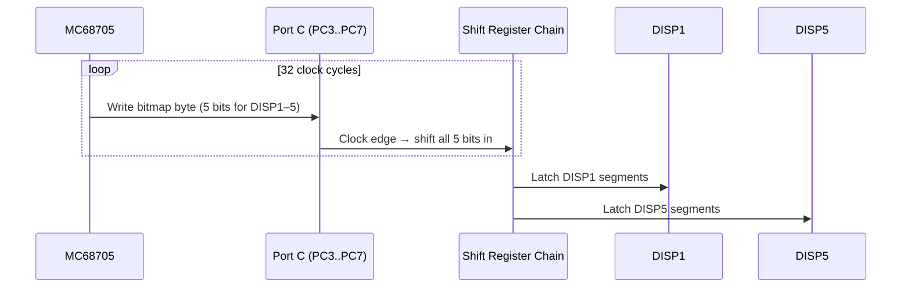

# MC68705U3 — ND-120 Front Panel Controller
## Complete Firmware Analysis

**File:** `E:/Dev/Repos/Ronny/nd-120/Code/68705/MC68705U3_35C.BIN`  
**Ghidra Project:** `E:\Dev\Repos\Ronny\RetroGhidra\ND-120-68705-U3\`  
**Architecture:** Motorola MC68705U3 (6805 family), 4KB ROM (0x0000–0x0FFF), 128-byte RAM (page 0)  
**Crystal:** 4 MHz  
**Analysis date:** 2026-04-06
**Corrected:** 2026-08-28 - every pin/strobe statement below was re-checked against the ROM bytes with a fresh disassembly (see section 17, "Corrections 28-AUG-2026"). The clock path is now emulated in `Verilog/CPU-BOARD-3202/circuit/PANCAL_68705_CLOCK.v` (doc: `Verilog/docs/panel-clock-68705.md`).

---

## Table of Contents

1. [Hardware Overview](#1-hardware-overview)
2. [Port Assignment Summary](#2-port-assignment-summary)
3. [Boot Sequence](#3-boot-sequence)
4. [Timer ISR (~247 Hz)](#4-timer-isr-247-hz)
5. [Main Loop — FIFO Command Processing](#5-main-loop--fifo-command-processing)
6. [PANC Command Protocol — Receiving Commands](#6-panc-command-protocol--receiving-commands)
7. [PANC Text Protocol — Writing Text to the Panel](#7-panc-text-protocol--writing-text-to-the-panel)
8. [PANC Response Protocol — Sending Data to ND-120](#8-panc-response-protocol--sending-data-to-nd-120)
9. [Display Update — From Characters to Shift Register](#9-display-update--from-characters-to-shift-register)
10. [MM58274 RTC Interface](#10-mm58274-rtc-interface)
11. [Software RTC (Timer-Driven)](#11-software-rtc-timer-driven)
12. [CPU Performance Monitoring (Port D)](#12-cpu-performance-monitoring-port-d)
13. [PRES / MIPANS / IDB:15 Hardware Path](#13-pres--mipans--idb15-hardware-path)
14. [RAM Layout](#14-ram-layout)
15. [ROM Data Tables](#15-rom-data-tables)
16. [Interrupt Vectors](#16-interrupt-vectors)
17. [Corrections to Existing Analysis Documents](#17-corrections-to-existing-analysis-documents)

---

## 1. Hardware Overview

The MC68705U3 (chip 44A) is the dedicated front-panel controller for the ND-120 minicomputer. It sits between the Delilah DGA (Gate Array) CPU and the 3202D CBP (Control Board Panel), performing:

- Reception and dispatch of PANC commands from the ND-120 CPU via the IDB FIFO
- Display update: 4-character text output to 5 × 7-segment digits via Port C serial shift register chain
- Software real-time clock (seconds → minutes → hours → days → months → years)
- MM58274 hardware RTC read-at-boot for clock seeding
- CPU performance monitoring: samples Port D ~247 times/second, builds utilization histograms

```
┌──────────────────────────────────────────────────────────────────┐
│                        ND-120 SYSTEM                             │
│                                                                  │
│  ┌──────────────┐   IDB[15:0]   ┌──────────────────────────┐   │
│  │  Delilah DGA │◄─────────────►│  3202D CBP Board         │   │
│  │  (CPU)       │               │  ┌────────────────────┐   │   │
│  └──────────────┘               │  │ 74LS374 (32B) Latch │   │   │
│          │ /EMP (FIFO rdy)      │  │ IDB[7:0] ↔ PA[7:0] │   │   │
│          │ IDBS.MIPANS (20ms)   │  └────────────────────┘   │   │
│          │                      │                            │   │
│          │                      │  ┌────────────────────┐   │   │
│          ▼                      │  │  MC68705U3 (44A)   │   │   │
│       IDB Bus                   │  │  Panel Controller  │   │   │
│          │                      │  └────────────────────┘   │   │
│          │                      └──────────────────────────┘   │
│          │                                                       │
│       74LS244                                                    │
│       IDB:15 ← PRES ← 74F04 inv ← PB7 (always 0)               │
└──────────────────────────────────────────────────────────────────┘
```

---

## 2. Port Assignment Summary

### Port A — IDB Data Bus (Bidirectional)

| Mode | DDRA | PA[7:0] Function |
|------|------|-----------------|
| Normal (command rx) | `0x00` (all input) | Receives IDB[7:0] data from 74LS374 latch via WMM strobe |
| Response (data tx) | Modified per output | Drives IDB[7:0] back to ND-120 CPU |
| RTC access (boot) | `0xF0` (upper=out, lower=in) | PA[7:4]=RTC register address, PA[3:0]=RTC data nibble read-back |

### Port B — Control Signals (Output, DDRB=0xFF, init=0x2F = 0b00101111)

Pin names are from sheet 40 of the 3202D schematic; the use of each pin is what the ROM bytes do with it (corrected 28-AUG-2026):

| Bit | Signal (sheet 40) | Direction | Function |
|-----|-------------------|-----------|----------|
| PB0 | WMM~ → 74LS374 (32B) CK | **Panel → ND-120** | Answer-byte strobe. Rising edge latches PA[7:0] into the 74LS374 → IDB[7:0] on EPANS. Used by `Output_Response_To_ND120_IDB` (0x09C5). The ONLY path from the panel to the CPU. |
| PB1 | WRCLK~ → MM58274 /WR | MM58274 only | Write strobe to the calendar chip. Used by 0x09EE, which writes the whole calendar (PA[7:4] = register address, PA[3:0] = BCD digit) after the CPU has set the time. Never reaches the ND-120. |
| PB2 | ROCLK~ → MM58274 /RD | MM58274 only | Read strobe. Used by 0x0AC0 to read the calendar (at boot and at every time READ, see 0x0705). |
| PB3 | RMM~ → DGA | **ND-120 → Panel** | FIFO read strobe. `Strobe_WMM_Read_From_FIFO` (0x09BC) = `BCLR 3,PORTB ; LDA PORTA ; BSET 3,PORTB`. While RMM~ is low the DGA drives the FIFO head on PA and pops it. |
| PB4 | STAT3 → DGA | Panel → ND-120 | Panel request. Pulsed high→low in the idle loop (0x0153/0x0155) every 255 EMP~ polls. The DGA (IDBS A282/A283) turns the edge into PRQ. Also PANS bit 11 via the 74LS244. |
| PB5 | STAT4 → DGA + PANS bit 12 path | Panel → ND-120 | "Answered" level: 1 at reset (PORTB=0x2F), cleared at the start of a clock command (0x06D3), set after the answer is latched (0x06ED/0x0712), cleared at 0x0195 after every command's display pipeline. The DGA makes VAL (PANS bit 12) from it. |
| PB6 | READ → PANS bit 13 | Panel → ND-120 | 1 = the latched answer byte is clock data (set 0x06FA on a read, cleared 0x06E1 on a write). |
| PB7 | PRES source | Hardware only | Permanently driven 0. Inverted by 74F04 (13G) → PRES=1 always → IDB:15=1 via 74LS244 |

> **PB0 vs PB3 — do not confuse these:** PB3 (RMM~) reads bytes FROM the ND-120 (FIFO→PA). PB0 (WMM~) writes ONE byte TO the ND-120 (PA→74LS374→IDB). They are opposite directions on the same data bus.

> **PB0 initial state = 1 (HIGH = /WMM deasserted).** The strobe fires as a LOW pulse: PB0 goes LOW then immediately HIGH. The 74LS374 latches PA on the **rising edge** (PB0 going HIGH).

> **PB7 hardware path:** PB7=0 → 74F04 inverter (13G) → PRES=1 → 74LS244 → IDB:15=1 when ND-120 asserts IDBS.MIPANS. The panel MCU never controls this value; MIPANS is asserted by ND-120 microcode MS20 every ~20ms to latch PRES into IDB:15.

### Port C — Display Shift Register Chain (Output, DDRC=0xFF, init=0xF8)

| Bit | Signal | Function |
|-----|--------|----------|
| PC[2:0] | STAT0-2 → 74LS244 → PANS bits 8-10 | PFUNC echo: 0x06C5-0x06CB copies the command's bits 2:0 here for every bit3=0 command (init 0xF8 = 000) |
| PC3 | DISP1 | Bit for display digit 1 (serial shift chain) |
| PC4 | DISP2 | Bit for display digit 2 |
| PC5 | DISP3 | Bit for display digit 3 |
| PC6 | DISP4 | Bit for display digit 4 |
| PC7 | DISP5 | Bit for display digit 5 (rightmost) |

Port C is the serial shift register output. All 5 display bits are clocked simultaneously for each bit position of the display bitmap.

### Port D — ND-120 CPU Status Monitoring (Input, DDRD=0x00)

| Bit | Signal | Function |
|-----|--------|----------|
| PD0 | PCR Ring[0] | CPU ring level bit 0 |
| PD1 | PCR Ring[1] | CPU ring level bit 1 |
| PD2 | PONI | Memory Protection ON (from ND-120) |
| PD3 | IONI | Interrupt system ON (from ND-120) |
| PD4 | LHIT | Cache hit (sampled by 0x09AF `BRCLR 4,PORTD`) |
| PD5 | LEV0 | 1 = CPU on level 0 = idle (sampled by 0x09B4 `BRSET 5,PORTD`) |
| PD6 | GND | Tied low on sheet 40 |
| PD7 | EMP~ | DGA FIFO not empty (XEMN = ~fifo_empty): 1 = a command byte is waiting |

---

## 3. Boot Sequence

Entry point: **0x0110** (reset vector at 0x0FFE)



**Timer rate calculation:**

The timer uses an external clock input with /32 prescaler, reload value TDR=3. With the ND-120 board clock feeding the 68705 timer input:

- TCR=0x35: TOIE=1 (timer overflow interrupt enable), prescaler=/32, external clock
- Actual measured rate ≈ **247 Hz** (the function was originally named `Timer_1200Hz` but the naming was incorrect)

---

## 4. Timer ISR (~247 Hz)

Entry point: **0x08C8** (timer vector at 0x0FF8)



**Timer tick chain summary:**

| Counter | Reload | Fires every | Action |
|---------|--------|-------------|--------|
| 0x5B | 16 | 16 ticks ≈ 65ms | Shift CPU utilization history buffer |
| 0x5C | 200 | 200 ticks ≈ 810ms | Outer prescaler |
| 0x5D | 2 | 2 × 810ms ≈ 1.62s | Software RTC tick (1 second) |

> **Note:** The 1-second tick fires every ~1.62 seconds in practice, not every 1.0 second. This is because 247Hz × 16 × 200 × 2 = 1,580,800 ticks per second (counter rolls before perfect alignment). For wall-clock accuracy, the software RTC will drift; only the MM58274 hardware RTC was accurate for time-keeping.

---

## 5. Main Loop — FIFO Command Processing and /EMP Signal

After boot, the MCU enters an infinite polling loop at the end of `Init_And_Main_Loop` (0x0110+).

### /EMP (PD7) — The Central Trigger

`/EMP` is the FIFO "data ready" signal driven by the 3202D CBP board hardware. It appears on **Port D bit 7** (PD7). The MCU sees PD7=1 when the FIFO has a command byte ready to be read.

> **Critical:** /EMP is NOT an interrupt. The MCU polls PD7 at two specific points in its loop (see scenarios below). The timer ISR does NOT check PD7.

**IDB read path** (when PD7=1, MCU reads a byte):

```
0x09BC: Strobe_WMM_Read_From_FIFO
  SEI                    ; protect the bus transaction
  BCLR PB3              ; PB3 = RMM~ LOW  → DGA drives the FIFO head on PA and pops it
  A = PORTA             ; read the byte
  BSET PB3              ; PB3 = RMM~ HIGH
  CLI
  RTS
```

PB3 is RMM~ (sheet 40). The DGA (DECODE_DGA.v) does `XA_7_0 = RMM_n ? 0 : fifo_out` and pops one byte per XCLK while RMM~ is low. PB4 is STAT3 (panel request), NOT a FIFO strobe - see below.

---

### Scenario A — /EMP asserted while MCU is idle (waiting for first command)

This is the **normal wakeup path**. The MCU loops at 0x014E–0x0161, repeatedly pulsing PB4 (WMM strobe to prime FIFO) and then polling PD7 up to 255 times before pulsing again.



---

### Scenario B — /EMP asserted immediately after command completes (back-to-back)

At address **0x01A2**, after every full command+display cycle, PD7 is checked again **before** the inter-command delay. If the FIFO already has the next command loaded, the MCU re-enters command processing immediately without delay.



---

### Combined /EMP State Machine



---

### PB3 vs PB4 (corrected 28-AUG-2026)

| Pin | Sheet 40 | When used | What it does |
|-----|----------|-----------|-------------|
| **PB4** | STAT3 | Main idle loop (0x0152–0x0155), once per 255-poll timeout (~3 ms) | Pulses STAT3 HIGH→LOW towards the DGA. The DGA's A282/A283 edge detector turns it into a PRQ (panel request) that vectors the microcode to MOPC (PRQ: at o2340). It has nothing to do with the FIFO. |
| **PB3** | RMM~ | Inside every `Strobe_WMM_Read_From_FIFO` (0x09BC) | Read strobe to the DGA FIFO; MCU reads PORTA while RMM~ is LOW |

For a 5-byte command PB3 fires 5 times. PB4 fires only while the panel is idle.

---

### Main loop — complete flow



---

## 6. PANC Command Protocol — Receiving Commands

### Transport Layer

The ND-120 CPU sends commands with `TRR PANC`. Microcode RPANC (o1045 in the DELILAH-L listing) does `IDBS,SWAP COMM,LDPANC` twice, so the FIFO in the DGA receives A[15:8] first and A[7:0] second. The FIFO signals "not empty" on PD7 (EMP~). The MC68705 reads bytes one at a time with RMM~ (PB3).

**`Strobe_WMM_Read_From_FIFO` (0x09BC):**
1. `BCLR 3, PortB` (RMM~ LOW - the DGA drives the FIFO head on PA and pops it on XCLK)
2. Read Port A: `LDA PORTA`
3. `BSET 3, PortB` (RMM~ HIGH)
4. Return byte in A

So the command byte IS the high byte of the PANC register: bit 5 = PANC bit 13 ("read request"), bit 3 = PANC bit 11, bits 2:0 = PFUNC (PANC bits 10:8). The second byte is WPAN (PANC bits 7:0).

### Command Byte Format

```
 Bit:  7   6   5   4   3   2   1   0
      ┌───┬───┬───┬───┬───┬───┬───┬───┐
      │ X │ X │ X │ X │DIR│ CMD[2:0]  │
      └───┴───┴───┴───┴───┴───┴───┴───┘
```

| Bit | Name | Value=0 | Value=1 |
|-----|------|---------|---------|
| 3 (DIR) | Direction | clock path (0x06BE): PFUNC 4-7 read or write one of the four time bytes, PFUNC 0-3 do nothing | text/display command 0-7 |
| [2:0] (CMD) | Command type | — | 0–7 |

**Dispatch logic (0x04D8–0x04EA):**
```asm
JSR  Strobe_WMM_Read_From_FIFO   ; A = command byte
STA  0x001C                       ; store in RAM[0x1C]
BRSET 3, 0x001C, dispatch_write   ; bit3=1: config/display command
JMP  Output_RTC_Time_Data_To_ND120 ; bit3=0: ND-120 wants time data
dispatch_write:
LDA  0x001C
AND  #7                           ; A = cmd[2:0]
ASLA / ASLA                       ; ×4 (3-byte JMP entries)
TAX
JMP  0x04FC,X                     ; indexed jump into command table
```

### Command Jump Table (0x04FC)

| cmd[2:0] | Full byte | Jump target | Description | Input bytes |
|----------|-----------|-------------|-------------|-------------|
| 0 | `0x08` | 0x051B | SET_DISPLAY_DATA — set 5 time/display registers | 5 |
| 1 | `0x09` | 0x0575 | SET_TIME_DISPLAY — 4 bytes → time display regs 0x15–0x18 | 4 |
| 2 | `0x0A` | 0x0594 | SET_PERF_DISPLAY — enable performance mode, 2 params | 2 |
| 3 | `0x0B` | 0x05C3 | SET_EXT_DISPLAY — 3 bytes → extended display mode | 3 |
| 4 | `0x0C` | 0x05DF | SET_CHAR_DISPLAY — 1 byte index → ROM character lookup | 1 |
| 5 | `0x0D` | 0x0608 | SET_CONFIG — 1 byte → RAM[0x1A] configuration flags | 1 |
| 6 | `0x0E` | 0x0610 | SET_CHAR_INDICES — 4 bytes directly → display char buffer | 4 |
| 7 | `0x0F` | 0x0627 | SET_FORMAT_FLAGS — 2 bytes; 0x4X = soft reset | 2 |

---

## 7. PANC Text Protocol — Writing Text to the Panel

This section directly answers: **how does the ND-120 CPU write text to the front panel?**

### Method 1: Direct Character Write — Command 6 (`0x0E`)

This is the primary "write text" command. The ND-120 sends 5 bytes total:

```
Byte 0:  0x0E        Command byte (bit3=1, cmd=6)
Byte 1:  char1_idx   → stored at RAM[0x11]
Byte 2:  char0_idx   → stored at RAM[0x10]
Byte 3:  char3_idx   → stored at RAM[0x13]
Byte 4:  char2_idx   → stored at RAM[0x12]
```

> **Note:** The byte order is NOT sequential left-to-right. The order received is: pos1, pos0, pos3, pos2. This is confirmed by the disassembly at 0x0610–0x0624.

```asm
; 0x0610: Command 6 handler
JSR  Strobe_WMM_Read_From_FIFO  ; read byte 1
STA  0x0011                      ; → display position 1
JSR  Strobe_WMM_Read_From_FIFO  ; read byte 2
STA  0x0010                      ; → display position 0
JSR  Strobe_WMM_Read_From_FIFO  ; read byte 3
STA  0x0013                      ; → display position 3
JSR  Strobe_WMM_Read_From_FIFO  ; read byte 4
STA  0x0012                      ; → display position 2
JMP  0x04ED                      ; → post-command processing
```

**Display position layout:**
```
Panel: [pos0][pos1][pos2][pos3][pos4]
                                 ^--- pos4 is the performance/status digit (not set by cmd6)
RAM:  [0x10][0x11][0x12][0x13]
```

**Character index encoding:**
The values stored in RAM[0x10–0x13] are **7-segment pattern indices**, not raw ASCII. They are looked up through the character ROM at 0x0D22. Values 0x10–0x13 were observed as standard character indices. The actual 7-segment encoding table starts at ROM 0x0CF8 with digit patterns at offset +0x10.

**Character ROM (ROM 0x0D22):**
- 2-byte entries per character
- Indexed by value in RAM[0x10–0x13]
- Used for symbolic characters like letters ('P', 'E', 'X', 'M', 'T', etc.)

### Method 2: ROM Character Select — Command 4 (`0x0C`)

Selects from 4 predefined character pairs stored in ROM. The ND-120 sends 2 bytes:

```
Byte 0:  0x0C        Command byte (bit3=1, cmd=4)
Byte 1:  sel         Selection byte:
                     bits[1:0] → index into ROM table at 0x0D12 → RAM[0x12],[0x13]
                     bits[4:3] → index into ROM table at 0x0D1A → RAM[0x10],[0x11]
```

### Method 3: Status/Time Command — Command 0 (`0x08`)

Sets predefined messages based on system mode:

```
Byte 0:  0x08        Command byte (bit3=1, cmd=0)
Bytes 1–5:           5 time/date bytes → RAM[0x14–0x18]

Result in display buffer:
  Normal mode (RAM[0x1A] bit2=0):  RAM[0x10..0x13] = 'P','E','X','M'  → shows "PEXM"
  Test mode   (RAM[0x1A] bit2=1):  RAM[0x10..0x13] = 'P','T', 0, ##   → shows "PT##"
```

### Display Update Sequence (after any command)

Once RAM[0x10–0x13] are updated, the main loop triggers the display pipeline on the next iteration:



---

## 8. PANC Response Protocol — Sending Data to ND-120

When the command byte has **bit3=0**, the clock path at **0x06BE** runs. This is the ND-100 hardware-clock protocol (ND-06.014 ch. 4.3, `ND-HWCLCK`): the time is four bytes, addressed by PFUNC 4..7, and every access carries a read/write bit.

```
0x06BE:  X = cmd ; PORTC[2:0] = cmd & 7          ; STAT2:0 = PFUNC (PANS bits 10:8)
         if (cmd & 4) == 0: RTS                  ; PFUNC 0-3: nothing (the WPAN byte
                                                 ;   stays in the FIFO and is read as
                                                 ;   the NEXT command byte)
         BCLR 5,PORTB                            ; STAT4 = 0 (busy)
         idx = (cmd & 3) ^ 3                     ; RAM $47+idx
         if (cmd & 0x20) == 0:                   ; --- CPU WRITES the clock
             BCLR 6,PORTB                        ; READ = 0
             A = FIFO byte (WPAN) ; $47[idx] = A ; answer(A) via 0x09C5 (WMM~)
             BSET 5,PORTB                        ; STAT4 = 1 (answered)
             if idx == 0: 0x0715 ($47..$4A -> calendar $20..$25) ; 0x09EE (write MM58274)
         else:                                   ; --- CPU READS the clock
             BSET 6,PORTB                        ; READ = 1
             FIFO byte read and discarded (WPAN)
             if idx == 3: 0x0AC0 (read MM58274 -> $20..$26) ; 0x0803 (calendar -> $47..$4A)
             answer($47[idx]) via 0x09C5 ; BSET 5,PORTB
```

| PFUNC | idx | RAM | Byte |
|-------|-----|-----|------|
| 4 | 3 | $4A | seconds within the half-day (0..43199), low byte |
| 5 | 2 | $49 | seconds, high byte |
| 6 | 1 | $48 | half-days since 1979-01-01 00:00, low byte |
| 7 | 0 | $47 | half-days, high byte |

The format is proven by the constants at ROM $80..$83: `02DA` = 730 half-days per year (732 in a leap year, 0x0751-0x0753), `0E10` = 3600 s/hour, `07BB` = 1979 (0x0763 `ADD #$4F` = 79 -> two-digit year), and by 0x07A2 `LSRA` / `BCC`: an odd half-day count sets hour = 12. A write only becomes the clock when PFUNC 7 arrives (the CPU writes 4,5,6,7 in that order); a read takes a fresh snapshot of the calendar on PFUNC 4 and returns bytes of that snapshot for 5,6,7.

### IDB Write Strobe

There is exactly ONE path from the panel to the CPU: PA[7:0] → 74LS374 (32B) → IDB[7:0], clocked by **PB0 = WMM~** in 0x09C5 `Output_Response_To_ND120_IDB`. The CPU reads it with `TRA PANS` (EPANS) together with {PRES, FUL~, READ, VAL, STAT3..0} from the 74LS244 (33B).

**PB1 is NOT an IDB strobe.** 0x09EE pulses PB1 = WRCLK~, the MM58274's /WR, with PA[7:4] = register address and PA[3:0] = one BCD digit: F←0 (stop), F←0, 0←5 (hold), F←1|leap, D←year tens, C←year units, B←month tens, A←month units, 9←day tens, 8←day units, 7←hour tens, 6←hour units, 5←min tens, 4←min units, 3←sec tens, 2←sec units, 0←1 (start). That is the MM58274 register map exactly. DDRA is FF for the whole sequence and cleared at the end (0x0ABD).

---

### PB0 → /WMM → 74LS374 CK → IDB[7:0] — Detailed Path

#### Hardware chain

```
MC68705 PB0
    │  (active-low pulse: HIGH→LOW→HIGH)
    ▼
/WMM signal on 3202D CBP board
    │
    ▼
74LS374 (32B) — octal D-type flip-flop, positive-edge triggered CK
    │  D[7:0] ← PA[7:0] from MC68705 Port A
    │  CK ← /WMM (latches on RISING EDGE when /WMM goes HIGH)
    │  /OE — output always enabled toward IDB
    ▼
IDB[7:0] — Internal Data Bus to ND-120 CPU
```

#### Exact code sequence at 0x09C5 (`Output_Response_To_ND120_IDB`)

```asm
09c5: SEI              ; disable interrupts — protect the atomic IDB transaction
09c6: STA 0x0000       ; PA output latch = data byte (DDRA still 0x00, pins still tristate)
09c8: LDA #0xFF
09ca: STA 0x0004       ; DDRA = 0xFF → enable PA output drivers → data now on PA pins
09cc: BCLR 0x0, 0x0001 ; PB0 LOW  → /WMM falls (hold time: data stable on PA)
09ce: BSET 0x0, 0x0001 ; PB0 HIGH → /WMM rises → 74LS374 CK RISING EDGE → LATCH PA→IDB
09d0: CLR 0x0004       ; DDRA = 0x00 → tristate PA (release IDB bus)
09d2: CLI              ; re-enable interrupts
09d3: RTS
```

> **Write order matters:** Data is written to the PA output latch BEFORE DDRA is set to output. This prevents a glitch where partially-settled data could appear on the bus. The sequence is: latch data (tristate) → enable drivers → strobe → release.

#### When does PB0 fire?

PB0 fires **only** for a clock command (**bit3=0 AND bit2=1**, i.e. PFUNC 4-7), once per command. It does **not** fire during any display/text command (bit3=1) and not for PFUNC 0-3.

```
Command byte decode (0x06BE):
  bit3 = 0  → clock path
  bit2 = 1  → PFUNC 4-7 (if bit2=0: early RTS, no answer)
  bit5 = 0  → CPU WRITES a time byte: it is stored and echoed back (PB0 once);
              on PFUNC 7 the calendar is recomputed and written to the MM58274 (PB1 = WRCLK~)
  bit5 = 1  → CPU READS a time byte: on PFUNC 4 the MM58274 is read first (PB2 = ROCLK~);
              the byte is answered (PB0 once)
```



---

### 0x09EE — MM58274 write (was wrongly called "Full Time Packet to the ND-120")

0x09EE uses **PB1 = WRCLK~**, the MM58274's /WR. Nothing in it reaches the IDB. The old description of an "18-byte packet" is kept below only so the byte list can be compared with the register map: byte 0/1 = register F (clock stop), byte 2 = register 0 (hold), byte 3 = register F (leap-year field), then year..seconds digits into registers D..2, and the last byte (0x0AB5, `01`) = register 0 = start.

```asm
; Pattern repeated for each of 18 bytes:
STA  0x0000          ; PA = data byte (DDRA already 0xFF, set once at entry)
BCLR 0x1, 0x0001     ; PB1 LOW  → strobe falls
BSET 0x1, 0x0001     ; PB1 HIGH → strobe rises → 74LS374 latches → IDB updated
```

**Packet format** (sent in this order via IDB[7:0]):

| Byte | PA value | Content |
|------|----------|---------|
| 0 | `0x0F` | Header nibble 1 |
| 1 | `0xF0` | Header nibble 2 |
| 2 | `0x05` | Command code (RTC time packet) |
| 3 | `0xF1 \| (leap_cycle & 3) << 2` | Flags + leap year indicator |
| 4 | `ROM[0x0E44 + year×2] \| 0xD0` | Year high digit + 0xD0 tag |
| 5 | `ROM[0x0E44 + year×2 + 1] \| 0xC0` | Year low digit + 0xC0 tag |
| 6 | `ROM[0x0E44 + month×2] \| 0xB0` | Month high digit |
| 7 | `ROM[0x0E44 + month×2 + 1] \| 0xA0` | Month low digit |
| 8 | `ROM[0x0E44 + day×2] \| 0x90` | Day high digit |
| 9 | `ROM[0x0E44 + day×2 + 1] \| 0x80` | Day low digit |
| 10 | `ROM[0x0E44 + hour×2] \| 0x70` | Hour high digit |
| 11 | `ROM[0x0E44 + hour×2 + 1] \| 0x60` | Hour low digit |
| 12 | `ROM[0x0E44 + min×2] \| 0x50` | Minute high digit |
| … | … | (continues through seconds) |

Each field is tagged with a high-nibble identifier (0xD0=year, 0xC0=year-low, 0xB0=month, etc.) so the ND-120 can parse the packet independently of byte position.

The digits come from the calendar in RAM $20-$25 that 0x0715 just computed from the four bytes the CPU wrote. On a READ the MM58274 is read again (0x0705 → 0x0AC0), so the battery-backed chip - not the software counters - is the source of the time the CPU gets.

---

## 9. Display Update — From Characters to Shift Register

### Overview

The display has 5 digits (DISP1–DISP5). Each digit is a 7-segment display. The MC68705 drives all 5 simultaneously through a **serial shift register chain** on PC3–PC7.

### Step 1: Character ROM Lookup

Characters in RAM[0x10–0x13] are used as indices. For octal-mode (standard numerics from RAM[0x16–0x18]), each 3-bit octal digit is extracted and looked up in the 7-segment pattern ROM:

```asm
; Extract 3-bit octal digit from packed data in RAM[0x18]
AND  #0x7        ; A = 3-bit nibble (0–7)
ADD  #0x10       ; A += 0x10 (offset into 7-seg table)
TAX
LDA  0xCF8,X    ; load 7-seg pattern from ROM
STA  0x0059      ; store in display work buffer
```

**7-segment pattern ROM (0x0CF8):**
- 32 entries total (0x00–0x1F)
- Digits 0–7 at offsets 0x10–0x17
- Letters and symbols at other offsets
- Custom encoding (not standard 7-seg BCD)

### Step 2: 3-Pass Bit Merge into Bitmap

The patterns are merged into the 32-byte display bitmap (RAM 0x27–0x46) in three passes, each using a different mask/shift:

| Pass | Mask | Shift | Port C bits affected |
|------|------|-------|---------------------|
| 1 | 0x40 | 4 | DISP4, DISP5 |
| 2 | 0x20 | 2 | DISP2, DISP3 |
| 3 | 0x10 | 1 | DISP1 |

`Process_7Segment_Display_Bit_Manipulation` extracts each bit from the 7-seg patterns and places it into the correct position within the 32-byte bitmap corresponding to the serial shift timing.

### Step 3: Serialize to Port C

`Update_RTC_Interface` (called mid-main-loop) serializes the 32-byte bitmap by clocking bits through PC3–PC7:

```
For each bit position (0–31):
  PC[7:3] = bitmap_byte[bit_pos][4:0]  (5 display bits simultaneously)
  PC[2:0] = unchanged (held 0)
  → rising edge of clock shifts all 5 bits into display shift registers
```

This means for each clock cycle, one bit column of all 5 displays is shifted in simultaneously. After 32 clocks, all 5 × 7-segment digits are fully loaded.



---

## 10. MM58274 RTC Interface

The MM58274 is the battery-backed calendar chip. It is read at boot (0x013C) AND at every time READ from the CPU (0x0705, PFUNC 4), and it is WRITTEN (0x09EE, PB1 = WRCLK~) whenever the CPU has written all four time bytes (PFUNC 7). The software RTC counters are only for the display.

### Hardware Connection

| MC68705 Pin | Signal | MM58274 Pin | Description |
|-------------|--------|-------------|-------------|
| PA[7:4] | Address out | A[3:0] | Register address (upper nibble of Port A) |
| PA[3:0] | Data in | D[3:0] | Data nibble read-back (lower nibble of Port A) |
| PB2 | /ROCLK | /RD | Read clock (active low pulse) — **confirmed from code** |
| PB1 | /WRCLK | /WR | Write clock (active low pulse) — **confirmed from hardware schematic** |

> **PB1/PB2 (corrected 28-AUG-2026):** 0x0AC0 reads with PB2 = ROCLK~; 0x09EE writes with PB1 = WRCLK~ (`STA PORTA ; BCLR 1,PORTB ; BSET 1,PORTB` per register, DDRA = FF). Both confirmed in the ROM and on sheet 40.

### MM58274 Read Protocol (from boot code 0x0AC0)

```
DDRA = 0xF0          ; PA[7:4] = output, PA[3:0] = input

; For each RTC register read:
PA = (reg_addr << 4) ; set address in upper nibble, lower nibble don't-care
BCLR PB2             ; /ROCLK LOW — assert read strobe
A = PORTA            ; read data nibble from PA[3:0]
BSET PB2             ; /ROCLK HIGH — deassert read strobe
A &= 0x0F            ; mask to 4-bit data nibble
```

### Register Read Sequence at Boot (0x0AC0)

The init reads from these MM58274 registers:

| PA value | Reg addr (PA[7:4]) | Contents seeded to |
|----------|--------------------|--------------------|
| 0xF0 | 0xF = Leap-year control | RAM[0x26] = leap-year cycle (0=leap year, 1/2/3=non-leap) |
| 0xC0 | 0xC = Year tens BCD | Used to build binary year |
| 0xD0 | 0xD = Year units BCD | Combined with tens → RAM[0x20] = binary year (0–99) |
| 0xA0 | 0xA = Month tens BCD | Used to build binary month |
| 0xB0 | 0xB = Month units BCD | Combined → RAM[0x21] = binary month |
| 0x80 | 0x8 = Day tens BCD | Used to build binary day |
| 0x90 | 0x9 = Day units BCD | Combined → RAM[0x22] = binary day |
| ... | Hours, minutes, seconds | → RAM[0x23], [0x24], [0x25] |

**BCD to binary conversion** is done inline: `tens × 10 + units` using multiply-by-8 (ASLX×3) + multiply-by-2 + add.

---

## 11. Software RTC (Timer-Driven)

After boot, the MM58274 is **not accessed again**. All timekeeping runs in software via `Increment_Software_RTC_Counters` (0x08F9), called from the timer ISR.

### Software RTC Counters (RAM)

| Address | Counter | Range | Rollover |
|---------|---------|-------|---------|
| 0x25 | Seconds | 0–59 | → 0, increment minutes |
| 0x24 | Minutes | 0–59 | → 0, increment hours |
| 0x23 | Hours | 0–23 | → 0, increment days |
| 0x22 | Day of month | 1–31 | Month-dependent, uses days-in-month table |
| 0x21 | Month | 1–12 | → 1, increment year |
| 0x20 | Year | 0–99 | → 0 (wraps, no century) |
| 0x26 | Leap-year cycle | 0–3 | 0=leap, 1/2/3=non-leap |

### Leap Year Handling

ROM table at 0x0E37 (days-in-month) has separate entries for leap (month[13]) and non-leap years. The code uses RAM[0x26] to select the correct entry when rolling over the day counter.

---

## 12. CPU Performance Monitoring (Port D)

Every timer ISR tick (the seconds counter in 0x08F9 advances once per 16 x 200 x 2 = 6400 ticks, so the ISR runs at 6400 Hz - the "~247 Hz" given earlier cannot be right or the software clock would gain a second every 26 s; with TDR=3 and the /32 prescaler that puts PANOSC at about 614 kHz, i.e. RTOSC/4 in DECODE_DGA_POW.v - the absolute RTOSC frequency has NOT been verified here):

1. `Sample_ND120_CPU_Status_Signals` (0x09D4): `A = PORTD ; $70 = A ; $19 = (A & 0x0C) << 2` = {PONI, IONI} in bits 5:4. Then, **only if PONI (bit 2) is set**: `X = A & 3` (the protect ring from PCR1:0), `$19 |= ROM[0x0F0C + X]` with the table `01 02 04 08` - one-hot ring bit in bits 3:0. Without paging the ring bits are meaningless, so they are skipped.
2. `Update_CPU_Ring_PONI_IONI_Statistics` (0x06B2): `$60 = ($60 & ~$6F) | $19 ; $19 = $60` - ORs the sample into the accumulator, dropping what fell out of the history window.
3. If display flag $1B bit 1 (performance mode, set by command 2): `Monitor_LEV0_LHIT` (0x0985), below.

**Ring level utilization accumulation:**

Every 16 ticks: `Shift_CPU_Utilization_History_Buffer` (0x0948) shifts the 16-byte ring buffer at RAM[0x64–0x6F] left by one position.

Every 200×2 ticks (≈1.62s): Utilization percentages are calculated and made available to the ND-120 via `Exchange_CPU_Stats_With_DGA` (IDB output).

**Cache hit rate and CPU utilisation - `Monitor_LEV0_LHIT` (0x0985), added 28-AUG-2026:**

```
0x0985:  DEC $71 ; BNE sample              ; $71 = window counter, reloaded with 128
         $71 = 128
         A = $72 (LHIT count)               ; if 0 -> bar = 0
         if A != 0: A = A >> 1 ; $72 = A    ; (halved, kept as a decaying carry-over)
                    A = A >> 4 ; A = A + 1  ; count/32 + 1  -> 1..5
         $11 = A + 0x21                     ; display position 1: bar character index
         A = $73 (busy count)               ; same maths
         $10 = A + 0x21                     ; display position 0: bar character index
sample:  BRCLR 4,PORTD,+2 ; INC $72         ; LHIT = 1  -> one more cache hit
         BRSET 5,PORTD,+2 ; INC $73         ; LEV0 = 0  -> one more busy sample (not idle)
         RTS
```

So the panel's "cache" bar is the number of ticks out of the last 128 (20 ms at 6400 Hz) in which LHIT was high, in five steps of 32; the "load" bar is the number of ticks in which the CPU was NOT on level 0. No PIL value ever reaches the panel: the only level information on Port D is LEV0.

**Port D signals (sheet 40):**

| PD bit | Signal | Meaning when 1 |
|--------|--------|----------------|
| PD[1:0] | PCR1:0 | Current protect ring (0..3), used only while PONI=1 |
| PD2 | PONI | Paging (memory protection) on |
| PD3 | IONI | Interrupt system on |
| PD4 | LHIT | Cache hit |
| PD5 | LEV0 | CPU on level 0 (idle) |
| PD6 | GND | - |
| PD7 | EMP~ | FIFO has a command byte |

---

## 13. PRES / MIPANS / IDB:15 Hardware Path

This is frequently misunderstood. The complete path:

```
MC68705 PB7 = 0 (always, driven low by firmware)
    ↓
74F04 inverter chip 13G
    ↓
PRES = 1 (always, because PB7=0 inverted)
    ↓
74LS244 buffer (enabled when ND-120 asserts IDBS.MIPANS)
    ↓
IDB:15 = 1 (always)
```

**MIPANS is NOT triggered by the panel MCU.** It is asserted by the ND-120 CPU's own microcode, specifically in the MS20 timer routine, every ~20ms. When MIPANS fires:
- The 74LS244 gates PRES onto IDB:15
- Since PRES=1 always, IDB:15=1 always
- The MS20 microcode reads IDB:15=1 → continues to MOPC code

**Implication:** The MC68705 never drives IDB:15 to 0. Any interpretation that the panel MCU controls the MS20 continuation decision is incorrect.

---

## 14. RAM Layout

| Address | Size | Name | Used by |
|---------|------|------|---------|
| 0x10 | 1 | display_char[0] | cmd 0/4/6, main display loop |
| 0x11 | 1 | display_char[1] | cmd 0/4/6 |
| 0x12 | 1 | display_char[2] | cmd 2/4/6 |
| 0x13 | 1 | display_char[3] | cmd 0/4/6 |
| 0x14 | 1 | time_byte1 (seconds seed) | cmd 0 |
| 0x15 | 1 | time_byte3 (minutes seed) | cmd 0/1 |
| 0x16 | 1 | time_byte2 (hours seed) | cmd 0/1/3 |
| 0x17 | 1 | time_byte5 (day seed) | cmd 0/1/2/3 |
| 0x18 | 1 | time_byte4 (month seed) | cmd 0/1/2/3 |
| 0x19 | 1 | cpu_status_raw | PORTD sample, timer ISR |
| 0x1A | 1 | system_config | cmd 5, controls display mode |
| 0x1B | 1 | control_flags | modified by all cmds; bit1=LHIT mode; bit2=feature; bit3=ext; bit4=time-only |
| 0x1C | 1 | last_command_byte | FIFO dispatcher |
| 0x1D | 1 | util_param1 | cmd 2/7, utilization params |
| 0x1E | 1 | util_param2 | cmd 2/7 |
| 0x1F | 1 | emp_timeout | main loop timeout counter |
| 0x20 | 1 | year (binary 0–99) | software RTC, init from MM58274 |
| 0x21 | 1 | month (binary 1–12) | software RTC |
| 0x22 | 1 | day (binary 1–31) | software RTC |
| 0x23 | 1 | hour (binary 0–23) | software RTC |
| 0x24 | 1 | minutes (binary 0–59) | software RTC |
| 0x25 | 1 | seconds (binary 0–59) | software RTC |
| 0x26 | 1 | leap_cycle (0–3) | software RTC leap year |
| 0x27–0x46 | 32 | display_bitmap | 7-seg serial shift buffer |
| 0x47–0x4A | 4 | data_store | write operation buffer |
| 0x52–0x59 | 8 | seg_patterns | 7-seg pattern work area |
| 0x5B | 1 | shift_prescaler | timer: counts 16 ticks |
| 0x5C | 1 | window_prescaler | timer: counts 200 windows |
| 0x5D | 1 | rtc_divider | timer: counts 2 → 1-sec tick |
| 0x60 | 1 | led_accumulator | CPU status LED latch |
| 0x61–0x6F | 15 | util_history | CPU utilization ring buffer |

---

## 15. ROM Data Tables

| Address | Size | Name | Description |
|---------|------|------|-------------|
| 0x0080 | 4 | epoch_base | 0x02DA0E10 — Unix epoch base for time calculations |
| 0x0CF8 | 32 | seg_patterns | 7-segment patterns (custom encoding); digits 0–7 at +0x10 |
| 0x0D22 | varies | char_rom | Character ROM: 2-byte entries for display characters indexed by 0x10–0x13 |
| 0x0DDE | 26 | days_before_month | Cumulative days before each month ×2; non-leap at base, +0x0D offset for leap |
| 0x0E1F | 24 | sec_per_hour | Cumulative seconds per hour (16-bit): hour×3600 |
| 0x0E37 | 13 | days_in_month | Days per month (bytes, index 1–12) |
| 0x0E44 | 16 | day_of_week_idx | Day-of-week index table (16-bit pairs, 0–7) |
| 0x0F0C | 4 | cpu_bitmask | CPU status bit-mask table: 0x01, 0x02, 0x04, 0x08 |

---

## 16. Interrupt Vectors

(ROM 0x0FF0–0x0FFF, read from hexdump)

| Address | Vector | Handler | Notes |
|---------|--------|---------|-------|
| 0x0FF8 | Timer Overflow | 0x08C8 | ~247 Hz main timing ISR |
| 0x0FFA | External INT | (unused) | No handler connected |
| 0x0FFC | SWI (software) | 0x09BA | NOP + RTI (dummy) |
| 0x0FFE | Reset | 0x0110 | Boot / re-init entry point |

---

## 17. Corrections to Existing Analysis Documents

### Corrections 28-AUG-2026 (to THIS document's 2026-04-06 text, from a fresh disassembly of the ROM)

| Old claim | ROM says | Where |
|-----------|----------|-------|
| PB4 is the "WMM FIFO strobe", PB3 a "state flag" | PB3 = RMM~ is the FIFO read strobe; PB4 = STAT3 is pulsed in the idle loop (panel request) | 0x09BC, 0x0153 |
| PB1 strobes an "18-byte time packet" to the ND-120 | PB1 = WRCLK~ writes the calendar into the MM58274; nothing but the single WMM~ byte reaches the CPU | 0x09EE |
| PB5 "sync control", PB6 "RTC mode" | PB5 = STAT4 (answered / VAL source), PB6 = READ (PANS bit 13) | 0x06D3, 0x06E1, 0x06FA, 0x0195 |
| PC[2:0] "reserved/low" | PC2:0 = STAT2:0 = PFUNC echo, PANS bits 10:8 | 0x06C5 |
| PD4/PD5 "reserved", PD6 = LHIT | PD4 = LHIT, PD5 = LEV0, PD6 = GND | 0x09AF, 0x09B4, sheet 40 |
| MM58274 "only read at boot", never written | read at boot and at every PFUNC 4 read; written after every PFUNC 7 write | 0x0705, 0x06F3 |
| Timer ISR "~247 Hz" | 6400 Hz (16 x 200 x 2 ticks per second in 0x08C8/0x08F9) | 0x08DA-0x08F5 |
| "IDB[11:8] for STAT bits - not confirmed" | confirmed: 74LS244 33B puts STAT3:0 on IDB11:8, VAL/READ/FUL~/PRES on IDB12:15 | sheet 40 |
| bit 3 = "ND-120 requests data FROM panel" | bit3=0 is the clock path: PFUNC 4-7 with bit 5 = read/write; PFUNC 0-3 do nothing | 0x06BE |

The four-byte time format (half-days since 1979 + seconds in the half-day) and the PFUNC/idx table are in section 8.

The following documents in `E:\Dev\Repos\Ronny\nd-120\Code\68705\U3\AI\` contain errors:

### `mm58274_rtc_analysis.md` — CRITICAL ERRORS

| Claim in document | Reality | Evidence |
|-------------------|---------|----------|
| "PC[3:0] is used for RTC address/data" | **WRONG.** Port A (PA[7:0]) is the RTC bus | Boot init code 0x0AC0: `STA 0x0000` (Port A), DDRA=0xF0 |
| "PORTC = ..." in C pseudocode for RTC | **WRONG.** No Port C access in RTC init | Only PB2 and PA are used in 0x0AC0–0x0B?? |
| MM58274 RAM mapping (0x20=tenths seconds) | **WRONG.** 0x20=year in actual firmware | Code at 0x0AE6–0x0B01: `STA 0x0020` after reading year register |
| "Firmware does continuous RTC reads for display" | **WRONG.** Only reads at boot (0x0AC0) | After boot: all timekeeping uses software RTC counters |

**Port C is the display shift register output, NOT the RTC bus.**

### `nd100_integration_analysis.md` — ERRORS

| Claim | Reality |
|-------|---------|
| "1200Hz sampling rate" | Actual rate ≈ **247 Hz** (TCR=0x35, TDR=3, /32 prescaler) |
| Port C = "RTC Data Interface" | Port C = **display shift register** (DISP1–5 on PC3–PC7) |
| Port B PB1 = "Reserved", PB2 = "RTC Reset/Enable" | PB1=/WRCLK (write clock), PB2=/ROCLK (read clock) for MM58274 |
| "IDB[11:8] for STAT bits" | Not confirmed in disassembly — treat as unverified |

### `panc_command_specification.md` — MOSTLY CORRECT

This document has the most accurate command-level detail. Minor issues:
- The "Response Byte Format" table with STA/ERR/RDY/VAL/TYP fields is **speculative** — no evidence in disassembly of this field encoding. The actual response byte is raw data (time, status, etc.).
- MM58274 RAM mapping at 0x20–0x26 showing "tenths seconds" etc. is wrong — matches the `mm58274_rtc_analysis.md` error above.

### `firmware_analysis_report.md` — TOO GENERIC

This document is a guidance framework, not factual analysis. Port C described as "timing/clock hardware" is incorrect. Use this document only as a methodology reference, not as a source of facts about this specific firmware.

---

## Key Function Address Reference

| Address | Name | Description |
|---------|------|-------------|
| 0x0110 | Init_And_Main_Loop | Reset entry, full init, then main polling loop |
| 0x04D8 | FIFO_Command_Dispatcher | Read command byte, dispatch cmd0–7 or time output |
| 0x04FC | Command_Jump_Table | 8 × JMP entries (3 bytes + 1 NOP each) |
| 0x0610 | cmd6_SET_CHAR_INDICES | Write 4 chars directly to display buffer 0x10–0x13 |
| 0x05DF | cmd4_SET_CHAR_DISPLAY | ROM character lookup into 0x10–0x13 |
| 0x051B | cmd0_SET_DISPLAY_DATA | 5 bytes → 0x14–0x18 + set "PEXM"/"PT##" |
| 0x06BE | Output_RTC_Time_Data_To_ND120 | cmd bit3=0: send time/status to ND-120 |
| 0x09BC | Strobe_WMM_Read_From_FIFO | Read one byte from the DGA FIFO via RMM~ (PB3) |
| 0x09C5 | Output_Response_To_ND120_IDB | Write one byte via IDB to ND-120 (PB0 latch) |
| 0x09EE | Write_MM58274_Calendar | Write the calendar ($20-$26) into the MM58274 via WRCLK~ (PB1) - NOT an ND-120 output |
| 0x08C8 | Timer_ISR | 6400 Hz: sample CPU status, drive the software RTC chain |
| 0x08F9 | Increment_Software_RTC_Counters | Tick sec→min→hr→day→month→year |
| 0x0948 | Shift_CPU_Utilization_History_Buffer | Shift 16-byte ring buffer left |
| 0x09D4 | Sample_ND120_CPU_Status_Signals | PORTD → RAM[0x19] composite status |
| 0x0AC0 | Read_MM58274 | Read the MM58274 registers → $20-$26 (at boot and at every PFUNC 4 read) |
| 0x09BA | SWI_Dummy | NOP + RTI (software interrupt handler, unused) |
