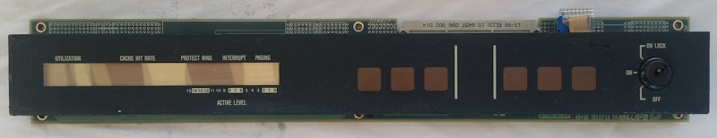

# ND-120 PANEL - ONBOARD PANEL CONTROLLER - MC68705U3

The panel controller controls the LCD display in the panel, and handles button presses and sends that to the CPU board.

## Schematic ##

Sheet 40 of the CPU Board has the MC68705 connectins

## PROM  ##

PROM dump from MC68705U3 for ND-120 CPU Board

(not available)

# The ND-5000C PANEL 

## Panel Controller

The panel uses an MC68705P3 (Which is not the same as the U3 used on the ND-120 CPU board.)
The 68705P3 is 28 pins with 3 ports (PORT A,B and C)

Reference NORSK-DATA.COM:

* [323165 - PCB 1844 - Panel Operator including display, ND-5000C](http://www.norsk-data.com/hardware/nd-other/nd-323165.html)
* [324494 - PCB 1834 - Panel Control](http://www.norsk-data.com/hardware/nd-other/nd-324494.html)
* [xxxxxx - PCB xxxx - LCDs](http://www.norsk-data.com/hardware/nd-other/nd-LCD.html)
* [324147 - PCB 1844 - Telefix/Driver Comson](http://www.norsk-data.com/hardware/nd-other/nd-324147.html)
* [CY7C401 - FIFO](http://www.norsk-data.com/library/libother/extern/CY7C401.pdf)

## PROM  ##

PROM dump from MC68705P3

[Binary PROM dump](ND-5000C-MC68705P3.BIN)

## Dissasembly ##

PROM dump reverse engineered with Ghidra

[68705P3 Dissassembly PDF](P3-Dissassembly.pdf)

## C code

Reverse engineered C code (draft)
[68705 as C code](p3.c)

# 6805 CPU doc

* MC68705P3, 18 page PDF - [MC68705PR 8-BIT EPROM Microcomputer Unit](6805/MC68705P3.PDF)
* 6805P_Oct84, 15 page PDF - [MC68(7)05P SERIES 8-BIT MICROCOMPUTERS](6805/6805P_Oct84.PDF)
* 6805_Users_Manual_2ed_1983, 263 page PDF - [M6805 HMOS/M146805 CMOS FAMILY USERS MANUAL](6805/6805_Users_Manual_2ed_1983.PDF)
