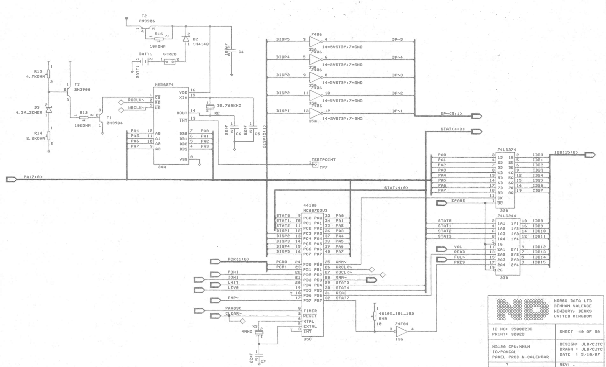

# ND-120 PANEL CONTROLLER - MC68705U3

The panel controller controls the LCD display in the panel, and handles button presses and sends that to the CPU board.

## Schematic ##

Sheet 40 of the CPU Board has the MC68705 connectins

## PROM  ##

[Binary PROM dump](MC68705U3_35C.BIN)

## Dissasembly ##

PROM dump reverse engineered with Ghidra

[Dissassembly PDF](Dissassembly.pdf)