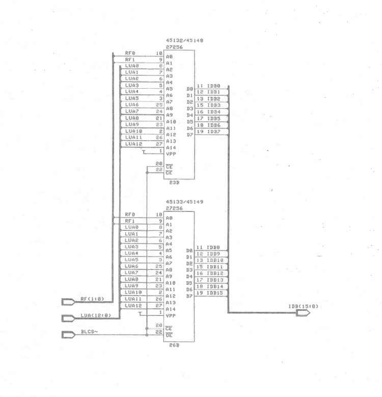
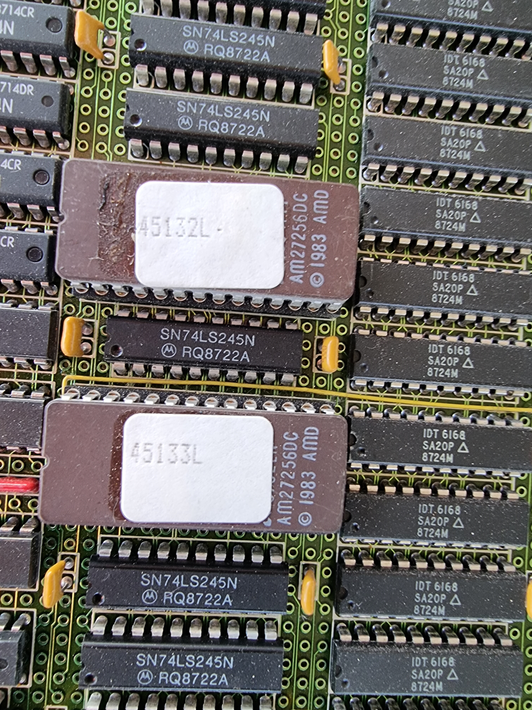

# ND-120/CX Microcode

The complete microcode of the Norsk Data ND-120 "DELILAH" CPU — as EPROM dumps,
as a 600 DPI scan of the original 1987 printed listing, and (the crown jewel)
as **fully reconstructed, compilable assembly source** recovered from that scan
and proven bit-for-bit against the silicon.

## The reconstructed source

| File | Version | What it is |
|------|---------|------------|
| [ND-120-DELILAH-K.LISTING.txt](ND-120-DELILAH-K.LISTING.txt) | K (oct 13) | The printed listing, re-typed from the scans — every line number, label, comment and instruction |
| [nd-120-delilah-K.uc](nd-120-delilah-K.uc) | K | The same source, compilable with the ND110Compile assembler |
| [ND-120-DELILAH-L.LISTING.txt](ND-120-DELILAH-L.LISTING.txt) | L (oct 14) | Version L, derived from K by applying ND's own changes |
| [nd-120-delilah-L-from-K.uc](nd-120-delilah-L-from-K.uc) | L | Compiles **bit-exact against the EPROM dump — all 4886 words** |

The printed listing is version **K**; the EPROMs in the machines are version
**L**. It took a long OCR-correction campaign (every suspect line verified
against the page scans) to get here, and the payoff is the full K→L diff:
Norsk Data bumped the version word, inserted **one** `COMM,SLOW` word in the
CPU-init sequence, removed the P/B/X register-read delay (an assembler
token-table change — no source lines touched), adjusted six condition-false
sequencing specs, and made four small operand fixes. **13 changed source lines
in total, and every jump label identical** — that is the entire difference
between the two ROMs.

The reconstruction pipeline, gates and the full change-log live in the
ND120UC repo (external repository, not in this tree) (`docs/K-to-L-source-changes.md`).

## The EPROMs

The microcode is stored in two 32 KByte EPROMs, each holding 8 bits of a
16-bit word:

- [AM27256_45132L](AM27256_45132L.bin) — LO 8 bits (0–7)
- [AM27256_45133L](AM27256_45133L.bin) — HI 8 bits (8–15)

The 45132/45133 pair contains the 32-bit floating point code; the
45148/45149 pair contains the 48-bit floating point code.

Each 64-bit microcode word is built from 4 consecutive 16-bit reads:

| EPROM Address | Microcode bits |
|---------------|----------------|
| 0 | Bits 48–63 |
| 1 | Bits 32–47 |
| 2 | Bits 16–31 |
| 3 | Bits 0–15 |

The low byte of the word at octal address 020 is the microcode version:
oct 13 = K, oct 14 = L.

## Reading the binary microcode in C#

C# code to read the microcode into a 64-bit wide array named `chip_microcode`:

```csharp
        byte[] LOBits = File.ReadAllBytes("AM27256_45132L.bin");
        byte[] HiBits = File.ReadAllBytes("AM27256_45133L.bin");


        ulong[] chip_microcode = new ulong[1024 * 64];
        int cnt = 0;
        for (int i = 0; i < HiBits.Length; i += 4)
        {
            ulong uc = 0;
            for (int b = 3; b >= 0; b--)
            {                
                ushort w = (ushort)(HiBits[b + i] << 8 | LOBits[b + i]);
                uc = uc << 16;
                uc |= (ushort)w;
            }


            string ucHex = $"{uc:X16}".PadLeft(16, '0');
            string addr = Convert.ToString(cnt, 8).PadLeft(6, '0');

            Console.WriteLine($"i={i}, uC[{addr}]: {ucHex}");
            chip_microcode[cnt++] = uc;
        }

        ushort version = (ushort)(chip_microcode[0x10] & 0xFF);
        Console.WriteLine($"Version is {Convert.ToString(version,8)}  (octal)");

```

## Documentation

- [ND-120 Mikroprogramlisting-L-ocr.pdf](ND-120%20Mikroprogramlisting-L-ocr.pdf)
  — the original printed listing (version K), 249 pages, scanned at 600 DPI.
  The source of truth the reconstruction was verified against.
- [ND-06.031.1 EN ND-110 and ND-120 Microprogrammer's Guide](ND-06.031.1%20EN%20ND-110%20and%20ND-120%20Microprogrammer's%20Guide-Gandalf-OCR.pdf)
  — the reference for understanding the microcode word format and tokens.

## Schematic

Here you can see how the EPROMs were connected to the internal data bus (IDB):



## EPROM on CPU board 3202



## Hex dump of microcode

In case you just want to review the microcode as hex, here is a dump for your
convenience: [Hex dump](microcode.md)
