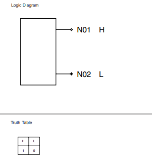
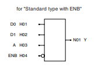
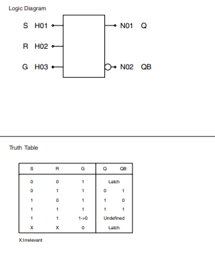

# DGA Chip

[DELILAH Decoding Logic Gate Array (DGA)](ND_DGA.pdf) - 19 pages

The Gate Array is made by NEC, and the components refer to their library from 1986.

There are details in the PDF that needs additional context, showing what the components really are:

* https://www.semiee.com/file/EOL2/NEC-UPD65000.pdf  
    * [Local PDF](NEC-UPD65000.pdf)
* https://www.renesas.com/jp/ja/document/lbr/687546 
    * [Local PDF](REN_A15895EJ1V0BL00_LBR_20021001.pdf)

Using these documents its possible to decode the different components like F571, F595, ..

## What is an "F091" ##

> H, L Level Generator

## What is an "F571" ##

> 2 to 1 Multiplexer (Positive Out) with ENB

## What is an "F595" ##

> RS Latch

## What is an "F924" ##

>??

## What is an "F714" ##

> 

