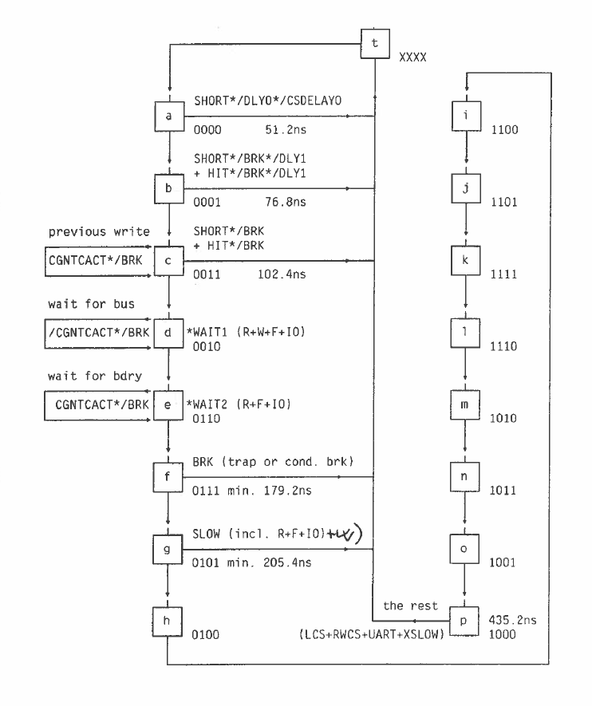
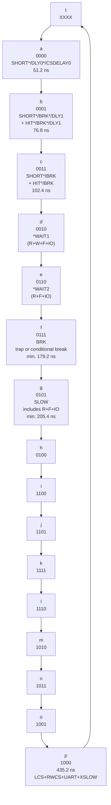

# 4-Bit Gray-Coded Bus Timing State Machine

## Purpose

This diagram shows a **4-bit state-machine / timing sequencer**.  
The states are named `a` through `p`, with a special entry or unknown state `t`.

The state values are not normal binary counting. They follow a **4-bit Gray-code sequence**, meaning that only **one bit changes between consecutive states**. This is useful in hardware because it reduces the risk of glitches when decoding state transitions.





---

## State Encoding Table

| State | Binary value | Notes |
|---|---:|---|
| `t` | `XXXX` | Unknown / don't-care / pre-entry state |
| `a` | `0000` | Early short-delay phase |
| `b` | `0001` | Delay phase involving `SHORT`, `BRK`, `DLY1`, `HIT` |
| `c` | `0011` | Previous-write / break-related phase |
| `d` | `0010` | `WAIT1`, waiting for bus |
| `e` | `0110` | `WAIT2`, waiting for boundary / bus-ready style condition |
| `f` | `0111` | `BRK`, trap or conditional break |
| `g` | `0101` | `SLOW`, includes slow read/fetch/I/O cases |
| `h` | `0100` | End of left-side sequence |
| `i` | `1100` | Start of right-side continuation |
| `j` | `1101` | Continuation state |
| `k` | `1111` | Continuation state |
| `l` | `1110` | Continuation state |
| `m` | `1010` | Continuation state |
| `n` | `1011` | Continuation state |
| `o` | `1001` | Continuation state |
| `p` | `1000` | Final shown state before returning/wrapping |

---

## Extracted State Sequence

```text
t -> a -> b -> c -> d -> e -> f -> g -> h -> i -> j -> k -> l -> m -> n -> o -> p
```

The binary sequence is:

```text
XXXX,
0000, 0001, 0011, 0010,
0110, 0111, 0101, 0100,
1100, 1101, 1111, 1110,
1010, 1011, 1001, 1000
```

Without the unknown `t` state:

```text
0000, 0001, 0011, 0010,
0110, 0111, 0101, 0100,
1100, 1101, 1111, 1110,
1010, 1011, 1001, 1000
```

This is the standard 4-bit reflected Gray-code order.

---

## Mermaid Diagram



---

## Timing Values Visible in the Diagram

| State / point | Time shown |
|---|---:|
| `a` | `51.2 ns` |
| `b` | `76.8 ns` |
| `c` | `102.4 ns` |
| `f` | minimum `179.2 ns` |
| `g` | minimum `205.4 ns` |
| `p` | `435.2 ns` |

The early timing increments are approximately `25.6 ns`.

```text
76.8 ns - 51.2 ns = 25.6 ns
102.4 ns - 76.8 ns = 25.6 ns
```

That corresponds to a timing base of approximately:

```text
1 / 25.6 ns = 39.0625 MHz
```

This suggests the sequencer may be based on a roughly `39 MHz` timing clock or equivalent derived timing interval.

---

## Interpretation of Main Control Labels

### `SHORT`

Likely indicates a short-cycle path, where the bus operation can complete without entering the full slow sequence.

### `BRK`

Indicates a break condition. The diagram explicitly mentions:

```text
BRK (trap or cond. brk)
```

So this may cover trap handling or conditional break logic.

### `WAIT1` and `WAIT2`

These are wait states.

From the diagram:

```text
WAIT1 (R+W+F+IO)
WAIT2 (R+F+IO)
```

This suggests that read, write, fetch, and I/O cycles can cause waiting, but the second wait state may not apply to all write cases.

### `SLOW`

The `SLOW` state appears to extend the cycle for slower accesses.

The diagram notes:

```text
SLOW (incl. R+F+IO)
```

At the end, additional slow-cycle sources are listed:

```text
LCS + RWCS + UART + XSLOW
```

These likely represent different hardware-controlled slow paths.

---

## Key Point

The diagram is best understood as a **hardware bus-cycle timing sequencer** using a **4-bit Gray-code state counter**.

The complete state encoding from `a` to `p` is:

| Order | State | Binary |
|---:|---|---:|
| 1 | `a` | `0000` |
| 2 | `b` | `0001` |
| 3 | `c` | `0011` |
| 4 | `d` | `0010` |
| 5 | `e` | `0110` |
| 6 | `f` | `0111` |
| 7 | `g` | `0101` |
| 8 | `h` | `0100` |
| 9 | `i` | `1100` |
| 10 | `j` | `1101` |
| 11 | `k` | `1111` |
| 12 | `l` | `1110` |
| 13 | `m` | `1010` |
| 14 | `n` | `1011` |
| 15 | `o` | `1001` |
| 16 | `p` | `1000` |

---

## See also

- [`../../Verilog/docs/hw-timing-vs-verilog.md`](../../Verilog/docs/hw-timing-vs-verilog.md)
  - How this cycle timing maps into the Verilog implementation, and why our
    zero/uniform-delay Verilog behaves differently from the original ASIC (CGA/DGA)
    plus TTL hardware. Notes (per the designer) that signal-phase mismatches between
    our model and the real machine may be timing-model artifacts rather than logic
    bugs, and that we may need to deliberately re-introduce signal delays/phasing to
    match the real inter-chip timing. Relevant when using these cycle-state timings
    to reason about ALUCLK/MCLK/MACLK and the terminate (TERM) latch.
