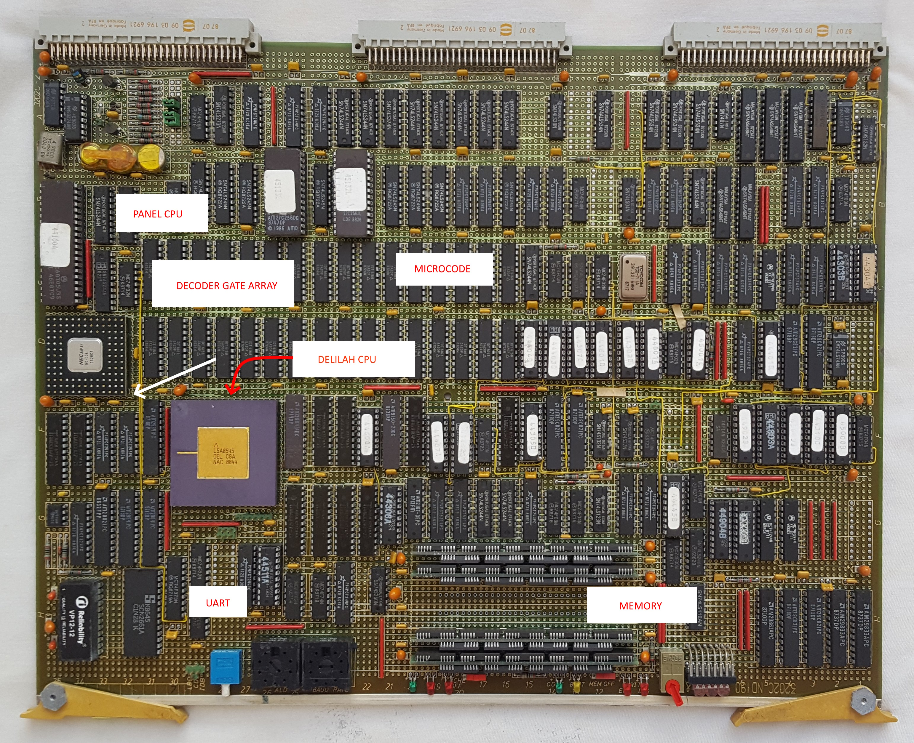

# 3202D CPU Board for ND-120 CPU #

The 3202D CPU Board is described in the design documents in a PDF spanning 50 pages.

# 3202D Circuits #

A few Logisim files has been created.

## Status of Logisim drawings from 3202D Schematics PDF ##

| Page name         |                       | PDF page number(s) | Area         | Status                                      | Comment                                                                 |
|-------------------|-----------------------|--------------------|--------------|---------------------------------------------|-------------------------------------------------------------------------|
| **Main PCB**                              |
| DELILAH TOP LEVEL | BLOCK DIAGRAM         | 1                  | D3202        |                                             | Combines CYC + CPU + BIF + IO + MEM |
| DELILAH TOP LEVEL | A PLUG                | 2                  | D3202        |                                             |
| DELILAH TOP LEVEL | B PLUG                | 3                  | D3202        |
| DELILAH TOP LEVEL | C PLUG                | 4                  | D3202        |
| **Bus interface** |                       |                    |              | Compiles to Verilog successfull!            |
| BIF               | BUS IF                | 5                  | BIF          | Complete                                    |
| BIF/BCTL          | BIF CONTROL           | 6                  | BIF          | Complete. Need fix in Verilog               | PAL 44801, 44401, 45001
| BIF/BCTL/BDRV     | BUS DRIVERS           | 7                  | BIF          | Complete                                    |
| BIF/DPATH         | BIF SYNC              | 8                  | BIF          | Complete                                    |
| BIF DATA PATH     | BIF SYNC              | 9                  | BIF          | Complete. Need fix in Verilog               |
| BIF/DPATH/BDLBD   | BIF BD TO LBD         | 10                 | BIF          | Complete                                    |
| BIF/DPATH/CDLBD   | BIF CD TO LBD         | 11                 | BIF          | Complete                                    |
| BIF/DPATH/LBCTL   | LBD CONTROL           | 12                 | BIF          | Complete. Need fix in Verilog               | PAL 44302, 44303, 44304
| BIF/DPATH/PESPEA  | BIF PES & PEA         | 13                 | BIF          | Complete. Need fix in Verilog               |
| BIF/DPATH/PPNLBD  | BIF PPN to LBD        | 14                 | BIF          | Complete                                    |
| **CPU**
| CPU               | TOP LEVEL             | 15                 | CPU          | Will be done in Verilog directly            |
| CPU/CS            | CONTROL STORE         | 16                 | CPU          | Complete. Need 1 fix in Verilog             |
| CPU/CS/ACAL       | MICRO ADDR CALC       | 17                 | CPU          | Complete                                    |
| CPU/CS/CTL        | CS CONTROL            | 18                 | CPU          | Complete                                    |
| CPU/CS/PROM       | CS PROMS              | 19                 | CPU          | Complete                                    | Microcode EPROMS |
| CPU/CS/TCV        | CS TRANSCIEVERS       | 20                 | CPU          | Complete                                    |
| CPU/CS/WCS        | Register file         | 21-22              | CPU          | Complete                                    |
| CPU/LAPA          | LA TO PPN BUFF        | 23                 | CPU          | Complete                                    |
| CPU/MMU           | MMU TOP LEVEL         | 24                 | CPU          | Complete                                    | PAL 44306 |
| CPU/MMU/CACHE     | CACHE                 | 25                 | CPU          | Will be done in Verilog directly            | 4x TMM2018D_25(16K Static RAM) and 1x AM9150_20 (1024 x 4 High-Speed Static R/W RAM) |
| CPU/MMU/CSR       | CACHE STATUS REG      | 26                 | CPU          | Complete                                    |
| CPU/MMU/HIT       | HIT DETECTION         | 27                 | CPU          | Complete                                    |
| CPU/MMU/PPNX      | PPN TO IDB            | 28                 | CPU          | Will be done in Verilog directly            | Uses 2x SNx4LS245 Octal Bus Transceivers With 3-State Outputs  +  74LS244 |
| CPU/MMU/PT        | PAGE TABLES           | 29                 | CPU          | Will be done in Verilog directly            | 4x TMM2018D_25  (16K Static RAM) and 1x IMS1403_25 (16K x 1 Static RAM) |
| CPU/MMU/PTIDB     | PT TO IDB             | 30                 | CPU          | Complete                                    | Uses 2x SNx4LS245 Octal Bus Transceivers With 3-State Outputs |
| CPU/MMU/WCA       | PPN TO CPN            | 31                 | CPU          | Complete                                    |
| CPU/PROC          | PROCESSOR TOP LEVEL   | 32                 | CPU          | Will be done in Verilog directly            | 2x TMM2018D_25  (16K Static RAM)
| CPU/PROC/CGA      | CPU GATE ARRAY        | 33                 | CPU          | Will be done in Verilog directly            | DELILAH Circuits plugin |
| CPU/PROC/CMDDEC   | COMMANDS & IDB DECODE | 34                 | CPU          | Drawing complete. PAL's needs to be created | PAL 44407, 44608, 44511 |
| CPU/STOC          | IDB TO CD             | 35                 | CPU          | Complete                                    |
| **Cycle control** |                       |                    |              | Compiles to Verilog successfull!            |
| CYC               | CYCLE CONTROL         | 36                 | CYC          | Drawing complete. 4x fixed in Verilog needed. PAL's needs to be created |PAL 44404, 44403, 44601/44611, 44307
| **IO**            |                       |                    |              | Compiles to Verilog successfull!            |
| IO                | IO TOP LEVEL          | 37                 | IO           | Partially - finish in Verilog               |
| IO/DCD            | IO DECODING           | 38                 | IO           | Partially - finish in Verilog               |
| IO/DCD/DGA        | DECODE GATE ARRAY     | 39                 | IO           | Partially - finish in Verilog               | DECODE GATE ARRAY (DGA) Plugin |
| IO/PANCAL         | PANEL PROC & CALENDAR | 40                 | IO           | Partially - finish in Verilog               | PANEL CPU |
| IO/REG            | IOC, ALD & INR REGS   | 41                 | IO           | Complete                                    | ALD register has also STRAP 5-9info in IDB11-IDB8 (For reading ECO level) IDB4-6 has "Print level", 0b100 for version D. IDB7 has info on CX, 0=Enabled
| IO/UART           | UART AND IOR REG      | 42                 | IO           | Complete. UART must be made in Verilog. Signal need to be fixed in Verilog |
| **Memory**
| MEM               | MEMORY TOP LEVEL      | 43                 | MEM          |
| MEM/ADDR          | MEM ADDR MUX          | 44                 | MEM          | Complete. Need signal fix in Verilog        |
| MEM/ADEC          | ADDRESS DECODER       | 45                 | MEM          |   | PAL 44425/44445/44465, 44426/44446/44466, 44904 |
| MEM/DATA          | DATA & PARITY TCV     | 46                 | MEM          |   | PAL 45008
| MEM/ERROR         | LOCAL PES & PEA       | 47                 | MEM          | Complete                                    | PAL 45009
| MEM/LBDIF         | LOCAL BD CONTROL      | 48                 | MEM          | Complete. Some signals needs manual connections in Verilog | PAL 44310          |
| MEM/RAM           | LOCAL RAM             | 49                 | MEM          | Complete. Need Memory Chip SIP1M9 designed  | 3 Banks with 1 MegaWord RAM = 6MB |
| MEM/RAMC          | LOCAL RAM CONTROL     | 50                 | MEM          | Complete                                    | PAL 44803,44902                   |
