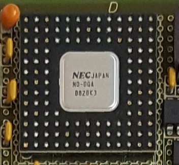

# NEC Decode Gate Array #

The Decode Gate Array (DGA) is described in a PDF spanning 19 pages

# DGA Circuits #

The decoder diagrams are all in one file: ND_DGA

## Status of Logisim drawings from DGA Schematics PDF ##

* Helper circuits needs to be validated
* All circuits needs to be tested

| Page name          | PDF page number(s) |  Status | Comment |
|--------------------|--------------------|---------|---------|
| DECODE_DGA         | 1-7 (8 pages)      |  OK |
| DECODE_DGA_POW     | 8-10 (3 pages)     |  OK |
| DECODE_DGA_PFIFD   | 11 (1 page)        |  OK |
| DECODE_DGA_PFIFC   | 12 (8 pages)       |  OK |
| DECODE_DGA_PFIFC_DELAY | 13 (1 page)    |  OK |
| DECODE_DGA_IDBS    | 14-15 (2 pages)    |  OK |
| DECODE_DGA_COMM    | 16-19 (4 pages)    |  OK |

## Helper Circuits

Details found in the NEC User's Manual 

* **CMOS-8L Family CMOS Gate Array**
* **Block Library Ver 5.0**
* File: REN_A12213XJ5V1UM00_OTH_19980801.PDF

| Circuits name      | Description                                      | Status |
|--------------------|--------------------------------------------------|--------|
| F091               |  Level Generator                                 | OK |
| F103               |  Inverter                                        | OK |
| F571               |  2 to 1 MULTIPLEXER POSITIVE OUTPUT WITH ENABLE  | OK |
| F595               |  RS-LATCH                                        | OK |
| F617               |  D Flip-Flop with RB an SB                       | OK |
| F924               |  4-BIT D Flip-Flop                               | OK |
| F714               |  T Flip-Flop with R an S                         | OK |
| F774               |  JK-F/F WITH R,S                                 | OK |
