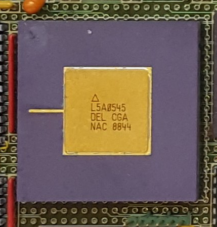

# DELILAH #

The DELIAH CPU is described in the design documents in a PDF spanning 105 pages.

# DELILAH Circuits #

The Logisim CPU diagrams are split over multiple files:

| File       | Pages              | Description                                 | Note |
|------------|--------------------|---------------------------------------------|------|
| DELILAH    | 2-9 (9 pages)      | Combines all CGA pages into the DELILAH CPU |
| CGA_HELPER |  -                 | 16 bit three-state bus driver. Special made for CGA page 6 | Need to find a better solution |
| CGA_MIC    | 10-23 (14 pages)   | Micro adressing  |
| CGA_MAC    | 24-40 (17 pages)   | Macro adressing  |
| CGA_ALU    | 41-58 (18 pages)   | ALU              |
| CGA_WRF    | 59-64 (6 pages)    | Register File    |
| CGA_DCD    | 65-73,75 (11 pages)| Decoding         |
| CGA_INTR   | 76-96 (21 pages)   | Interrupt        |
| CGA_IDBCTL | 97-99 (3 pages)    | IDB Control      |
| CGA_TRAP   | 100-104 (5 pages)  | TRAP System      |
| TEXTMUX    | 105 (1 page)       | Testmux          |
| ND_LIB     |      -             | Support components used acrosss multiple schematics |

## Status of Logisim drawings from ND-120 CPU Schematics PDF ##

| Page name          | PDF page number(s) | LogiSim file | Status | Comment |
|--------------------|--------------------|--------------|--------|---------|
|CGA                 | 2-9 (8 pages)      | DELILAH |
| **Micro adressing**|                    |   -     |
|CGA_MIC             | 10-13 (4 pages )   | CGA_MIC |
|CGA_MIC_CSEL        | 14                 | CGA_MIC | 
|CGA_MIC_CONDREG     | 15                 | CGA_MIC | 
|CGA_MIC_IINC        | 16                 | CGA_MIC | 
|CGA_MIC_STACK       | 17                 | CGA_MIC | 
|CGA_MIC_STACK_BIT   | 17                 | CGA_MIC | 
|CGA_MIC_STACK_BIT12 | 18                 | CGA_MIC | 
|CGA_MIC_MASEL       | 19                 | CGA_MIC | 
|CGA_MIC_MASEL_REPEAT| 20                 | CGA_MIC | 
|CGA_MIC_WCAREG      | 21                 | CGA_MIC | 
|CGA_MIC_IPOS        | 22                 | CGA_MIC | | <=== TRAP GIVES INPUT HERE|
|CGA_MIC_INCOUNT     | 23                 | CGA_MIC | 
| **Macro adressing**|                    |   -     |
|CGA_MAC             | 24                 | CGA_MAC |
|CGA_MAC_DECODE      | 25-28 (4 pages)    | CGA_MAC |
|CGA_MAC_ADD         | 29                 | CGA_MAC | Looks good, need test
|CGA_MAC_FASTADD     | 30                 | CGA_MAC | OK!
|CGA_MAC_APOS        | 31                 | CGA_MAC | -
|CGA_MAC_APOS_CALCA  | 32                 | CGA_MAC | Seems ok
|CGA_MAC_APOS_INC    | 33                 | CGA_MAC | Tested OK
|CGA_MAC_PTSEL       | 34                 | CGA_MAC | Added NOT to PR/CL  (needs more test)
|CGA_MAC_SEGPT       | 35                 | CGA_MAC | Seems OK
|CGA_MAC_SEGPT_SEG   | 36                 | CGA_MAC | Seems OK
|CGA_MAC_SEGPT_PCR   | 37                 | CGA_MAC | Seems OK
|CGA_MAC_SEGPT_XPT   | 38                 | CGA_MAC | Seems OK
|CGA_MAC_LASEL       | 39                 | CGA_MAC | Manually fixed |
|CGA_MAC_LA_1025     | 40                 | CGA_MAC |
| **ALU**            |                    |   -     |
|CGA_ALU             | 41                 | CGA_ALU |
|CGA_CPU_ALU_CONTR   | 42                 | CGA_ALU |
|CGA_CPU_ALU_QREG    | 43                 | CGA_ALU |
|CGA_CPU_ALU_RMUX    | 44                 | CGA_ALU |
|CGA_CPU_ALU_SMUX    | 45                 | CGA_ALU |
|CGA_CPU_ALU_RALU    | 46                 | CGA_ALU |
|CGA_ALU_MUX216L     | 47                 | CGA_ALU |
|CGA_ALU_LOGOP       | 48                 | CGA_ALU |
|CGA_ALU_SHIFT       | 49                 | CGA_ALU |
|CGA_ALU_GPR         | 50                 | CGA_ALU |
|CGA_ALU_STS         | 51                 | CGA_ALU |
|CGA_ALU_DBR         | 52                 | CGA_ALU |
|CGA_ALU_ARG         | 53                 | CGA_ALU |
|CGA_ALU_SWAP        | 54                 | CGA_ALU |
|CGA_ALU_OUTMUX      | 55                 | CGA_ALU |
|CGA_ALU_OUTMUX_SEL8 | 56                 | CGA_ALU |
|CGA_ALU_OUTMUX_SEL7 | 57                 | CGA_ALU |
|CGA_ALU_OUTMUX_IDBS | 58                 | CGA_ALU |
| **Register file**  |                    |   -     |
|CGA_WRF                  | 59            | CGA_WRF |
|CGA_WRF_RBLOCK           | 60            | CGA_WRF |
|CGA_ALU_WRF_RBLOCK_SEL16 | 61            | CGA_WRF |
|CGA_WRF_RBLOCK_PREG      | 62            | CGA_WRF |
|CGA_WRF_RBLOCK_LR16      | 63            | CGA_WRF |
|CGA_WRF_RBLOCK_DR16      | 64            | CGA_WRF |
| **Decoding**       |                    |   -     |
|CGA_DCD             | 65-73, 75 (11 Pages) | CGA_DCD |
| **Interrupt**      |                    |   -     |
|CGA_INTR                         | 74    | CGA_INTR | |Combines IRSRC + CNTLR
|CGA_INTR_IRSRC                   | 76    | CGA_INTR | |
|CGA_INTR_CNTLR                   | 77    | CGA_INTR | |Combines IMUX + IRQ + CLR + VECGEN + MDCD + IRGEL
|CGA_INTR_CNTLR_IRQ_REG_RQBIT     | 78    | CGA_INTR | |
|CGA_INTR_CNTLR_IRQ_REG           | 78    | CGA_INTR | |
|CGA_INTR_CNTLR_IRQ               | 79    | CGA_INTR | |Combines REG + MASK + MREQ
|CGA_INTR_CNTLR_IRQ_MASK          | 80    | CGA_INTR | |
|CGA_INTR_CNTLR_IRQ_MASK_MASKBIT  | 80    | CGA_INTR | |
|CGA_INTR_CNTLR_IRQ_MREQ          | 81    | CGA_INTR | |
|CGA_INTR_CNTLR_CLR               | 82    | CGA_INTR | |
|CGA_INTR_CNTLR_CLR_CLRBIT        | 82    | CGA_INTR | |
|CGA_INTR_CNTLR_VECGEN            | 83    | CGA_INTR | |Combines all VECGEN_* circuits
|CGA_INTR_CNTLR_VECGEN_PTY        | 84    | CGA_INTR | |
|CGA_INTR_CNTLR_VECGEN_PTY_PTYENC | 84    | CGA_INTR | |
|CGA_INTR_CNTLR_VECGEN_ISMUX      | 85    | CGA_INTR | |
|CGA_INTR_CNTLR_VECGEN_VHR        | 86    | CGA_INTR | |
|CGA_INTR_CNTLR_VECGEN_STAT       | 87    | CGA_INTR | |
|CGA_INTR_CNTLR_VECGEN_STAT_SBIT  | 87    | CGA_INTR | |
|CGA_INTR_CNTLR_VECGEN_CMP        | 88    | CGA_INTR | |
|CGA_INTR_CNTLR_VECGEN_CMP_MAGCMP | 88    | CGA_INTR | |
|CGA_INTR_CNTLR_VECGEN_OSMUX      | 89    | CGA_INTR | |
|CGA_INTR_CNTLR_IRGEL             | 90    | CGA_INTR | |Combines all IRGEL_* circuits
|CGA_INTR_CNTLR_IRGEL_HIRL        | 91    | CGA_INTR | |
|CGA_INTR_CNTLR_IRGEL_LORL        | 92    | CGA_INTR | |
|CGA_INTR_CNTLR_IRGEL_HIGEL       | 93    | CGA_INTR | |
|CGA_INTR_CNTLR_IRGEL_LOGEL       | 94    | CGA_INTR | |
|CGA_INTR_CNTLR_IRGEL_VMUX        | 95    | CGA_INTR | |
|CGA_INTR_CNTLR_MDCD              | 96    | CGA_INTR | |
| **IDB Control**|                |   -   |
|CGA_IDBCTL                       | 97    | CGA_IDBCTL | |
|CGA_IDBCTL_PGSREG                | 98    | CGA_IDBCTL | |
|CGA_IDBCTL_SEL6                  | 99    | CGA_IDBCTL | |
| **TRAP System**|                |   -   |
|CGA_TRAP                         | 100   | CGA_TRAP | | Combines CGA_TRAP_TBUF with CGA_TRAP_BRKDET and CGA_TRAP_TVGEN
|CGA_TRAP_BRKDET                  | 103   | CGA_TRAP | | Break detection
|CGA_TRAP_TBUF                    | 101   | CGA_TRAP | | 
|CGA_TRAP_TVGEN (1/2)             | 102   | CGA_TRAP | | Trap Vector generator
|CGA_TRAP_TVGEN (2/2)             | 104   | CGA_TRAP | | Trap Vector generator
| **Text mux**|                   |   -   |
|CGA_TESTMUX                      | 105   | TEXTMUX  | | Mux that selects test signals to be output from the CPU
