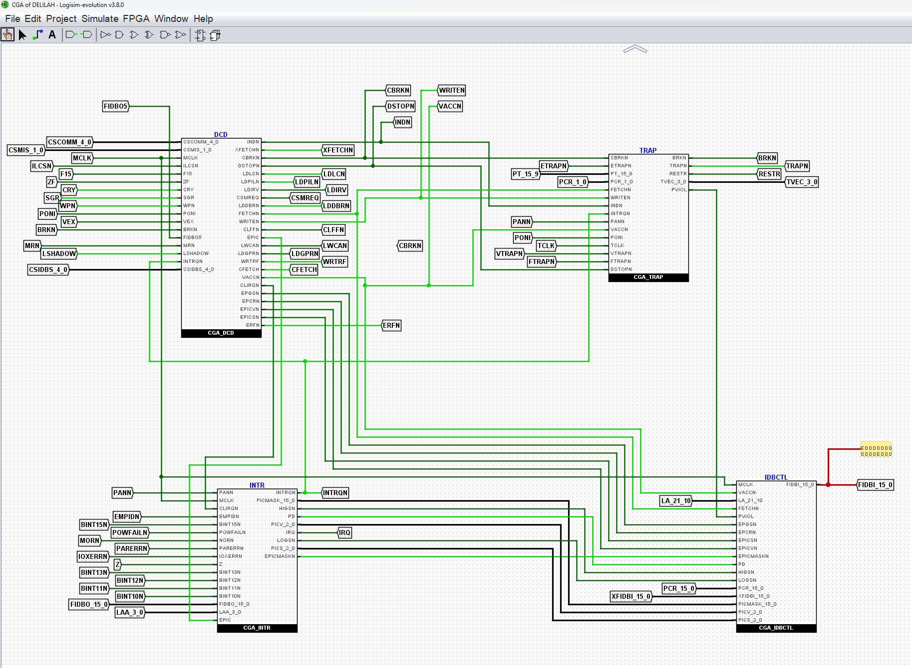

# Logisim files #

There are 3 set of Logisim schematic files

* [DELILAH CPU](DELILAH-CPU/readme.md)
* [Decoder Gate Array](DECODE-GateArray/readme.md)
* [3202D CPU Board](CPU-BOARD-3202/readme.md)

## Screenshot of Logisim schematich - part of DELILAH

