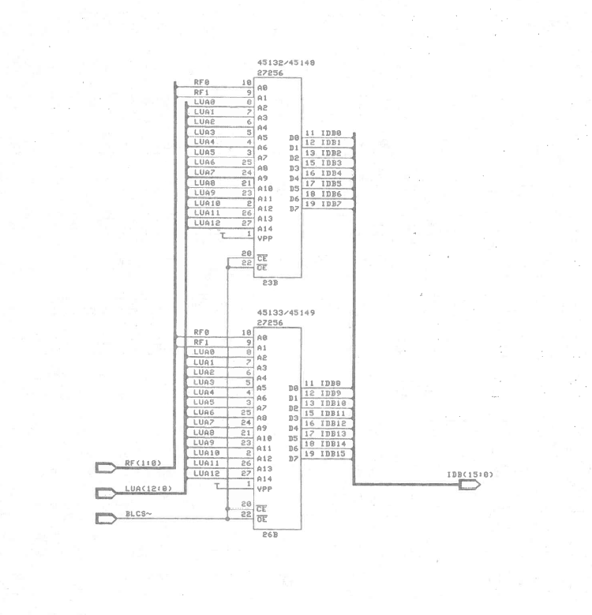
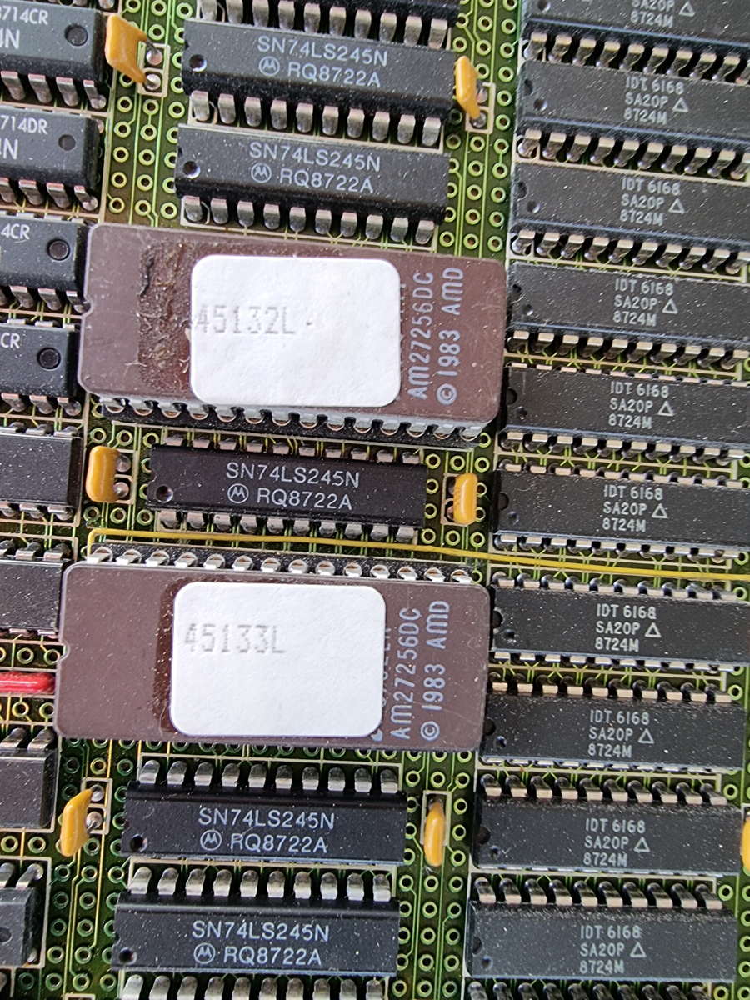

# ND-120/CX Microcode


The Microcode is stored in two different EPROM's each holding 8-bit of a 16 bit word

Each EPROM is 32KBytes

The PROM's 45123/45133 contains the 32 bits floating point code, the PROM's 45148/45149 contains the 48bit floating point code

[AM27256_45132L](AM27256_45132L.bin) = Contains the LO 8 bits (0-7)
[AM27256_45133L](AM27256_45133L.bin) = Contains the HI 8 bits (8-15)

When creating the 64 bit microcode, you will need to read 4 addresses of 16 bits to get the 


| EPROM Address | Microcode bits | 
|---------|----------------|
| 0       | Bits 48-63 |
| 1       | Bits 31-47 | 
| 2       | Bits 16-31 | 
| 3       | Bits 0-15 |


## Microcode source code ##

The [Source code](ND-120%20Mikroprogramlisting-L-ocr.pdf) for the microcode is available as a PDF with a total of 249 pages.
Its scanned in 600 DPI and it's been OCR'ed

The [ND-06.031.1 EN ND-110 and ND-120 Microprogrammer's Guide](ND-06.031.1%20EN%20ND-110%20and%20ND-120%20Microprogrammer's%20Guide-Gandalf-OCR.pdf) is useful for understanding the microcode.

## Reading the binary microcode in C# ##
C# code to read the microcode into an 64bit wide array named chip_microcode


```csharp
        byte[] LOBits = File.ReadAllBytes("AM27256_45132L.bin");
        byte[] HiBits = File.ReadAllBytes("AM27256_45133L.bin");


        ulong[] chip_microcode = new ulong[1024 * 64];
        int cnt = 0;
        for (int i = 0; i < HiBits.Length; i += 4)
        {
            ulong uc = 0;
            for (int b = 3; b >= 0; b--)
            {                
                ushort w = (ushort)(HiBits[b + i] << 8 | LOBits[b + i]);
                uc = uc << 16;
                uc |= (ushort)w;
            }


            string ucHex = $"{uc:X16}".PadLeft(16, '0');
            string addr = Convert.ToString(cnt, 8).PadLeft(6, '0');

            Console.WriteLine($"i={i}, uC[{addr}]: {ucHex}");
            chip_microcode[cnt++] = uc;
        }

        ushort version = (ushort)(chip_microcode[0x10] & 0xFF);
        Console.WriteLine($"Version is {Convert.ToString(version,8)}  (octal)");

```


## Schematic ##

Here you can se how the EPROM's was connected to the internal databuse (IDB)



## EPPROM on CPU board 3202 ##



## Hex dump of Microkode ##

In case you just want to review the microcode as hex, here is a dump for your convinience

[Hex dump](microcode.md)