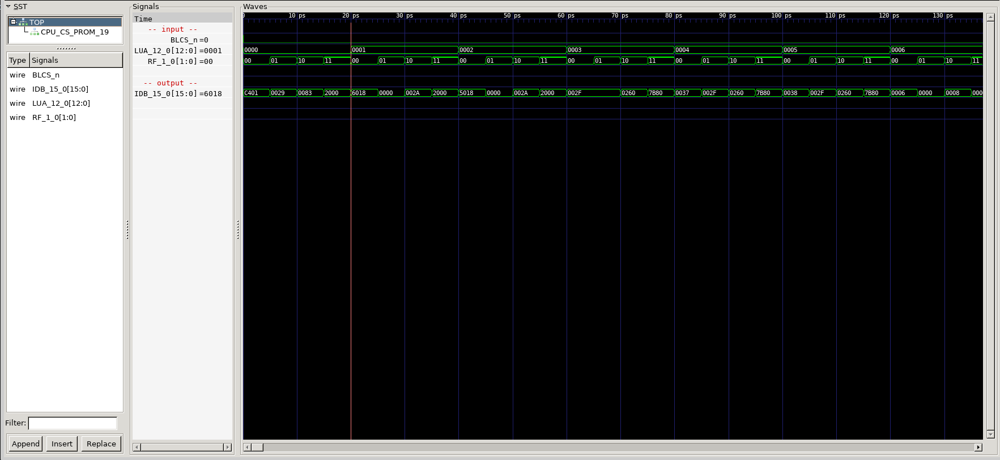
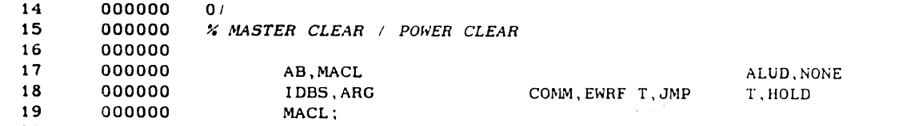

# CPU/CS/PROM

MICROCODE PROM

## CPU Board 3202D - Sheet 19

### Test program verification

The IDB values show the microcode. 16 bits.

RF selects which part of the 64 bit microcode, and LUA is the microcode address.

We can see the microcode at address 0 is

<h1>0x200000830029C401</h1>

