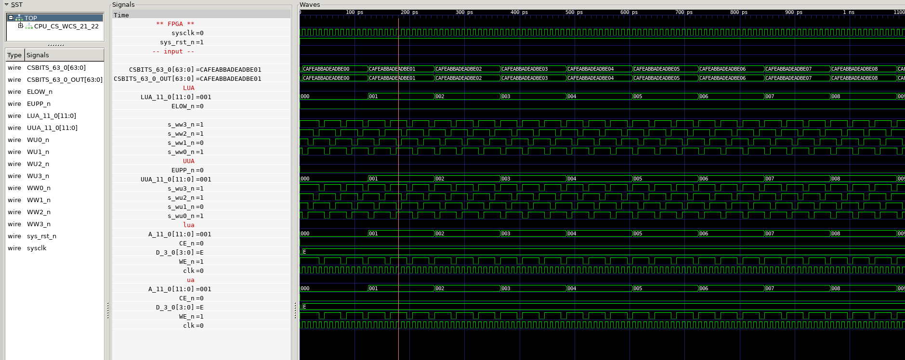

# CPU/CS/WCS

WRITABLE CONTROL STORE

## CPU Board 3202D - Sheet 19

### Test program verification

Test code writes 32 addressed to LUA and UUA. Output values while both are selected will be from LUA

Then reads the contents of UUA, same 32 addresses.

