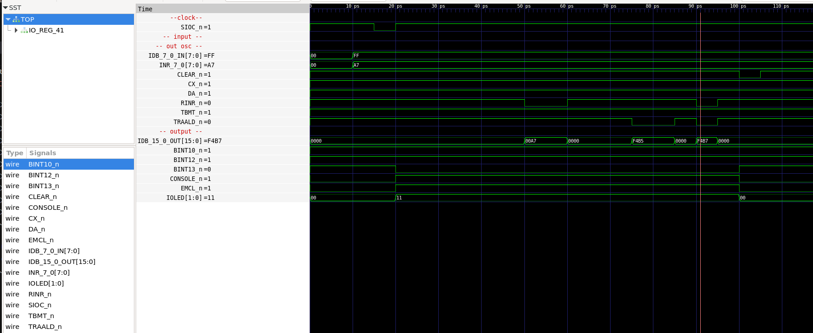

# IO / REG

IOC, ALD and INR regs

* Write to IDB = 0xFF;
* Write to INR = 0xA7;
* Latch 0xFF to IOC (chip 28A) => Change signals for SCONS,EMCL, LED2,LED3, IOC3:0

* Read INR => IDB OUT = 0xA7
* Stop reading => IDB OUT = 0
* Read ALD => IDB OUT = 0xF4B5

* Read both INR and ALD at the same time to validate that output is OR'ed together => IDB OUT = 0xF4B7

* Clear IOC chip by setting CLEAR_n low

## CPU Board 3202D - Sheet 41

### Test program verification

