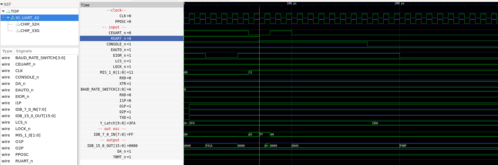

# IO / UART

## CPU Board 3202D - Sheet 42

* Read IO signal from chip 33G    - 0xF81A
* Write command register to UART  - 0xA5
* Read command register from UART - 0xA5
* Change IO signal for CONSOLE    - IO signal changes to 0xF01A
* Read both IO and UART to see that the data is "or'ed" together - 0xF0BF

### Test program verification

