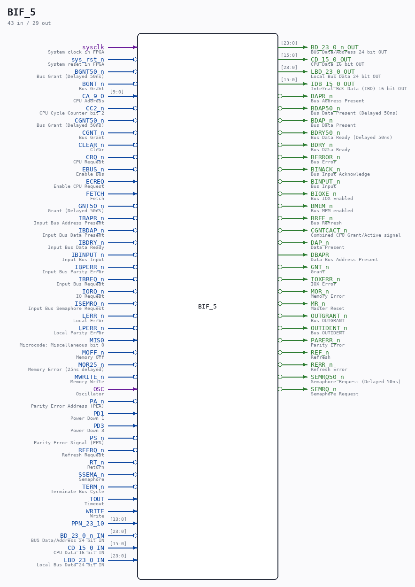

# BIF_5

Source: `/mnt/e/Dev/Repos/Ronny/nd-120/Verilog/CPU-BOARD-3202/circuit/BIF_5.v`

> Generated by `Verilog/tests/module_doc.py` from the `//!`
> comments in the source. Do not edit by hand - edit the RTL comments and regenerate.

## Description

ND120 CPU, MM&M
BIF/BCTL
BUS INTERFACE
SHEET 5  of 50
Last reviewed: 22-MAR-2025
Ronny Hansen

## Ports

| Direction | Width | Name | Description |
|---|---|---|---|
| input | `1` | `sysclk` | System clock in FPGA |
| input | `1` | `sys_rst_n` *(active low)* | System reset in FPGA |
| input | `1` | `BGNT50_n` *(active low)* | Bus Grant (Delayed 50ns) |
| input | `1` | `BGNT_n` *(active low)* | Bus Grant |
| input | `[9:0]` | `CA_9_0` | CPU Address |
| input | `1` | `CC2_n` *(active low)* | CPU Cycle Counter bit 2 |
| input | `1` | `CGNT50_n` *(active low)* | Bus Grant (Delayed 50ns) |
| input | `1` | `CGNT_n` *(active low)* | Bus Grant |
| input | `1` | `CLEAR_n` *(active low)* | Clear |
| input | `1` | `CRQ_n` *(active low)* | CPU Request |
| input | `1` | `EBUS_n` *(active low)* | Enable Bus |
| input | `1` | `ECREQ` | Enable CPU Request |
| input | `1` | `FETCH` | Fetch |
| input | `1` | `GNT50_n` *(active low)* | Grant (Delayed 50ns) |
| input | `1` | `IBAPR_n` *(active low)* | Input Bus Address Present |
| input | `1` | `IBDAP_n` *(active low)* | Input Bus Data Present |
| input | `1` | `IBDRY_n` *(active low)* | Input Bus Data Ready |
| input | `1` | `IBINPUT_n` *(active low)* | Input Bus Input |
| input | `1` | `IBPERR_n` *(active low)* | Input Bus Parity Error |
| input | `1` | `IBREQ_n` *(active low)* | Input Bus Request |
| input | `1` | `IORQ_n` *(active low)* | IO Request |
| input | `1` | `ISEMRQ_n` *(active low)* | Input Bus Semaphore Request |
| input | `1` | `LERR_n` *(active low)* | Local Error |
| input | `1` | `LPERR_n` *(active low)* | Local Parity Error |
| input | `1` | `MIS0` | Microcode: Miscellaneous bit 0 |
| input | `1` | `MOFF_n` *(active low)* | Memory Off |
| input | `1` | `MOR25_n` *(active low)* | Memory Error (25ns delayed) |
| input | `1` | `MWRITE_n` *(active low)* | Memory Write |
| input | `1` | `OSC` | Oscillator |
| input | `1` | `PA_n` *(active low)* | Parity Error Address (PEA) |
| input | `1` | `PD1` | Power Down 1 |
| input | `1` | `PD3` | Power Down 3 |
| input | `1` | `PS_n` *(active low)* | Parity Error Signal (PES) |
| input | `1` | `REFRQ_n` *(active low)* | Refresh Request |
| input | `1` | `RT_n` *(active low)* | Return |
| input | `1` | `SSEMA_n` *(active low)* | Semaphore |
| input | `1` | `TERM_n` *(active low)* | Terminate Bus Cycle |
| input | `1` | `TOUT` | Timeout |
| input | `1` | `WRITE` | Write |
| input | `[13:0]` | `PPN_23_10` |  |
| input | `[23:0]` | `BD_23_0_n_IN` | BUS Data/Address 24 bit IN |
| output | `[23:0]` | `BD_23_0_n_OUT` | BUS Data/Address 24 bit OUT |
| input | `[15:0]` | `CD_15_0_IN` | CPU Data 16 bit IN |
| output | `[15:0]` | `CD_15_0_OUT` | CPU Data 16 bit OUT |
| input | `[23:0]` | `LBD_23_0_IN` | Local Bus Data 24 bit IN |
| output | `[23:0]` | `LBD_23_0_OUT` | Local Bus Data 24 bit OUT |
| output | `[15:0]` | `IDB_15_0_OUT` | Internal Bus Data (IBD) 16 bit OUT |
| output | `1` | `BAPR_n` *(active low)* | Bus Address Present |
| output | `1` | `BDAP50_n` *(active low)* | Bus Data Present (Delayed 50ns) |
| output | `1` | `BDAP_n` *(active low)* | Bus Data Present |
| output | `1` | `BDRY50_n` *(active low)* | Bus Data Ready (Delayed 50ns) |
| output | `1` | `BDRY_n` *(active low)* | Bus Data Ready |
| output | `1` | `BERROR_n` *(active low)* | Bus Error |
| output | `1` | `BINACK_n` *(active low)* | Bus Input Acknowledge |
| output | `1` | `BINPUT_n` *(active low)* | Bus Input |
| output | `1` | `BIOXE_n` *(active low)* | Bus IOX Enabled |
| output | `1` | `BMEM_n` *(active low)* | Bus MEM enabled |
| output | `1` | `BREF_n` *(active low)* | Bus Refresh |
| output | `1` | `CGNTCACT_n` *(active low)* | Combined CPU Grant/Active signal |
| output | `1` | `DAP_n` *(active low)* | Data Present |
| output | `1` | `DBAPR` | Data Bus Address Present |
| output | `1` | `GNT_n` *(active low)* | Grant |
| output | `1` | `IOXERR_n` *(active low)* | IOX Error |
| output | `1` | `MOR_n` *(active low)* | Memory Error |
| output | `1` | `MR_n` *(active low)* | Master Reset |
| output | `1` | `OUTGRANT_n` *(active low)* | Bus OUTGRANT |
| output | `1` | `OUTIDENT_n` *(active low)* | Bus OUTIDENT |
| output | `1` | `PARERR_n` *(active low)* | Parity Error |
| output | `1` | `REF_n` *(active low)* | Refresh |
| output | `1` | `RERR_n` *(active low)* | Refresh Error |
| output | `1` | `SEMRQ50_n` *(active low)* | Semaphore Request (Delayed 50ns) |
| output | `1` | `SEMRQ_n` *(active low)* | Semaphore Request |
