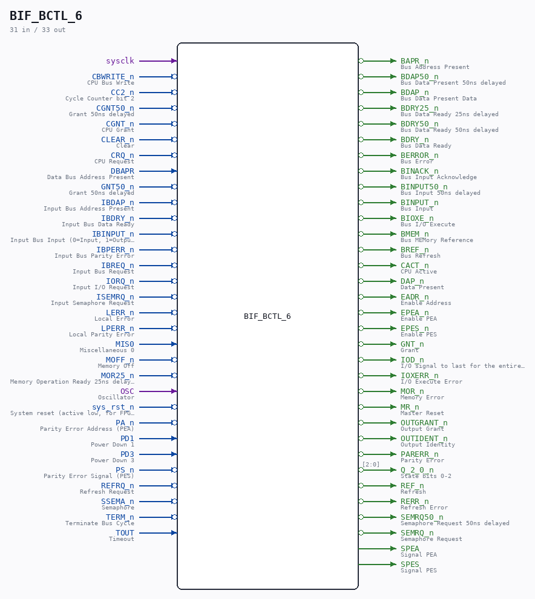

# BIF_BCTL_6

Source: `/mnt/e/Dev/Repos/Ronny/nd-120/Verilog/CPU-BOARD-3202/circuit/BIF_BCTL_6.v`

> Generated by `Verilog/tests/module_doc.py` from the `//!`
> comments in the source. Do not edit by hand - edit the RTL comments and regenerate.

## Description

ND120 CPU, MM&M
BIF/BCTL
BIF CONTROL
SHEET 6 of 50
Last reviewed: 22-MAR-2025
Ronny Hansen

## Ports

| Direction | Width | Name | Description |
|---|---|---|---|
| input | `1` | `sysclk` |  |
| input | `1` | `CBWRITE_n` *(active low)* | CPU Bus Write |
| input | `1` | `CC2_n` *(active low)* | Cycle Counter bit 2 |
| input | `1` | `CGNT50_n` *(active low)* | Grant 50ns delayed |
| input | `1` | `CGNT_n` *(active low)* | CPU Grant |
| input | `1` | `CLEAR_n` *(active low)* | Clear |
| input | `1` | `CRQ_n` *(active low)* | CPU Request |
| input | `1` | `DBAPR` | Data Bus Address Present |
| input | `1` | `GNT50_n` *(active low)* | Grant 50ns delayed |
| input | `1` | `IBDAP_n` *(active low)* | Input Bus Address Present |
| input | `1` | `IBDRY_n` *(active low)* | Input Bus Data Ready |
| input | `1` | `IBINPUT_n` *(active low)* | Input Bus Input (0=Input, 1=Output) |
| input | `1` | `IBPERR_n` *(active low)* | Input Bus Parity Error |
| input | `1` | `IBREQ_n` *(active low)* | Input Bus Request |
| input | `1` | `IORQ_n` *(active low)* | Input I/O Request |
| input | `1` | `ISEMRQ_n` *(active low)* | Input Semaphore Request |
| input | `1` | `LERR_n` *(active low)* | Local Error |
| input | `1` | `LPERR_n` *(active low)* | Local Parity Error |
| input | `1` | `MIS0` | Miscellaneous 0 |
| input | `1` | `MOFF_n` *(active low)* | Memory Off |
| input | `1` | `MOR25_n` *(active low)* | Memory Operation Ready 25ns delayed |
| input | `1` | `OSC` | Oscillator |
| input | `1` | `sys_rst_n` *(active low)* | System reset (active low, for FPGA synthesis) |
| input | `1` | `PA_n` *(active low)* | Parity Error Address (PEA) |
| input | `1` | `PD1` | Power Down 1 |
| input | `1` | `PD3` | Power Down 3 |
| input | `1` | `PS_n` *(active low)* | Parity Error Signal (PES) |
| input | `1` | `REFRQ_n` *(active low)* | Refresh Request |
| input | `1` | `SSEMA_n` *(active low)* | Semaphore |
| input | `1` | `TERM_n` *(active low)* | Terminate Bus Cycle |
| input | `1` | `TOUT` | Timeout |
| output | `1` | `BAPR_n` *(active low)* | Bus Address Present |
| output | `1` | `BDAP50_n` *(active low)* | Bus Data Present 50ns delayed |
| output | `1` | `BDAP_n` *(active low)* | Bus Data Present Data |
| output | `1` | `BDRY25_n` *(active low)* | Bus Data Ready 25ns delayed |
| output | `1` | `BDRY50_n` *(active low)* | Bus Data Ready 50ns delayed |
| output | `1` | `BDRY_n` *(active low)* | Bus Data Ready |
| output | `1` | `BERROR_n` *(active low)* | Bus Error |
| output | `1` | `BINACK_n` *(active low)* | Bus Input Acknowledge |
| output | `1` | `BINPUT50_n` *(active low)* | Bus Input 50ns delayed |
| output | `1` | `BINPUT_n` *(active low)* | Bus Input |
| output | `1` | `BIOXE_n` *(active low)* | Bus I/O Execute |
| output | `1` | `BMEM_n` *(active low)* | Bus MEMory Reference |
| output | `1` | `BREF_n` *(active low)* | Bus Refresh |
| output | `1` | `CACT_n` *(active low)* | CPU Active |
| output | `1` | `DAP_n` *(active low)* | Data Present |
| output | `1` | `EADR_n` *(active low)* | Enable Address |
| output | `1` | `EPEA_n` *(active low)* | Enable PEA |
| output | `1` | `EPES_n` *(active low)* | Enable PES |
| output | `1` | `GNT_n` *(active low)* | Grant |
| output | `1` | `IOD_n` *(active low)* | I/O signal to last for the entire bus cycle |
| output | `1` | `IOXERR_n` *(active low)* | I/O Execute Error |
| output | `1` | `MOR_n` *(active low)* | Memory Error |
| output | `1` | `MR_n` *(active low)* | Master Reset |
| output | `1` | `OUTGRANT_n` *(active low)* | Output Grant |
| output | `1` | `OUTIDENT_n` *(active low)* | Output Identity |
| output | `1` | `PARERR_n` *(active low)* | Parity Error |
| output | `[2:0]` | `Q_2_0_n` *(active low)* | State bits 0-2 |
| output | `1` | `REF_n` *(active low)* | Refresh |
| output | `1` | `RERR_n` *(active low)* | Refresh Error |
| output | `1` | `SEMRQ50_n` *(active low)* | Semaphore Request 50ns delayed |
| output | `1` | `SEMRQ_n` *(active low)* | Semaphore Request |
| output | `1` | `SPEA` | Signal PEA |
| output | `1` | `SPES` | Signal PES |
