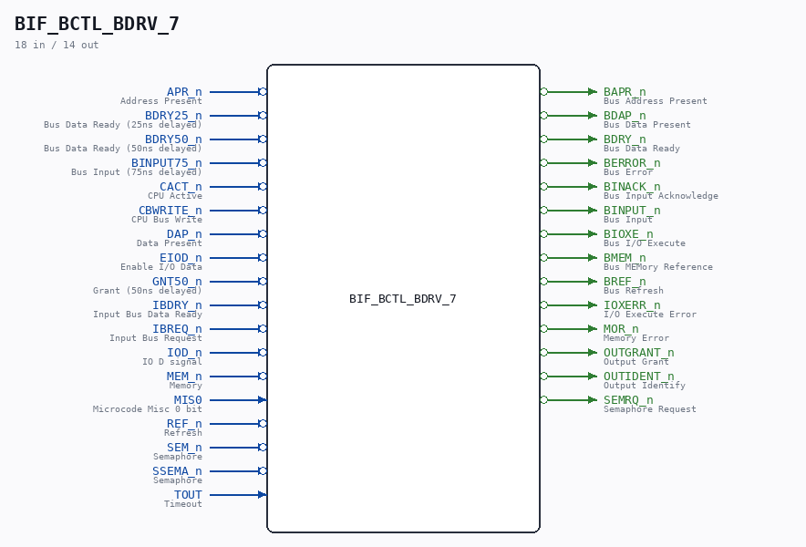

# BIF_BCTL_BDRV_7

Source: `/mnt/e/Dev/Repos/Ronny/nd-120/Verilog/CPU-BOARD-3202/circuit/BIF_BCTL_BDRV_7.v`

> Generated by `Verilog/tests/module_doc.py` from the `//!`
> comments in the source. Do not edit by hand - edit the RTL comments and regenerate.

## Description

ND120 CPU, MM&M
BIF/BCTL/BDRV
BUS DRIVER
SHEET 7 of 50
Last reviewed: 22-MAR-2024
Ronny Hansen

## Ports

| Direction | Width | Name | Description |
|---|---|---|---|
| input | `1` | `APR_n` *(active low)* | Address Present |
| input | `1` | `BDRY25_n` *(active low)* | Bus Data Ready (25ns delayed) |
| input | `1` | `BDRY50_n` *(active low)* | Bus Data Ready (50ns delayed) |
| input | `1` | `BINPUT75_n` *(active low)* | Bus Input (75ns delayed) |
| input | `1` | `CACT_n` *(active low)* | CPU Active |
| input | `1` | `CBWRITE_n` *(active low)* | CPU Bus Write |
| input | `1` | `DAP_n` *(active low)* | Data Present |
| input | `1` | `EIOD_n` *(active low)* | Enable I/O Data |
| input | `1` | `GNT50_n` *(active low)* | Grant (50ns delayed) |
| input | `1` | `IBDRY_n` *(active low)* | Input Bus Data Ready |
| input | `1` | `IBREQ_n` *(active low)* | Input Bus Request |
| input | `1` | `IOD_n` *(active low)* | IO D signal |
| input | `1` | `MEM_n` *(active low)* | Memory |
| input | `1` | `MIS0` | Microcode Misc 0 bit |
| input | `1` | `REF_n` *(active low)* | Refresh |
| input | `1` | `SEM_n` *(active low)* | Semaphore |
| input | `1` | `SSEMA_n` *(active low)* | Semaphore |
| input | `1` | `TOUT` | Timeout |
| output | `1` | `BAPR_n` *(active low)* | Bus Address Present |
| output | `1` | `BDAP_n` *(active low)* | Bus Data Present |
| output | `1` | `BDRY_n` *(active low)* | Bus Data Ready |
| output | `1` | `BERROR_n` *(active low)* | Bus Error |
| output | `1` | `BINACK_n` *(active low)* | Bus Input Acknowledge |
| output | `1` | `BINPUT_n` *(active low)* | Bus Input |
| output | `1` | `BIOXE_n` *(active low)* | Bus I/O Execute |
| output | `1` | `BMEM_n` *(active low)* | Bus MEMory Reference |
| output | `1` | `BREF_n` *(active low)* | Bus Refresh |
| output | `1` | `IOXERR_n` *(active low)* | I/O Execute Error |
| output | `1` | `MOR_n` *(active low)* | Memory Error |
| output | `1` | `OUTGRANT_n` *(active low)* | Output Grant |
| output | `1` | `OUTIDENT_n` *(active low)* | Output Identify |
| output | `1` | `SEMRQ_n` *(active low)* | Semaphore Request |
