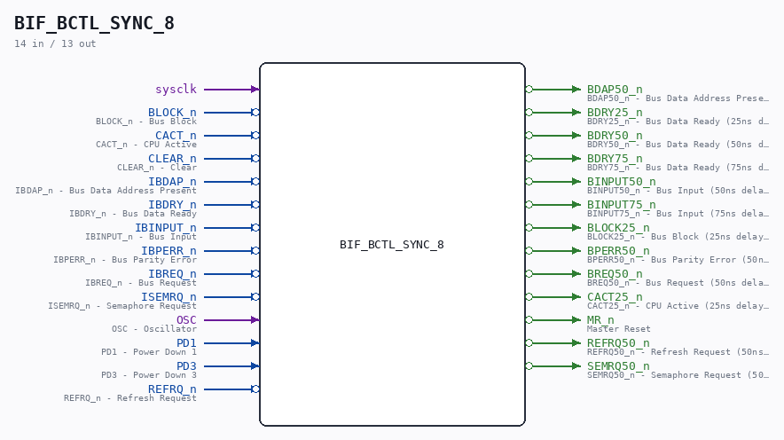

# BIF_BCTL_SYNC_8

Source: `/mnt/e/Dev/Repos/Ronny/nd-120/Verilog/CPU-BOARD-3202/circuit/BIF_BCTL_SYNC_8.v`

> Generated by `Verilog/tests/module_doc.py` from the `//!`
> comments in the source. Do not edit by hand - edit the RTL comments and regenerate.

## Description

ND120 CPU, MM&M
BIF/BCTL/SYNC
BIF SYNC
SHEET 8 of 50
Last reviewed: 14-DEC-2024
Ronny Hansen

## Ports

| Direction | Width | Name | Description |
|---|---|---|---|
| input | `1` | `sysclk` |  |
| input | `1` | `BLOCK_n` *(active low)* | BLOCK_n - Bus Block |
| input | `1` | `CACT_n` *(active low)* | CACT_n - CPU Active |
| input | `1` | `CLEAR_n` *(active low)* | CLEAR_n - Clear |
| input | `1` | `IBDAP_n` *(active low)* | IBDAP_n - Bus Data Address Present |
| input | `1` | `IBDRY_n` *(active low)* | IBDRY_n - Bus Data Ready |
| input | `1` | `IBINPUT_n` *(active low)* | IBINPUT_n - Bus Input |
| input | `1` | `IBPERR_n` *(active low)* | IBPERR_n - Bus Parity Error |
| input | `1` | `IBREQ_n` *(active low)* | IBREQ_n - Bus Request |
| input | `1` | `ISEMRQ_n` *(active low)* | ISEMRQ_n - Semaphore Request |
| input | `1` | `OSC` | OSC - Oscillator |
| input | `1` | `PD1` | PD1 - Power Down 1 |
| input | `1` | `PD3` | PD3 - Power Down 3 |
| input | `1` | `REFRQ_n` *(active low)* | REFRQ_n - Refresh Request |
| output | `1` | `BDAP50_n` *(active low)* | BDAP50_n - Bus Data Address Present (50ns delayed) |
| output | `1` | `BDRY25_n` *(active low)* | BDRY25_n - Bus Data Ready (25ns delayed) |
| output | `1` | `BDRY50_n` *(active low)* | BDRY50_n - Bus Data Ready (50ns delayed) |
| output | `1` | `BDRY75_n` *(active low)* | BDRY75_n - Bus Data Ready (75ns delayed) |
| output | `1` | `BINPUT50_n` *(active low)* | BINPUT50_n - Bus Input (50ns delayed) |
| output | `1` | `BINPUT75_n` *(active low)* | BINPUT75_n - Bus Input (75ns delayed) |
| output | `1` | `BLOCK25_n` *(active low)* | BLOCK25_n - Bus Block (25ns delayed) |
| output | `1` | `BPERR50_n` *(active low)* | BPERR50_n - Bus Parity Error (50ns delayed) |
| output | `1` | `BREQ50_n` *(active low)* | BREQ50_n - Bus Request (50ns delayed) |
| output | `1` | `CACT25_n` *(active low)* | CACT25_n - CPU Active (25ns delayed) |
| output | `1` | `MR_n` *(active low)* | Master Reset |
| output | `1` | `REFRQ50_n` *(active low)* | REFRQ50_n - Refresh Request (50ns delayed) |
| output | `1` | `SEMRQ50_n` *(active low)* | SEMRQ50_n - Semaphore Request (50ns delayed) |
