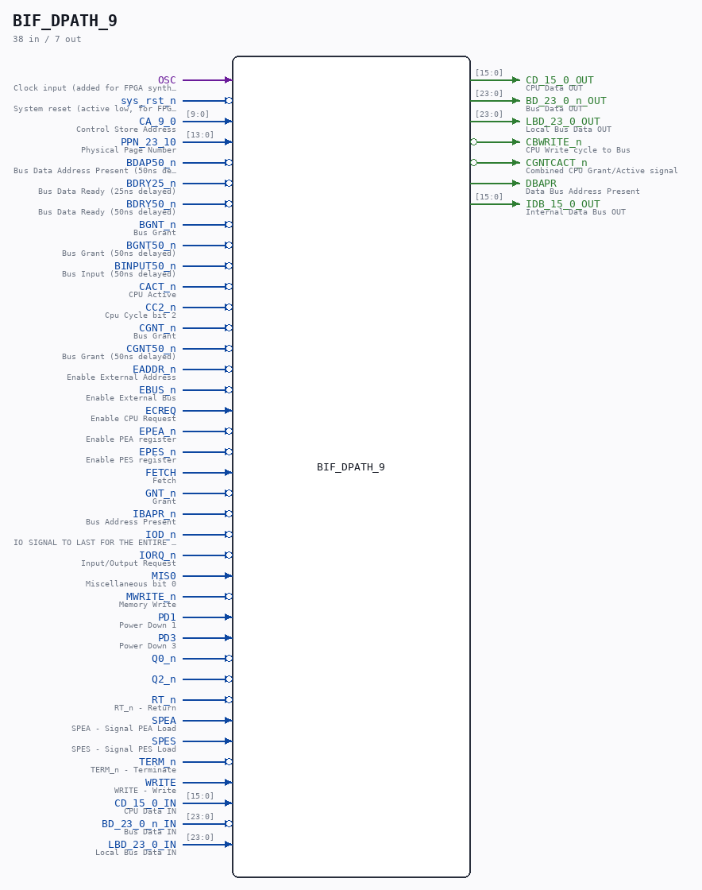

# BIF_DPATH_9

Source: `/mnt/e/Dev/Repos/Ronny/nd-120/Verilog/CPU-BOARD-3202/circuit/BIF_DPATH_9.v`

> Generated by `Verilog/tests/module_doc.py` from the `//!`
> comments in the source. Do not edit by hand - edit the RTL comments and regenerate.

## Description

ND120 CPU, MM&M
BIF/DPATH
BIF DATA PATH
SHEET 9 of 5 0
Last reviewed: 14-DEC-2024
Ronny Hansen

## Ports

| Direction | Width | Name | Description |
|---|---|---|---|
| input | `1` | `OSC` | Clock input (added for FPGA synthesis) |
| input | `1` | `sys_rst_n` *(active low)* | System reset (active low, for FPGA synthesis) |
| input | `[9:0]` | `CA_9_0` | Control Store Address |
| input | `[13:0]` | `PPN_23_10` | Physical Page Number |
| input | `1` | `BDAP50_n` *(active low)* | Bus Data Address Present (50ns delayed) |
| input | `1` | `BDRY25_n` *(active low)* | Bus Data Ready (25ns delayed) |
| input | `1` | `BDRY50_n` *(active low)* | Bus Data Ready (50ns delayed) |
| input | `1` | `BGNT_n` *(active low)* | Bus Grant |
| input | `1` | `BGNT50_n` *(active low)* | Bus Grant (50ns delayed) |
| input | `1` | `BINPUT50_n` *(active low)* | Bus Input (50ns delayed) |
| input | `1` | `CACT_n` *(active low)* | CPU Active |
| input | `1` | `CC2_n` *(active low)* | Cpu Cycle bit 2 |
| input | `1` | `CGNT_n` *(active low)* | Bus Grant |
| input | `1` | `CGNT50_n` *(active low)* | Bus Grant (50ns delayed) |
| input | `1` | `EADDR_n` *(active low)* | Enable External Address |
| input | `1` | `EBUS_n` *(active low)* | Enable External Bus |
| input | `1` | `ECREQ` | Enable CPU Request |
| input | `1` | `EPEA_n` *(active low)* | Enable PEA register |
| input | `1` | `EPES_n` *(active low)* | Enable PES register |
| input | `1` | `FETCH` | Fetch |
| input | `1` | `GNT_n` *(active low)* | Grant |
| input | `1` | `IBAPR_n` *(active low)* | Bus Address Present |
| input | `1` | `IOD_n` *(active low)* | IO SIGNAL TO LAST FOR THE ENTIRE BUS CYCLE |
| input | `1` | `IORQ_n` *(active low)* | Input/Output Request |
| input | `1` | `MIS0` | Miscellaneous bit 0 |
| input | `1` | `MWRITE_n` *(active low)* | Memory Write |
| input | `1` | `PD1` | Power Down 1 |
| input | `1` | `PD3` | Power Down 3 |
| input | `1` | `Q0_n` *(active low)* |  |
| input | `1` | `Q2_n` *(active low)* |  |
| input | `1` | `RT_n` *(active low)* | RT_n - Return |
| input | `1` | `SPEA` | SPEA - Signal PEA Load |
| input | `1` | `SPES` | SPES - Signal PES Load |
| input | `1` | `TERM_n` *(active low)* | TERM_n - Terminate |
| input | `1` | `WRITE` | WRITE - Write |
| input | `[15:0]` | `CD_15_0_IN` | CPU Data IN |
| output | `[15:0]` | `CD_15_0_OUT` | CPU Data OUT |
| input | `[23:0]` | `BD_23_0_n_IN` | Bus Data IN |
| output | `[23:0]` | `BD_23_0_n_OUT` | Bus Data OUT |
| input | `[23:0]` | `LBD_23_0_IN` | Local Bus Data IN |
| output | `[23:0]` | `LBD_23_0_OUT` | Local Bus Data OUT |
| output | `1` | `CBWRITE_n` *(active low)* | CPU Write cycle to Bus |
| output | `1` | `CGNTCACT_n` *(active low)* | Combined CPU Grant/Active signal |
| output | `1` | `DBAPR` | Data Bus Address Present |
| output | `[15:0]` | `IDB_15_0_OUT` | Internal Data Bus OUT |
