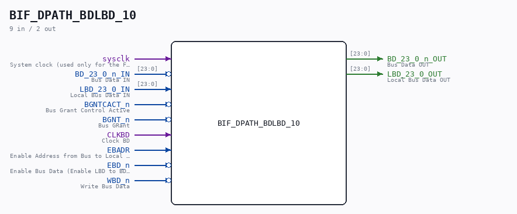

# BIF_DPATH_BDLBD_10

Source: `/mnt/e/Dev/Repos/Ronny/nd-120/Verilog/CPU-BOARD-3202/circuit/BIF_DPATH_BDLBD_10.v`

> Generated by `Verilog/tests/module_doc.py` from the `//!`
> comments in the source. Do not edit by hand - edit the RTL comments and regenerate.

## Description

ND120 CPU, MM&M
BIF/DPATH/BDLBD
BIF BD TO LBD
SHEET 10 of 50
Last reviewed: 14-DEC-2024
Ronny Hansen

## Ports

| Direction | Width | Name | Description |
|---|---|---|---|
| input | `1` | `sysclk` | System clock (used only for the FF-mode strobe edge-capture) |
| input | `[23:0]` | `BD_23_0_n_IN` | Bus Data IN |
| output | `[23:0]` | `BD_23_0_n_OUT` | Bus Data OUT |
| input | `[23:0]` | `LBD_23_0_IN` | Local Bus Data IN |
| output | `[23:0]` | `LBD_23_0_OUT` | Local Bus Data OUT |
| input | `1` | `BGNTCACT_n` *(active low)* | Bus Grant Control Active |
| input | `1` | `BGNT_n` *(active low)* | Bus GRant |
| input | `1` | `CLKBD` | Clock BD |
| input | `1` | `EBADR` | Enable Address from Bus to Local Memory |
| input | `1` | `EBD_n` *(active low)* | Enable Bus Data (Enable LBD to BD transceiver). |
| input | `1` | `WBD_n` *(active low)* | Write Bus Data |
