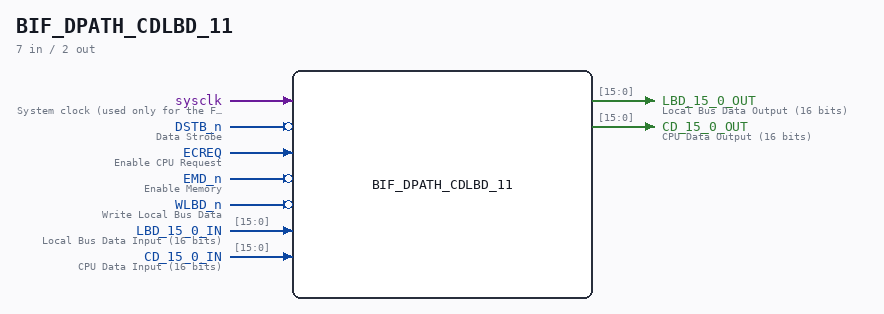

# BIF_DPATH_CDLBD_11

Source: `/mnt/e/Dev/Repos/Ronny/nd-120/Verilog/CPU-BOARD-3202/circuit/BIF_DPATH_CDLBD_11.v`

> Generated by `Verilog/tests/module_doc.py` from the `//!`
> comments in the source. Do not edit by hand - edit the RTL comments and regenerate.

## Description

ND120 CPU, MM&M
BIF/DPATH/CDLBD
BIF CD TO LBD
SHEET 11 of 50
Last reviewed: 20-DEC-2024
Ronny Hansen

## Ports

| Direction | Width | Name | Description |
|---|---|---|---|
| input | `1` | `sysclk` | System clock (used only for the FF-mode strobe edge-capture) |
| input | `1` | `DSTB_n` *(active low)* | Data Strobe |
| input | `1` | `ECREQ` | Enable CPU Request |
| input | `1` | `EMD_n` *(active low)* | Enable Memory |
| input | `1` | `WLBD_n` *(active low)* | Write Local Bus Data |
| input | `[15:0]` | `LBD_15_0_IN` | Local Bus Data Input (16 bits) |
| output | `[15:0]` | `LBD_15_0_OUT` | Local Bus Data Output (16 bits) |
| input | `[15:0]` | `CD_15_0_IN` | CPU Data Input (16 bits) |
| output | `[15:0]` | `CD_15_0_OUT` | CPU Data Output (16 bits) |
