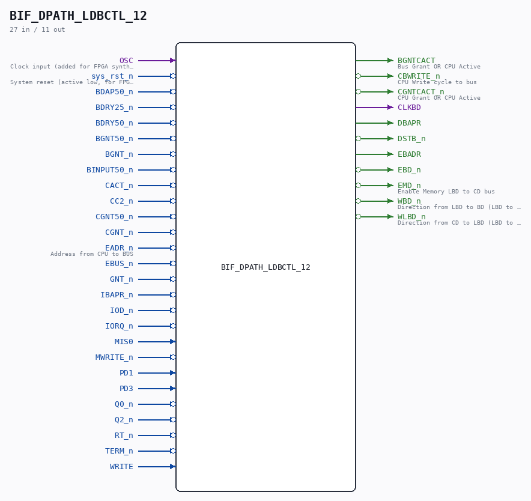

# BIF_DPATH_LDBCTL_12

Source: `/mnt/e/Dev/Repos/Ronny/nd-120/Verilog/CPU-BOARD-3202/circuit/BIF_DPATH_LDBCTL_12.v`

> Generated by `Verilog/tests/module_doc.py` from the `//!`
> comments in the source. Do not edit by hand - edit the RTL comments and regenerate.

## Description

ND120 CPU, MM&M
BIF/DPATH/LDBCTL
IO DECODING
SHEET 12 of 50
Last reviewed: 14-DEC-2024
Ronny Hansen

## Ports

| Direction | Width | Name | Description |
|---|---|---|---|
| input | `1` | `OSC` | Clock input (added for FPGA synthesis) |
| input | `1` | `sys_rst_n` *(active low)* | System reset (active low, for FPGA synthesis) |
| input | `1` | `BDAP50_n` *(active low)* |  |
| input | `1` | `BDRY25_n` *(active low)* |  |
| input | `1` | `BDRY50_n` *(active low)* |  |
| input | `1` | `BGNT50_n` *(active low)* |  |
| input | `1` | `BGNT_n` *(active low)* |  |
| input | `1` | `BINPUT50_n` *(active low)* |  |
| input | `1` | `CACT_n` *(active low)* |  |
| input | `1` | `CC2_n` *(active low)* |  |
| input | `1` | `CGNT50_n` *(active low)* |  |
| input | `1` | `CGNT_n` *(active low)* |  |
| input | `1` | `EADR_n` *(active low)* | Address from CPU to BUS |
| input | `1` | `EBUS_n` *(active low)* |  |
| input | `1` | `GNT_n` *(active low)* |  |
| input | `1` | `IBAPR_n` *(active low)* |  |
| input | `1` | `IOD_n` *(active low)* |  |
| input | `1` | `IORQ_n` *(active low)* |  |
| input | `1` | `MIS0` |  |
| input | `1` | `MWRITE_n` *(active low)* |  |
| input | `1` | `PD1` |  |
| input | `1` | `PD3` |  |
| input | `1` | `Q0_n` *(active low)* |  |
| input | `1` | `Q2_n` *(active low)* |  |
| input | `1` | `RT_n` *(active low)* |  |
| input | `1` | `TERM_n` *(active low)* |  |
| input | `1` | `WRITE` |  |
| output | `1` | `BGNTCACT` | Bus Grant OR CPU Active |
| output | `1` | `CBWRITE_n` *(active low)* | CPU Write cycle to bus |
| output | `1` | `CGNTCACT_n` *(active low)* | CPU Grant OR CPU Active |
| output | `1` | `CLKBD` |  |
| output | `1` | `DBAPR` |  |
| output | `1` | `DSTB_n` *(active low)* |  |
| output | `1` | `EBADR` |  |
| output | `1` | `EBD_n` *(active low)* |  |
| output | `1` | `EMD_n` *(active low)* | Enable Memory LBD to CD bus |
| output | `1` | `WBD_n` *(active low)* | Direction from LBD to BD (LBD to BD transceiver) |
| output | `1` | `WLBD_n` *(active low)* | Direction from CD to LBD (LBD to BD transceiver) |
