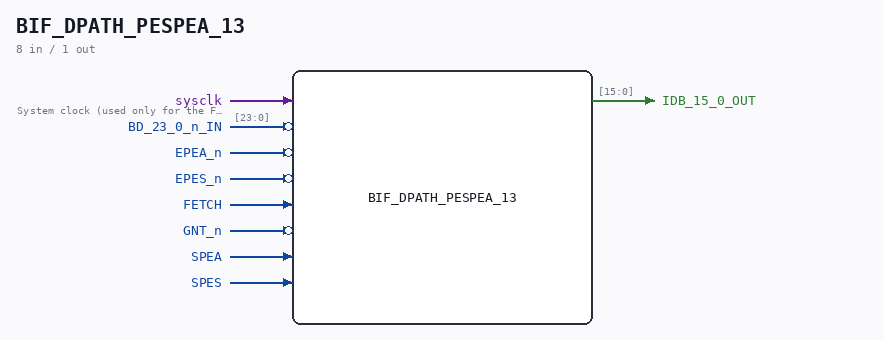

# BIF_DPATH_PESPEA_13

Source: `/mnt/e/Dev/Repos/Ronny/nd-120/Verilog/CPU-BOARD-3202/circuit/BIF_DPATH_PESPEA_13.v`

> Generated by `Verilog/tests/module_doc.py` from the `//!`
> comments in the source. Do not edit by hand - edit the RTL comments and regenerate.

## Description

ND120 CPU, MM&M
BIF/DPATH/PESPEA
BIF PES & PEA
SHEET 13 of 50
Last reviewed: 13-MAY-2024
Ronny Hansen

## Ports

| Direction | Width | Name | Description |
|---|---|---|---|
| input | `1` | `sysclk` | System clock (used only for the FF-mode strobe edge-capture) |
| input | `[23:0]` | `BD_23_0_n_IN` |  |
| input | `1` | `EPEA_n` *(active low)* |  |
| input | `1` | `EPES_n` *(active low)* |  |
| input | `1` | `FETCH` |  |
| input | `1` | `GNT_n` *(active low)* |  |
| input | `1` | `SPEA` |  |
| input | `1` | `SPES` |  |
| output | `[15:0]` | `IDB_15_0_OUT` |  |
