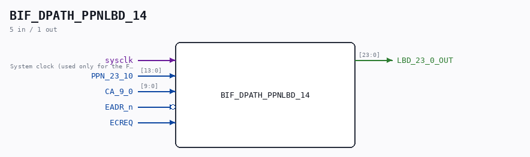

# BIF_DPATH_PPNLBD_14

Source: `/mnt/e/Dev/Repos/Ronny/nd-120/Verilog/CPU-BOARD-3202/circuit/BIF_DPATH_PPNLBD_14.v`

> Generated by `Verilog/tests/module_doc.py` from the `//!`
> comments in the source. Do not edit by hand - edit the RTL comments and regenerate.

## Description

ND120 CPU, MM&M
BIF/DPATH/PPNLBD
BIF PPN TO LBD
SHEET 14  of 50
Last reviewed: 09-NOV-2024
Ronny Hansen

## Ports

| Direction | Width | Name | Description |
|---|---|---|---|
| input | `1` | `sysclk` | System clock (used only for the FF-mode strobe edge-capture) |
| input | `[13:0]` | `PPN_23_10` |  |
| input | `[9:0]` | `CA_9_0` |  |
| input | `1` | `EADR_n` *(active low)* |  |
| input | `1` | `ECREQ` |  |
| output | `[23:0]` | `LBD_23_0_OUT` |  |
