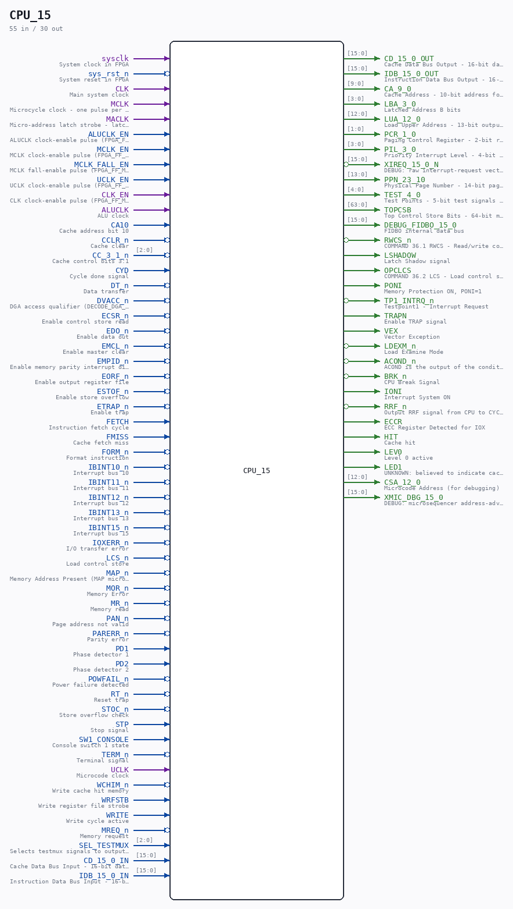

# CPU_15

Source: `/mnt/e/Dev/Repos/Ronny/nd-120/Verilog/CPU-BOARD-3202/circuit/CPU_15.v`

> Generated by `Verilog/tests/module_doc.py` from the `//!`
> comments in the source. Do not edit by hand - edit the RTL comments and regenerate.

## Description

ND120 CPU, MM&M
CPU
CPU TOP LEVEL
SHEET 15 of 50
Last reviewed: 2-FEB-2025
Ronny Hansen

## Ports

| Direction | Width | Name | Description |
|---|---|---|---|
| input | `1` | `sysclk` | System clock in FPGA |
| input | `1` | `sys_rst_n` *(active low)* | System reset in FPGA |
| input | `1` | `CLK` | Main system clock |
| input | `1` | `MCLK` | Microcycle clock - one pulse per microinstruction cycle (= TERM outside RWCS), stretched during RWCS. Not a master/memory clock. |
| input | `1` | `MACLK` | Micro-address latch strobe - latch enable for the control-store address latches in CPU_CS_ACAL_17 (transparent high, captures on the FALLING edge). NOT a memory clock. |
| input | `1` | `ALUCLK_EN` | ALUCLK clock-enable pulse (FPGA_FF_MODE, else 0) |
| input | `1` | `MCLK_EN` | MCLK clock-enable pulse (FPGA_FF_MODE, else 0) |
| input | `1` | `MCLK_FALL_EN` | MCLK fall-enable pulse (FPGA_FF_MODE, else 0) |
| input | `1` | `UCLK_EN` | UCLK clock-enable pulse (FPGA_FF_MODE, else 0) |
| input | `1` | `CLK_EN` | CLK clock-enable pulse (FPGA_FF_MODE, else 0) |
| input | `1` | `ALUCLK` | ALU clock |
| input | `1` | `CA10` | Cache address bit 10 |
| input | `1` | `CCLR_n` *(active low)* | Cache clear |
| input | `[2:0]` | `CC_3_1_n` *(active low)* | Cache control bits 3:1 |
| input | `1` | `CYD` | Cycle done signal |
| input | `1` | `DT_n` *(active low)* | Data transfer |
| input | `1` | `DVACC_n` *(active low)* | DGA access qualifier (DECODE_DGA_COMM A227), passed down to CPU_MMU_24 - not the CGA's VACC |
| input | `1` | `ECSR_n` *(active low)* | Enable control store read |
| input | `1` | `EDO_n` *(active low)* | Enable data out |
| input | `1` | `EMCL_n` *(active low)* | Enable master clear |
| input | `1` | `EMPID_n` *(active low)* | Enable memory parity interrupt disable |
| input | `1` | `EORF_n` *(active low)* | Enable output register file |
| input | `1` | `ESTOF_n` *(active low)* | Enable store overflow |
| input | `1` | `ETRAP_n` *(active low)* | Enable trap |
| input | `1` | `FETCH` | Instruction fetch cycle |
| input | `1` | `FMISS` | Cache fetch miss |
| input | `1` | `FORM_n` *(active low)* | Format instruction |
| input | `1` | `IBINT10_n` *(active low)* | Interrupt bus 10 |
| input | `1` | `IBINT11_n` *(active low)* | Interrupt bus 11 |
| input | `1` | `IBINT12_n` *(active low)* | Interrupt bus 12 |
| input | `1` | `IBINT13_n` *(active low)* | Interrupt bus 13 |
| input | `1` | `IBINT15_n` *(active low)* | Interrupt bus 15 |
| input | `1` | `IOXERR_n` *(active low)* | I/O transfer error |
| input | `1` | `LCS_n` *(active low)* | Load control store |
| input | `1` | `MAP_n` *(active low)* | Memory Address Present (MAP microcode address) |
| input | `1` | `MOR_n` *(active low)* | Memory Error |
| input | `1` | `MR_n` *(active low)* | Memory read |
| input | `1` | `PAN_n` *(active low)* | Page address not valid |
| input | `1` | `PARERR_n` *(active low)* | Parity error |
| input | `1` | `PD1` | Phase detector 1 |
| input | `1` | `PD2` | Phase detector 2 |
| input | `1` | `POWFAIL_n` *(active low)* | Power failure detected |
| input | `1` | `RT_n` *(active low)* | Reset trap |
| input | `1` | `STOC_n` *(active low)* | Store overflow check |
| input | `1` | `STP` | Stop signal |
| input | `1` | `SW1_CONSOLE` | Console switch 1 state |
| input | `1` | `TERM_n` *(active low)* | Terminal signal |
| input | `1` | `UCLK` | Microcode clock |
| input | `1` | `WCHIM_n` *(active low)* | Write cache hit memory |
| input | `1` | `WRFSTB` | Write register file strobe |
| input | `1` | `WRITE` | Write cycle active |
| input | `1` | `MREQ_n` *(active low)* | Memory request |
| input | `[2:0]` | `SEL_TESTMUX` | Selects testmux signals to output on TEST_4_0 |
| input | `[15:0]` | `CD_15_0_IN` | Cache Data Bus Input - 16-bit data bus for transferring data between cache and CPU |
| output | `[15:0]` | `CD_15_0_OUT` | Cache Data Bus Output - 16-bit data bus for transferring data from CPU to cache |
| input | `[15:0]` | `IDB_15_0_IN` | Instruction Data Bus Input - 16-bit bidirectional bus for transferring instructions and data between CPU components |
| output | `[15:0]` | `IDB_15_0_OUT` | Instruction Data Bus Output - 16-bit bidirectional bus for transferring instructions and data from CPU components |
| output | `[9:0]` | `CA_9_0` | Cache Address - 10-bit address for cache access |
| output | `[3:0]` | `LBA_3_0` | Latched Address B bits |
| output | `[12:0]` | `LUA_12_0` | Load Upper Address - 13-bit output for upper address bits of control store |
| output | `[1:0]` | `PCR_1_0` | Paging Control Register - 2-bit register for paging control |
| output | `[3:0]` | `PIL_3_0` | Priority Interrupt Level - 4-bit interrupt priority level |
| output | `[15:0]` | `XIREQ_15_0_N` *(active low)* | DEBUG: raw interrupt-request vector (active low) |
| output | `[13:0]` | `PPN_23_10` | Physical Page Number - 14-bit page number for memory mapping |
| output | `[4:0]` | `TEST_4_0` | Test Points - 5-bit test signals for debugging |
| output | `[63:0]` | `TOPCSB` | Top Control Store Bits - 64-bit microcode control signals |
| output | `[15:0]` | `DEBUG_FIDBO_15_0` | FIDBO internal data bus |
| output | `1` | `RWCS_n` *(active low)* | COMMAND 36.1 RWCS - Read/write control store as addressed by ADCS command |
| output | `1` | `LSHADOW` | Latch Shadow signal |
| output | `1` | `OPCLCS` | COMMAND 36.2 LCS - Load control store from PROM and perform a Master Clear |
| output | `1` | `PONI` | Memory Protection ON, PONI=1 |
| output | `1` | `TP1_INTRQ_n` *(active low)* | Testpoint1 - Interrupt Request |
| output | `1` | `TRAPN` | Enable TRAP signal |
| output | `1` | `VEX` | Vector Exception |
| output | `1` | `LDEXM_n` *(active low)* | Load Examine Mode |
| output | `1` | `ACOND_n` *(active low)* | ACOND is the output of the condition register. |
| output | `1` | `BRK_n` *(active low)* | CPU Break Signal |
| output | `1` | `IONI` | Interrupt System ON |
| output | `1` | `RRF_n` *(active low)* | Output RRF signal from CPU to CYCLE |
| output | `1` | `ECCR` | ECC Register Detected for IOX |
| output | `1` | `HIT` | Cache hit |
| output | `1` | `LEV0` | Level 0 active |
| output | `1` | `LED1` | UNKNOWN: believed to indicate cache enabled, never traced. See Verilog/docs/SIGNALS.md |
| output | `[12:0]` | `CSA_12_0` | Microcode Address (for debugging) |
| output | `[15:0]` | `XMIC_DBG_15_0` | DEBUG: microsequencer address-advance probe (Tang 06000-hang) |
