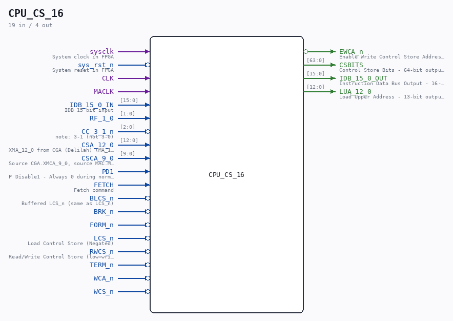

# CPU_CS_16

Source: `/mnt/e/Dev/Repos/Ronny/nd-120/Verilog/CPU-BOARD-3202/circuit/CPU_CS_16.v`

> Generated by `Verilog/tests/module_doc.py` from the `//!`
> comments in the source. Do not edit by hand - edit the RTL comments and regenerate.

## Description

ND120 CPU, MM&M
CPU/CS
CONTROL STORE
SHEET 16 of 50
Last reviewed: 9-FEB-2025
Ronny Hansen

## Ports

| Direction | Width | Name | Description |
|---|---|---|---|
| input | `1` | `sysclk` | System clock in FPGA |
| input | `1` | `sys_rst_n` *(active low)* | System reset in FPGA |
| input | `1` | `CLK` |  |
| input | `1` | `MACLK` |  |
| input | `[15:0]` | `IDB_15_0_IN` | IDB 15 bit input |
| input | `[1:0]` | `RF_1_0` |  |
| input | `[2:0]` | `CC_3_1_n` *(active low)* | note: 3-1 (not 3-0) |
| input | `[12:0]` | `CSA_12_0` | XMA_12_0 from CGA (Delilah) (MA_12_0 from CGA.MIC) <= Memory Address Bits (for Control Store) |
| input | `[9:0]` | `CSCA_9_0` | Source CGA.XMCA_9_0, source MAC.MCA_9_0, source MAC_AP09.MCA_9_0, source CALCA.MCA9_0 <= Input ICA.Bits [15:0] but only when MCLK is low. Almost the same as LCA15_0, execpt LCA_15_0 is locked in a register on clock lo-hi |
| input | `1` | `PD1` | P Disable1 - Always 0 during normal operations |
| input | `1` | `FETCH` | Fetch command |
| input | `1` | `BLCS_n` *(active low)* | Buffered LCS_n (same as LCS_n) |
| input | `1` | `BRK_n` *(active low)* |  |
| input | `1` | `FORM_n` *(active low)* |  |
| input | `1` | `LCS_n` *(active low)* | Load Control Store (Negated) |
| input | `1` | `RWCS_n` *(active low)* | Read/Write Control Store (low=write) |
| input | `1` | `TERM_n` *(active low)* |  |
| input | `1` | `WCA_n` *(active low)* |  |
| input | `1` | `WCS_n` *(active low)* |  |
| output | `1` | `EWCA_n` *(active low)* | Enable Write Control Store Address - Active low signal to enable writing to control store address |
| output | `[63:0]` | `CSBITS` | Control Store Bits - 64-bit output containing the control store data/instructions |
| output | `[15:0]` | `IDB_15_0_OUT` | Instruction Data Bus Output - 16-bit output bus for instruction data |
| output | `[12:0]` | `LUA_12_0` | Load Upper Address - 13-bit output for upper address bits of control store |
