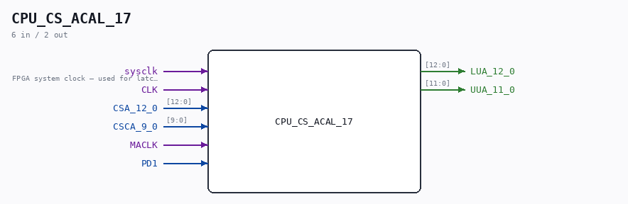

# CPU_CS_ACAL_17

Source: `/mnt/e/Dev/Repos/Ronny/nd-120/Verilog/CPU-BOARD-3202/circuit/CPU_CS_ACAL_17.v`

> Generated by `Verilog/tests/module_doc.py` from the `//!`
> comments in the source. Do not edit by hand - edit the RTL comments and regenerate.

## Description

ND120 CPU, MM&M
CPU/CS/ACAL
MICRO ADDR CALC UNIT
SHEET 17 of 50
Last reviewed: 6-APR-2025
Ronny Hansen

## Ports

| Direction | Width | Name | Description |
|---|---|---|---|
| input | `1` | `sysclk` | FPGA system clock — used for latch-equivalent FFs |
| input | `1` | `CLK` |  |
| input | `[12:0]` | `CSA_12_0` |  |
| input | `[9:0]` | `CSCA_9_0` |  |
| input | `1` | `MACLK` |  |
| input | `1` | `PD1` |  |
| output | `[12:0]` | `LUA_12_0` |  |
| output | `[11:0]` | `UUA_11_0` |  |
