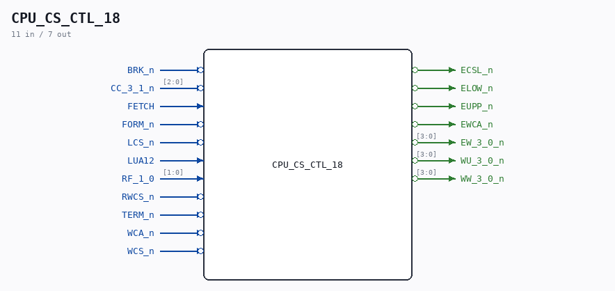

# CPU_CS_CTL_18

Source: `/mnt/e/Dev/Repos/Ronny/nd-120/Verilog/CPU-BOARD-3202/circuit/CPU_CS_CTL_18.v`

> Generated by `Verilog/tests/module_doc.py` from the `//!`
> comments in the source. Do not edit by hand - edit the RTL comments and regenerate.

## Description

ND120 CPU, MM&M
CPU/CS/CTL
CS CONTROL
SHEET 18 of 50
Last reviewed: 21-APRIL-2024
Ronny Hansen

## Ports

| Direction | Width | Name | Description |
|---|---|---|---|
| input | `1` | `BRK_n` *(active low)* |  |
| input | `[2:0]` | `CC_3_1_n` *(active low)* |  |
| input | `1` | `FETCH` |  |
| input | `1` | `FORM_n` *(active low)* |  |
| input | `1` | `LCS_n` *(active low)* |  |
| input | `1` | `LUA12` |  |
| input | `[1:0]` | `RF_1_0` |  |
| input | `1` | `RWCS_n` *(active low)* |  |
| input | `1` | `TERM_n` *(active low)* |  |
| input | `1` | `WCA_n` *(active low)* |  |
| input | `1` | `WCS_n` *(active low)* |  |
| output | `1` | `ECSL_n` *(active low)* |  |
| output | `1` | `ELOW_n` *(active low)* |  |
| output | `1` | `EUPP_n` *(active low)* |  |
| output | `1` | `EWCA_n` *(active low)* |  |
| output | `[3:0]` | `EW_3_0_n` *(active low)* |  |
| output | `[3:0]` | `WU_3_0_n` *(active low)* |  |
| output | `[3:0]` | `WW_3_0_n` *(active low)* |  |
