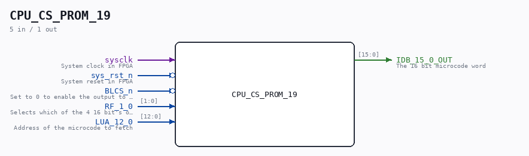

# CPU_CS_PROM_19

Source: `/mnt/e/Dev/Repos/Ronny/nd-120/Verilog/CPU-BOARD-3202/circuit/CPU_CS_PROM_19.v`

> Generated by `Verilog/tests/module_doc.py` from the `//!`
> comments in the source. Do not edit by hand - edit the RTL comments and regenerate.

## Description

ND120 CPU, MM&M
CPU/CS/PROM
PROMS
SHEET 19 of 50
Last reviewed: 9-FEB-2025
Ronny Hansen

## Ports

| Direction | Width | Name | Description |
|---|---|---|---|
| input | `1` | `sysclk` | System clock in FPGA |
| input | `1` | `sys_rst_n` *(active low)* | System reset in FPGA |
| input | `1` | `BLCS_n` *(active low)* | Set to 0 to enable the output to IDB |
| input | `[1:0]` | `RF_1_0` | Selects which of the 4 16 bit's of the microcoe to fetch |
| input | `[12:0]` | `LUA_12_0` | Address of the microcode to fetch |
| output | `[15:0]` | `IDB_15_0_OUT` | The 16 bit microcode word |
