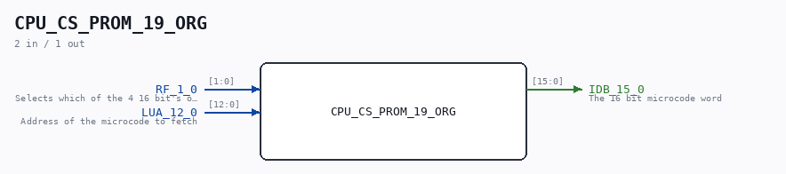

# CPU_CS_PROM_19_ORG

Source: `/mnt/e/Dev/Repos/Ronny/nd-120/Verilog/CPU-BOARD-3202/circuit/CPU_CS_PROM_19_ORG.v`

> Generated by `Verilog/tests/module_doc.py` from the `//!`
> comments in the source. Do not edit by hand - edit the RTL comments and regenerate.

## Description

Logisim-evolution goes FPGA automatic generated Verilog code
https://github.com/logisim-evolution/
Component : CPU_CS_PROM_19

## Ports

| Direction | Width | Name | Description |
|---|---|---|---|
| input | `[1:0]` | `RF_1_0` | Selects which of the 4 16 bit's of the microcoe to fetch |
| input | `[12:0]` | `LUA_12_0` | Address of the microcode to fetch |
| output | `[15:0]` | `IDB_15_0` | The 16 bit microcode word |
