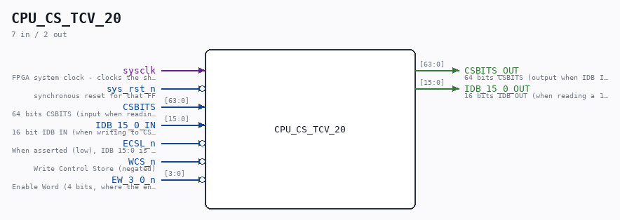

# CPU_CS_TCV_20

Source: `/mnt/e/Dev/Repos/Ronny/nd-120/Verilog/CPU-BOARD-3202/circuit/CPU_CS_TCV_20.v`

> Generated by `Verilog/tests/module_doc.py` from the `//!`
> comments in the source. Do not edit by hand - edit the RTL comments and regenerate.

## Description

ND120 CPU, MM&M
CPU/CS/TCV
CS TRANSCEIVERS
SHEET 20 of 50
Last reviewed: 14-APRIL-2024
Ronny Hansen

## Ports

| Direction | Width | Name | Description |
|---|---|---|---|
| input | `1` | `sysclk` | FPGA system clock - clocks the sheet-20 CS capture FF |
| input | `1` | `sys_rst_n` *(active low)* | synchronous reset for that FF |
| input | `[63:0]` | `CSBITS` | 64 bits CSBITS (input when reading from CSBITS to IDB OUT) |
| output | `[63:0]` | `CSBITS_OUT` | 64 bits CSBITS (output when IDB IN writes a 16 bit part to the CSBITS) |
| input | `[15:0]` | `IDB_15_0_IN` | 16 bit IDB IN (when writing to CSBITS) |
| output | `[15:0]` | `IDB_15_0_OUT` | 16 bits IDB OUT (when reading a 16 bit word from CSBITS) |
| input | `1` | `ECSL_n` *(active low)* | When asserted (low), IDB 15:0 is connected to IDB 15:0. Source PAL_44305D, CPU_CS_CTL_18. Comment in the PAL source says "ECSL HOLD IN g AND h cycles" |
| input | `1` | `WCS_n` *(active low)* | Write Control Store (negated) |
| input | `[3:0]` | `EW_3_0_n` *(active low)* | Enable Word (4 bits, where the enabled word (0-3) has its bit set to 0. Chooses which 16 bits of the 64 bits CSBITS that is read or written |
