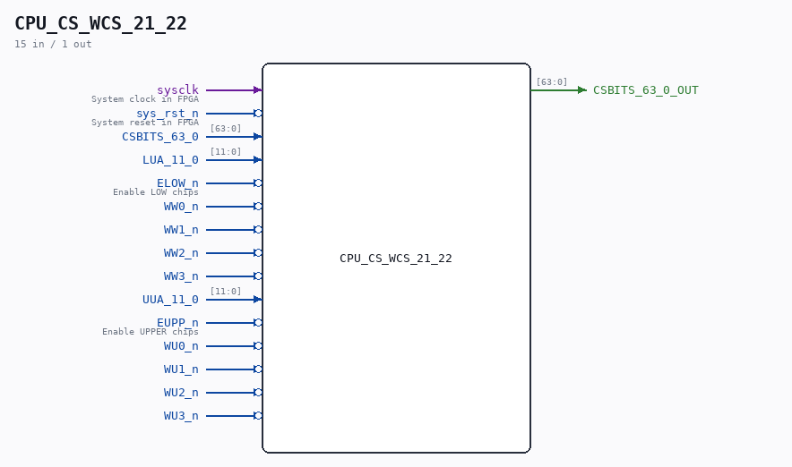

# CPU_CS_WCS_21_22

Source: `/mnt/e/Dev/Repos/Ronny/nd-120/Verilog/CPU-BOARD-3202/circuit/CPU_CS_WCS_21_22.v`

> Generated by `Verilog/tests/module_doc.py` from the `//!`
> comments in the source. Do not edit by hand - edit the RTL comments and regenerate.

## Description

ND120 CPU, MM&M
CPU/CS/WCS
Writable Control Store
SHEET 21 and 22 of 50
This module has 16 RAM CHIPS of type 16K (4Kx4) Static RAM for LUA
(4KByte Microcode)
This module has 16 RAM CHIPS of type 16K (4Kx4) Static RAM for UUA
(4KByte for Writable Control Store?)
Last reviewed: 9-NOV-2024
Ronny Hansen

## Ports

| Direction | Width | Name | Description |
|---|---|---|---|
| input | `1` | `sysclk` | System clock in FPGA |
| input | `1` | `sys_rst_n` *(active low)* | System reset in FPGA |
| input | `[63:0]` | `CSBITS_63_0` |  |
| output | `[63:0]` | `CSBITS_63_0_OUT` |  |
| input | `[11:0]` | `LUA_11_0` |  |
| input | `1` | `ELOW_n` *(active low)* | Enable LOW chips |
| input | `1` | `WW0_n` *(active low)* |  |
| input | `1` | `WW1_n` *(active low)* |  |
| input | `1` | `WW2_n` *(active low)* |  |
| input | `1` | `WW3_n` *(active low)* |  |
| input | `[11:0]` | `UUA_11_0` |  |
| input | `1` | `EUPP_n` *(active low)* | Enable UPPER chips |
| input | `1` | `WU0_n` *(active low)* |  |
| input | `1` | `WU1_n` *(active low)* |  |
| input | `1` | `WU2_n` *(active low)* |  |
| input | `1` | `WU3_n` *(active low)* |  |
