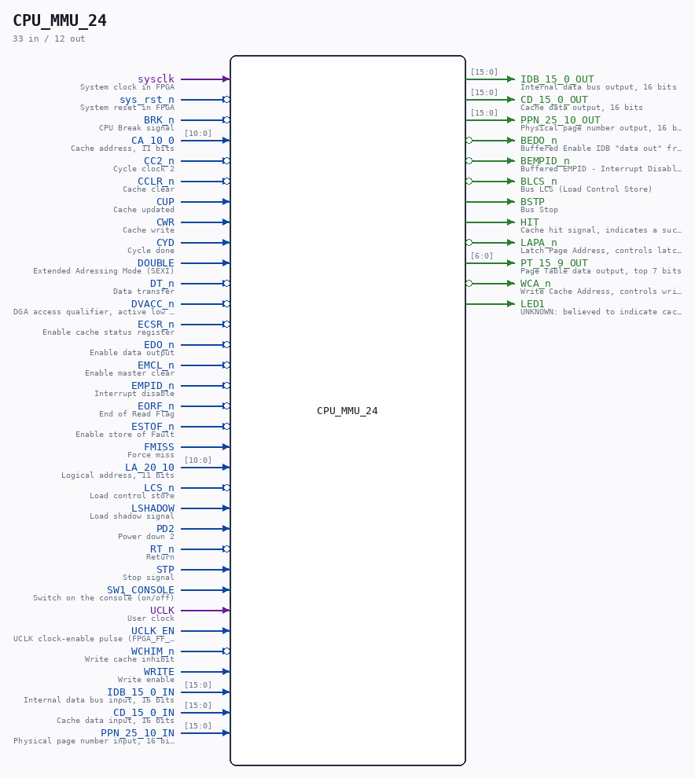

# CPU_MMU_24

Source: `/mnt/e/Dev/Repos/Ronny/nd-120/Verilog/CPU-BOARD-3202/circuit/CPU_MMU_24.v`

> Generated by `Verilog/tests/module_doc.py` from the `//!`
> comments in the source. Do not edit by hand - edit the RTL comments and regenerate.

## Description

ND120 CPU, MM&M
CPU/MMU
MMU TOP LEVEL
SHEET 24 of 50
Last reviewed: 2-FEB-2025
Ronny Hansen

## Ports

| Direction | Width | Name | Description |
|---|---|---|---|
| input | `1` | `sysclk` | System clock in FPGA |
| input | `1` | `sys_rst_n` *(active low)* | System reset in FPGA |
| input | `1` | `BRK_n` *(active low)* | CPU Break signal |
| input | `[10:0]` | `CA_10_0` | Cache address, 11 bits |
| input | `1` | `CC2_n` *(active low)* | Cycle clock 2 |
| input | `1` | `CCLR_n` *(active low)* | Cache clear |
| input | `1` | `CUP` | Cache updated |
| input | `1` | `CWR` | Cache write |
| input | `1` | `CYD` | Cycle done |
| input | `1` | `DOUBLE` | Extended Adressing Mode (SEXI) |
| input | `1` | `DT_n` *(active low)* | Data transfer |
| input | `1` | `DVACC_n` *(active low)* | DGA access qualifier, active low (see comment above) |
| input | `1` | `ECSR_n` *(active low)* | Enable cache status register |
| input | `1` | `EDO_n` *(active low)* | Enable data output |
| input | `1` | `EMCL_n` *(active low)* | Enable master clear |
| input | `1` | `EMPID_n` *(active low)* | Interrupt disable |
| input | `1` | `EORF_n` *(active low)* | End of Read Flag |
| input | `1` | `ESTOF_n` *(active low)* | Enable store of Fault |
| input | `1` | `FMISS` | Force miss |
| input | `[10:0]` | `LA_20_10` | Logical address, 11 bits |
| input | `1` | `LCS_n` *(active low)* | Load control store |
| input | `1` | `LSHADOW` | Load shadow signal |
| input | `1` | `PD2` | Power down 2 |
| input | `1` | `RT_n` *(active low)* | Return |
| input | `1` | `STP` | Stop signal |
| input | `1` | `SW1_CONSOLE` | Switch on the console (on/off) |
| input | `1` | `UCLK` | User clock |
| input | `1` | `UCLK_EN` | UCLK clock-enable pulse (FPGA_FF_MODE, else 0) |
| input | `1` | `WCHIM_n` *(active low)* | Write cache inhibit |
| input | `1` | `WRITE` | Write enable |
| input | `[15:0]` | `IDB_15_0_IN` | Internal data bus input, 16 bits |
| output | `[15:0]` | `IDB_15_0_OUT` | Internal data bus output, 16 bits |
| input | `[15:0]` | `CD_15_0_IN` | Cache data input, 16 bits |
| output | `[15:0]` | `CD_15_0_OUT` | Cache data output, 16 bits |
| input | `[15:0]` | `PPN_25_10_IN` | Physical page number input, 16 bits |
| output | `[15:0]` | `PPN_25_10_OUT` | Physical page number output, 16 bits |
| output | `1` | `BEDO_n` *(active low)* | Buffered Enable IDB "data out" from CGA |
| output | `1` | `BEMPID_n` *(active low)* | Buffered EMPID - Interrupt Disable (EPIC.LDMPIE->set mask reg:inh all ints) |
| output | `1` | `BLCS_n` *(active low)* | Bus LCS (Load Control Store) |
| output | `1` | `BSTP` | Bus Stop |
| output | `1` | `HIT` | Cache hit signal, indicates a successful cache lookup |
| output | `1` | `LAPA_n` *(active low)* | Latch Page Address, controls latching of the page address |
| output | `[6:0]` | `PT_15_9_OUT` | Page Table data output, top 7 bits |
| output | `1` | `WCA_n` *(active low)* | Write Cache Address, controls writing to the cache address register |
| output | `1` | `LED1` | UNKNOWN: believed to indicate cache enabled, never traced. See Verilog/docs/SIGNALS.md |
