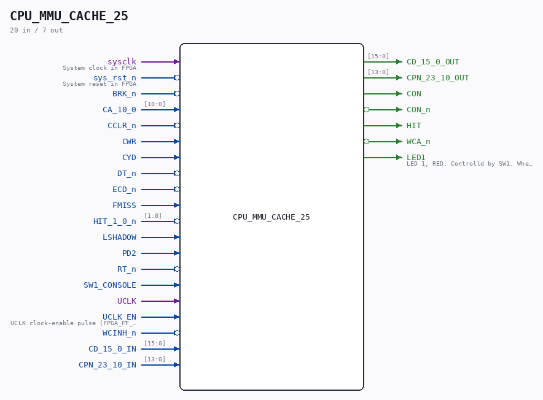

# CPU_MMU_CACHE_25

Source: `/mnt/e/Dev/Repos/Ronny/nd-120/Verilog/CPU-BOARD-3202/circuit/CPU_MMU_CACHE_25.v`

> Generated by `Verilog/tests/module_doc.py` from the `//!`
> comments in the source. Do not edit by hand - edit the RTL comments and regenerate.

## Description

ND120 CPU, MM&M
CPU/MMU/CACHE
CACHE
SHEET 25 of 50
Last reviewed: 2-FEB-2025
Ronny Hansen

## Ports

| Direction | Width | Name | Description |
|---|---|---|---|
| input | `1` | `sysclk` | System clock in FPGA |
| input | `1` | `sys_rst_n` *(active low)* | System reset in FPGA |
| input | `1` | `BRK_n` *(active low)* |  |
| input | `[10:0]` | `CA_10_0` |  |
| input | `1` | `CCLR_n` *(active low)* |  |
| input | `1` | `CWR` |  |
| input | `1` | `CYD` |  |
| input | `1` | `DT_n` *(active low)* |  |
| input | `1` | `ECD_n` *(active low)* |  |
| input | `1` | `FMISS` |  |
| input | `[1:0]` | `HIT_1_0_n` *(active low)* |  |
| input | `1` | `LSHADOW` |  |
| input | `1` | `PD2` |  |
| input | `1` | `RT_n` *(active low)* |  |
| input | `1` | `SW1_CONSOLE` |  |
| input | `1` | `UCLK` |  |
| input | `1` | `UCLK_EN` | UCLK clock-enable pulse (FPGA_FF_MODE, else 0) |
| input | `1` | `WCINH_n` *(active low)* |  |
| input | `[15:0]` | `CD_15_0_IN` |  |
| output | `[15:0]` | `CD_15_0_OUT` |  |
| input | `[13:0]` | `CPN_23_10_IN` |  |
| output | `[13:0]` | `CPN_23_10_OUT` |  |
| output | `1` | `CON` |  |
| output | `1` | `CON_n` *(active low)* |  |
| output | `1` | `HIT` |  |
| output | `1` | `WCA_n` *(active low)* |  |
| output | `1` | `LED1` | LED 1, RED. Controlld by SW1. When LED is on, CON is 0. and CON_n is 1. |
