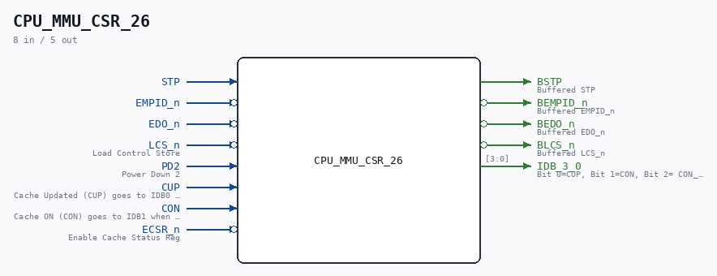

# CPU_MMU_CSR_26

Source: `/mnt/e/Dev/Repos/Ronny/nd-120/Verilog/CPU-BOARD-3202/circuit/CPU_MMU_CSR_26.v`

> Generated by `Verilog/tests/module_doc.py` from the `//!`
> comments in the source. Do not edit by hand - edit the RTL comments and regenerate.

## Description

ND120 CPU, MM&M
CPU/MMU/CSR
CACHE STATUS REGISER
SHEET 26 of 50
Last reviewed: 29-JAN-2025
Ronny Hansen

## Ports

| Direction | Width | Name | Description |
|---|---|---|---|
| input | `1` | `STP` |  |
| input | `1` | `EMPID_n` *(active low)* |  |
| input | `1` | `EDO_n` *(active low)* |  |
| input | `1` | `LCS_n` *(active low)* | Load Control Store |
| input | `1` | `PD2` | Power Down 2 |
| input | `1` | `CUP` | Cache Updated (CUP) goes to IDB0 when ECSR_n is low |
| input | `1` | `CON` | Cache ON (CON) goes to IDB1 when ECSR_n is low. CON_n goes to IDB2 |
| input | `1` | `ECSR_n` *(active low)* | Enable Cache Status Reg |
| output | `1` | `BSTP` | Buffered STP |
| output | `1` | `BEMPID_n` *(active low)* | Buffered EMPID_n |
| output | `1` | `BEDO_n` *(active low)* | Buffered EDO_n |
| output | `1` | `BLCS_n` *(active low)* | Buffered LCS_n |
| output | `[3:0]` | `IDB_3_0` | Bit 0=CUP, Bit 1=CON, Bit 2= CON_n, Bit 3=1 (FIN-Cache Clear finished. Not currently enabled) |
