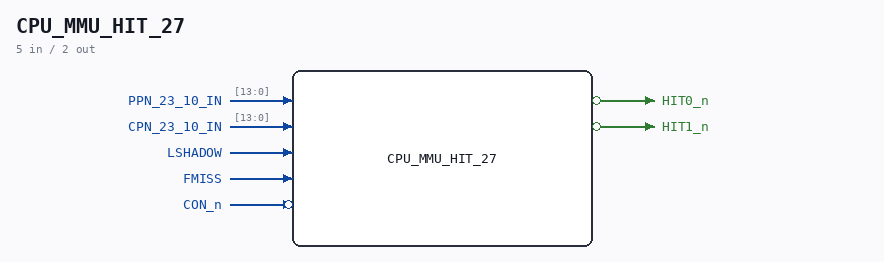

# CPU_MMU_HIT_27

Source: `/mnt/e/Dev/Repos/Ronny/nd-120/Verilog/CPU-BOARD-3202/circuit/CPU_MMU_HIT_27.v`

> Generated by `Verilog/tests/module_doc.py` from the `//!`
> comments in the source. Do not edit by hand - edit the RTL comments and regenerate.

## Description

ND120 CPU, MM&M
CPU/MMU/HIT
HIT DETECTOR
SHEET 27 of 50
Last reviewed: 21-APRIL-2024
Ronny Hansen

## Ports

| Direction | Width | Name | Description |
|---|---|---|---|
| input | `[13:0]` | `PPN_23_10_IN` |  |
| input | `[13:0]` | `CPN_23_10_IN` |  |
| input | `1` | `LSHADOW` |  |
| input | `1` | `FMISS` |  |
| input | `1` | `CON_n` *(active low)* |  |
| output | `1` | `HIT0_n` *(active low)* |  |
| output | `1` | `HIT1_n` *(active low)* |  |
