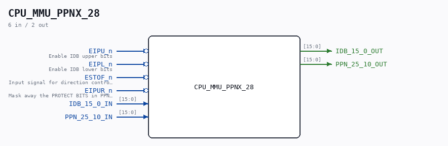

# CPU_MMU_PPNX_28

Source: `/mnt/e/Dev/Repos/Ronny/nd-120/Verilog/CPU-BOARD-3202/circuit/CPU_MMU_PPNX_28.v`

> Generated by `Verilog/tests/module_doc.py` from the `//!`
> comments in the source. Do not edit by hand - edit the RTL comments and regenerate.

## Description

ND120 CPU, MM&M
CPU/MMU/PPNX
PPN TO IDB
SHEET 28 of 50
Last reviewed: 2-FEB-2025
Ronny Hansen

## Ports

| Direction | Width | Name | Description |
|---|---|---|---|
| input | `1` | `EIPU_n` *(active low)* | Enable IDB upper bits |
| input | `1` | `EIPL_n` *(active low)* | Enable IDB lower bits |
| input | `1` | `ESTOF_n` *(active low)* | Input signal for direction control (PPN<->IDB) |
| input | `1` | `EIPUR_n` *(active low)* | Mask away the PROTECT BITS in PPN (PPN 25:19 == 000000) |
| input | `[15:0]` | `IDB_15_0_IN` |  |
| output | `[15:0]` | `IDB_15_0_OUT` |  |
| input | `[15:0]` | `PPN_25_10_IN` |  |
| output | `[15:0]` | `PPN_25_10_OUT` |  |
