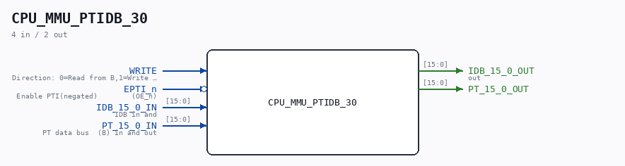

# CPU_MMU_PTIDB_30

Source: `/mnt/e/Dev/Repos/Ronny/nd-120/Verilog/CPU-BOARD-3202/circuit/CPU_MMU_PTIDB_30.v`

> Generated by `Verilog/tests/module_doc.py` from the `//!`
> comments in the source. Do not edit by hand - edit the RTL comments and regenerate.

## Description

ND120 CPU, MM&M
CPU/MMU/PTIDB
PT TO IDB
SHEET 30 of 50
Last reviewed: 2-FEB-2025
Ronny Hansen

## Ports

| Direction | Width | Name | Description |
|---|---|---|---|
| input | `1` | `WRITE` | Direction: 0=Read from B,1=Write to B  (DIR) |
| input | `1` | `EPTI_n` *(active low)* | Enable PTI(negated)        (OE_n) |
| input | `[15:0]` | `IDB_15_0_IN` | IDB in and |
| output | `[15:0]` | `IDB_15_0_OUT` | out |
| input | `[15:0]` | `PT_15_0_IN` | PT data bus  (B) in and out |
| output | `[15:0]` | `PT_15_0_OUT` |  |
