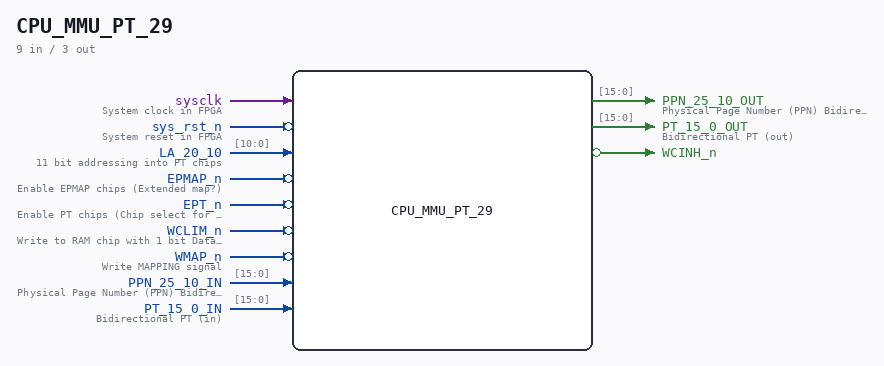

# CPU_MMU_PT_29

Source: `/mnt/e/Dev/Repos/Ronny/nd-120/Verilog/CPU-BOARD-3202/circuit/CPU_MMU_PT_29.v`

> Generated by `Verilog/tests/module_doc.py` from the `//!`
> comments in the source. Do not edit by hand - edit the RTL comments and regenerate.

## Description

ND120 CPU, MM&M
CPU/MMU/PT
CACHE
SHEET 29 of 50
Last reviewed: 2-FEB-2025
Ronny Hansen

## Ports

| Direction | Width | Name | Description |
|---|---|---|---|
| input | `1` | `sysclk` | System clock in FPGA |
| input | `1` | `sys_rst_n` *(active low)* | System reset in FPGA |
| input | `[10:0]` | `LA_20_10` | 11 bit addressing into PT chips |
| input | `1` | `EPMAP_n` *(active low)* | Enable EPMAP chips (Extended map?) |
| input | `1` | `EPT_n` *(active low)* | Enable PT chips (Chip select for PT chips). Combine with WMAP_n to write to PT chips (Chip 24G and Chip 25G) |
| input | `1` | `WCLIM_n` *(active low)* | Write to RAM chip with 1 bit Data being PPN hi bit (bit ppn 25) |
| input | `1` | `WMAP_n` *(active low)* | Write MAPPING signal |
| input | `[15:0]` | `PPN_25_10_IN` | Physical Page Number (PPN) Bidirectional PPN (in) (bit 23-10 in the calculated physical address) |
| output | `[15:0]` | `PPN_25_10_OUT` | Physical Page Number (PPN) Bidirectional PPN (out) (bit 23-10 in the calculated physical address) |
| input | `[15:0]` | `PT_15_0_IN` | Bidirectional PT (in) |
| output | `[15:0]` | `PT_15_0_OUT` | Bidirectional PT (out) |
| output | `1` | `WCINH_n` *(active low)* |  |
