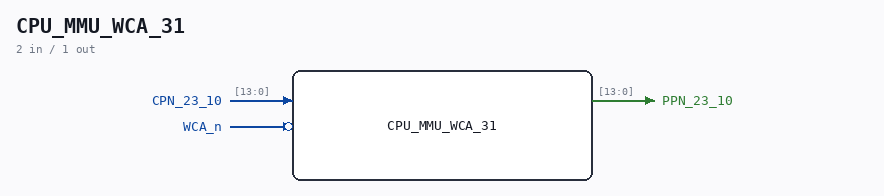

# CPU_MMU_WCA_31

Source: `/mnt/e/Dev/Repos/Ronny/nd-120/Verilog/CPU-BOARD-3202/circuit/CPU_MMU_WCA_31.v`

> Generated by `Verilog/tests/module_doc.py` from the `//!`
> comments in the source. Do not edit by hand - edit the RTL comments and regenerate.

## Description

ND120 CPU, MM&M
CPU/MMU/WCA
PPN TO CPN
SHEET 31 of 50
Last reviewed: 10-FEB-2024
Ronny Hansen

## Ports

| Direction | Width | Name | Description |
|---|---|---|---|
| input | `[13:0]` | `CPN_23_10` |  |
| input | `1` | `WCA_n` *(active low)* |  |
| output | `[13:0]` | `PPN_23_10` |  |
