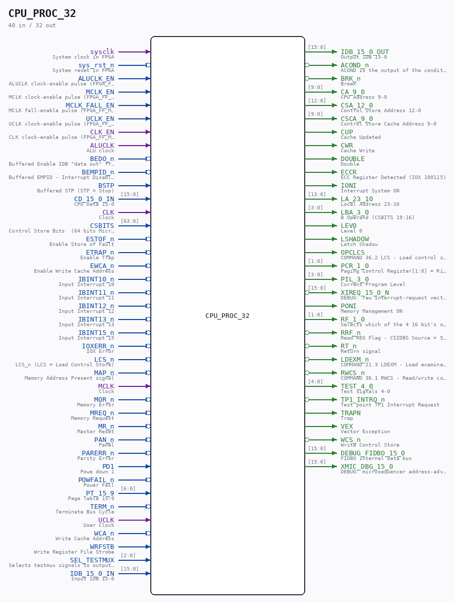

# CPU_PROC_32

Source: `/mnt/e/Dev/Repos/Ronny/nd-120/Verilog/CPU-BOARD-3202/circuit/CPU_PROC_32.v`

> Generated by `Verilog/tests/module_doc.py` from the `//!`
> comments in the source. Do not edit by hand - edit the RTL comments and regenerate.

## Description

ND120 CPU, MM&M
CPU/PROC
PROCESSOR TOP LEVEL
SHEET 32 of 50
Last reviewed: 2-FEB-2025
Ronny Hansen

## Ports

| Direction | Width | Name | Description |
|---|---|---|---|
| input | `1` | `sysclk` | System clock in FPGA |
| input | `1` | `sys_rst_n` *(active low)* | System reset in FPGA |
| input | `1` | `ALUCLK_EN` | ALUCLK clock-enable pulse (FPGA_FF_MODE, else 0) |
| input | `1` | `MCLK_EN` | MCLK clock-enable pulse (FPGA_FF_MODE, else 0) |
| input | `1` | `MCLK_FALL_EN` | MCLK fall-enable pulse (FPGA_FF_MODE, else 0) |
| input | `1` | `UCLK_EN` | UCLK clock-enable pulse (FPGA_FF_MODE, else 0) |
| input | `1` | `CLK_EN` | CLK clock-enable pulse (FPGA_FF_MODE, else 0) |
| input | `1` | `ALUCLK` | ALU clock |
| input | `1` | `BEDO_n` *(active low)* | Buffered Enable IDB "data out" from CGA |
| input | `1` | `BEMPID_n` *(active low)* | Buffered EMPID - Interrupt Disable (EPIC.LDMPIE->set mask reg:inh all ints) |
| input | `1` | `BSTP` | Buffered STP (STP = Stop) |
| input | `[15:0]` | `CD_15_0_IN` | CPU Data 15-0 |
| input | `1` | `CLK` | Clock |
| input | `[63:0]` | `CSBITS` | Control Store Bits  (64 bits Microcode) |
| input | `1` | `ESTOF_n` *(active low)* | Enable Store of Fault |
| input | `1` | `ETRAP_n` *(active low)* | Enable Trap |
| input | `1` | `EWCA_n` *(active low)* | Enable Write Cache Address |
| input | `1` | `IBINT10_n` *(active low)* | Input Interrupt 10 |
| input | `1` | `IBINT11_n` *(active low)* | Input Interrupt 11 |
| input | `1` | `IBINT12_n` *(active low)* | Input Interrupt 12 |
| input | `1` | `IBINT13_n` *(active low)* | Input Interrupt 13 |
| input | `1` | `IBINT15_n` *(active low)* | Input Interrupt 15 |
| input | `1` | `IOXERR_n` *(active low)* | IOX Error |
| input | `1` | `LCS_n` *(active low)* | LCS_n (LCS = Load Control Store) |
| input | `1` | `MAP_n` *(active low)* | Memory Address Present signal |
| input | `1` | `MCLK` | Clock |
| input | `1` | `MOR_n` *(active low)* | Memory Error |
| input | `1` | `MREQ_n` *(active low)* | Memory Request |
| input | `1` | `MR_n` *(active low)* | Master Reset |
| input | `1` | `PAN_n` *(active low)* | Panel |
| input | `1` | `PARERR_n` *(active low)* | Parity Error |
| input | `1` | `PD1` | Powe down 1 |
| input | `1` | `POWFAIL_n` *(active low)* | Power Fail |
| input | `[6:0]` | `PT_15_9` | Page Table 15-9 |
| input | `1` | `TERM_n` *(active low)* | Terminate Bus Cycle |
| input | `1` | `UCLK` | User Clock |
| input | `1` | `WCA_n` *(active low)* | Write Cache Address |
| input | `1` | `WRFSTB` | Write Register File Strobe |
| input | `[2:0]` | `SEL_TESTMUX` | Selects testmux signals to output on TEST_4_0 |
| input | `[15:0]` | `IDB_15_0_IN` | Input IDB 15-0 |
| output | `[15:0]` | `IDB_15_0_OUT` | Output IDB 15-0 |
| output | `1` | `ACOND_n` *(active low)* | ACOND is the output of the condition register. |
| output | `1` | `BRK_n` *(active low)* | Break |
| output | `[9:0]` | `CA_9_0` | CPU Address 9-0 |
| output | `[12:0]` | `CSA_12_0` | Control Store Address 12-0 |
| output | `[9:0]` | `CSCA_9_0` | Control Store Cache Address 9-0 |
| output | `1` | `CUP` | Cache Updated |
| output | `1` | `CWR` | Cache Write |
| output | `1` | `DOUBLE` | Double |
| output | `1` | `ECCR` | ECC Register Detected (IOX 100115) |
| output | `1` | `IONI` | Interrupt System ON |
| output | `[13:0]` | `LA_23_10` | Local Address 23-10 |
| output | `[3:0]` | `LBA_3_0` | B Operand (CSBITS 19:16) |
| output | `1` | `LEV0` | Level 0 |
| output | `1` | `LSHADOW` | Latch Shadow |
| output | `1` | `OPCLCS` | COMMAND 36.2 LCS - Load control store from PROM and perform a Master Clear |
| output | `[1:0]` | `PCR_1_0` | Paging Control Register[1:0] = Ring Protection Level |
| output | `[3:0]` | `PIL_3_0` | Current Program Level |
| output | `[15:0]` | `XIREQ_15_0_N` *(active low)* | DEBUG: raw interrupt-request vector (active low) |
| output | `1` | `PONI` | Memory Management ON |
| output | `[1:0]` | `RF_1_0` | Selects which of the 4 16 bit's of the microcode to fetch from ROM |
| output | `1` | `RRF_n` *(active low)* | Read REG Flag - CSIDBS Source = 5 (REG) |
| output | `1` | `RT_n` *(active low)* | Return signal |
| output | `1` | `LDEXM_n` *(active low)* | COMMAND 21.3 LDEXM - Load examine mode in MAC function |
| output | `1` | `RWCS_n` *(active low)* | COMMAND 36.1 RWCS - Read/write control store as addressed by ADCS command |
| output | `[4:0]` | `TEST_4_0` | Test signals 4-0 |
| output | `1` | `TP1_INTRQ_n` *(active low)* | Test point TP1 Interrupt Request |
| output | `1` | `TRAPN` | Trap |
| output | `1` | `VEX` | Vector Exception |
| output | `1` | `WCS_n` *(active low)* | Write Control Store |
| output | `[15:0]` | `DEBUG_FIDBO_15_0` | FIDBO internal data bus |
| output | `[15:0]` | `XMIC_DBG_15_0` | DEBUG: microsequencer address-advance probe (Tang 06000-hang) |
