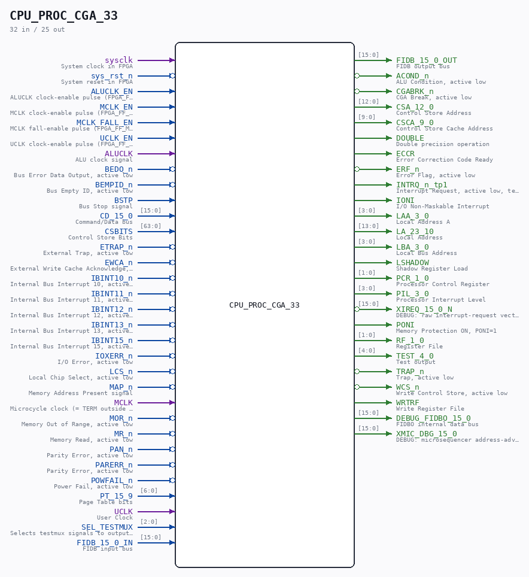

# CPU_PROC_CGA_33

Source: `/mnt/e/Dev/Repos/Ronny/nd-120/Verilog/CPU-BOARD-3202/circuit/CPU_PROC_CGA_33.v`

> Generated by `Verilog/tests/module_doc.py` from the `//!`
> comments in the source. Do not edit by hand - edit the RTL comments and regenerate.

## Description

ND120 CPU, MM&M
CPU/PROC/CGA
CPU GATE ARRAY
SHEET 33 of 50
Last reviewed: 2-FEB-2025
Ronny Hansen

## Ports

| Direction | Width | Name | Description |
|---|---|---|---|
| input | `1` | `sysclk` | System clock in FPGA |
| input | `1` | `sys_rst_n` *(active low)* | System reset in FPGA |
| input | `1` | `ALUCLK_EN` | ALUCLK clock-enable pulse (FPGA_FF_MODE, else 0) |
| input | `1` | `MCLK_EN` | MCLK clock-enable pulse (FPGA_FF_MODE, else 0) |
| input | `1` | `MCLK_FALL_EN` | MCLK fall-enable pulse (FPGA_FF_MODE, else 0) |
| input | `1` | `UCLK_EN` | UCLK clock-enable pulse (FPGA_FF_MODE, else 0) |
| input | `1` | `ALUCLK` | ALU clock signal |
| input | `1` | `BEDO_n` *(active low)* | Bus Error Data Output, active low |
| input | `1` | `BEMPID_n` *(active low)* | Bus Empty ID, active low |
| input | `1` | `BSTP` | Bus Stop signal |
| input | `[15:0]` | `CD_15_0` | Command/Data bus |
| input | `[63:0]` | `CSBITS` | Control Store Bits |
| input | `1` | `ETRAP_n` *(active low)* | External Trap, active low |
| input | `1` | `EWCA_n` *(active low)* | External Write Cache Acknowledge, active low |
| input | `1` | `IBINT10_n` *(active low)* | Internal Bus Interrupt 10, active low |
| input | `1` | `IBINT11_n` *(active low)* | Internal Bus Interrupt 11, active low |
| input | `1` | `IBINT12_n` *(active low)* | Internal Bus Interrupt 12, active low |
| input | `1` | `IBINT13_n` *(active low)* | Internal Bus Interrupt 13, active low |
| input | `1` | `IBINT15_n` *(active low)* | Internal Bus Interrupt 15, active low |
| input | `1` | `IOXERR_n` *(active low)* | I/O Error, active low |
| input | `1` | `LCS_n` *(active low)* | Local Chip Select, active low |
| input | `1` | `MAP_n` *(active low)* | Memory Address Present signal |
| input | `1` | `MCLK` | Microcycle clock (= TERM outside RWCS, stretched during RWCS) |
| input | `1` | `MOR_n` *(active low)* | Memory Out of Range, active low |
| input | `1` | `MR_n` *(active low)* | Memory Read, active low |
| input | `1` | `PAN_n` *(active low)* | Parity Error, active low |
| input | `1` | `PARERR_n` *(active low)* | Parity Error, active low |
| input | `1` | `POWFAIL_n` *(active low)* | Power Fail, active low |
| input | `[6:0]` | `PT_15_9` | Page Table bits |
| input | `1` | `UCLK` | User Clock |
| input | `[2:0]` | `SEL_TESTMUX` | Selects testmux signals to output on TEST_4_0 |
| input | `[15:0]` | `FIDB_15_0_IN` | FIDB input bus |
| output | `[15:0]` | `FIDB_15_0_OUT` | FIDB output bus |
| output | `1` | `ACOND_n` *(active low)* | ALU Condition, active low |
| output | `1` | `CGABRK_n` *(active low)* | CGA Break, active low |
| output | `[12:0]` | `CSA_12_0` | Control Store Address |
| output | `[9:0]` | `CSCA_9_0` | Control Store Cache Address |
| output | `1` | `DOUBLE` | Double precision operation |
| output | `1` | `ECCR` | Error Correction Code Ready |
| output | `1` | `ERF_n` *(active low)* | Error Flag, active low |
| output | `1` | `INTRQ_n_tp1` | Interrupt Request, active low, test point 1 |
| output | `1` | `IONI` | I/O Non-Maskable Interrupt |
| output | `[3:0]` | `LAA_3_0` | Local Address A |
| output | `[13:0]` | `LA_23_10` | Local Address |
| output | `[3:0]` | `LBA_3_0` | Local Bus Address |
| output | `1` | `LSHADOW` | Shadow Register Load |
| output | `[1:0]` | `PCR_1_0` | Processor Control Register |
| output | `[3:0]` | `PIL_3_0` | Processor Interrupt Level |
| output | `[15:0]` | `XIREQ_15_0_N` *(active low)* | DEBUG: raw interrupt-request vector (active low) |
| output | `1` | `PONI` | Memory Protection ON, PONI=1 |
| output | `[1:0]` | `RF_1_0` | Register File |
| output | `[4:0]` | `TEST_4_0` | Test output |
| output | `1` | `TRAP_n` *(active low)* | Trap, active low |
| output | `1` | `WCS_n` *(active low)* | Write Control Store, active low |
| output | `1` | `WRTRF` | Write Register File |
| output | `[15:0]` | `DEBUG_FIDBO_15_0` | FIDBO internal data bus |
| output | `[15:0]` | `XMIC_DBG_15_0` | DEBUG: microsequencer address-advance probe (Tang 06000-hang) |
