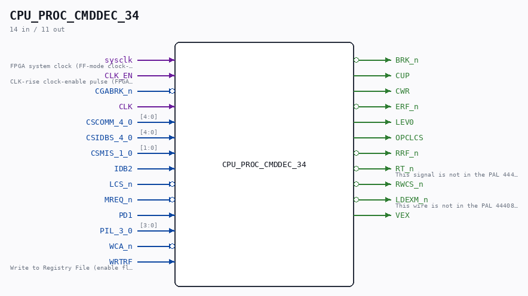

# CPU_PROC_CMDDEC_34

Source: `/mnt/e/Dev/Repos/Ronny/nd-120/Verilog/CPU-BOARD-3202/circuit/CPU_PROC_CMDDEC_34.v`

> Generated by `Verilog/tests/module_doc.py` from the `//!`
> comments in the source. Do not edit by hand - edit the RTL comments and regenerate.

## Description

ND120 CPU, MM&M
CPU/PROC/CMDDEC
COMMAND & IDB DECODE
SHEET 34 of 50
Last reviewed: 1-DEC-2024
Ronny Hansen

## Ports

| Direction | Width | Name | Description |
|---|---|---|---|
| input | `1` | `sysclk` | FPGA system clock (FF-mode clock-enable capture) |
| input | `1` | `CLK_EN` | CLK-rise clock-enable pulse (FPGA_FF_MODE, else 0) |
| input | `1` | `CGABRK_n` *(active low)* |  |
| input | `1` | `CLK` |  |
| input | `[4:0]` | `CSCOMM_4_0` |  |
| input | `[4:0]` | `CSIDBS_4_0` |  |
| input | `[1:0]` | `CSMIS_1_0` |  |
| input | `1` | `IDB2` |  |
| input | `1` | `LCS_n` *(active low)* |  |
| input | `1` | `MREQ_n` *(active low)* |  |
| input | `1` | `PD1` |  |
| input | `[3:0]` | `PIL_3_0` |  |
| input | `1` | `WCA_n` *(active low)* |  |
| input | `1` | `WRTRF` | Write to Registry File (enable flag) |
| output | `1` | `BRK_n` *(active low)* |  |
| output | `1` | `CUP` |  |
| output | `1` | `CWR` |  |
| output | `1` | `ERF_n` *(active low)* |  |
| output | `1` | `LEV0` |  |
| output | `1` | `OPCLCS` |  |
| output | `1` | `RRF_n` *(active low)* |  |
| output | `1` | `RT_n` *(active low)* | This signal is not in the PAL 44408B, but in the PAL 444608 (VXFIX). Use  RT_n signal from DGA until we find out what the 44608A does with this signal. |
| output | `1` | `RWCS_n` *(active low)* |  |
| output | `1` | `LDEXM_n` *(active low)* | This wire is not in the PAL 44408B, but in the PAL 444608 (VXFIX). Not sure what to do with this signal at the moment.. but brings it out here just in case.. |
| output | `1` | `VEX` |  |
