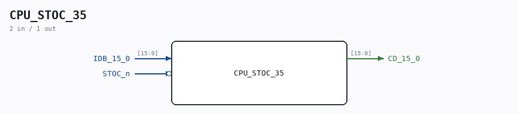

# CPU_STOC_35

Source: `/mnt/e/Dev/Repos/Ronny/nd-120/Verilog/CPU-BOARD-3202/circuit/CPU_STOC_35.v`

> Generated by `Verilog/tests/module_doc.py` from the `//!`
> comments in the source. Do not edit by hand - edit the RTL comments and regenerate.

## Description

ND120 CPU, MM&M
CPU/STOC
IDB TO CD
SHEET 35 of 50
Last reviewed: 13-JAN-2024
Ronny Hansen

## Ports

| Direction | Width | Name | Description |
|---|---|---|---|
| input | `[15:0]` | `IDB_15_0` |  |
| output | `[15:0]` | `CD_15_0` |  |
| input | `1` | `STOC_n` *(active low)* |  |
