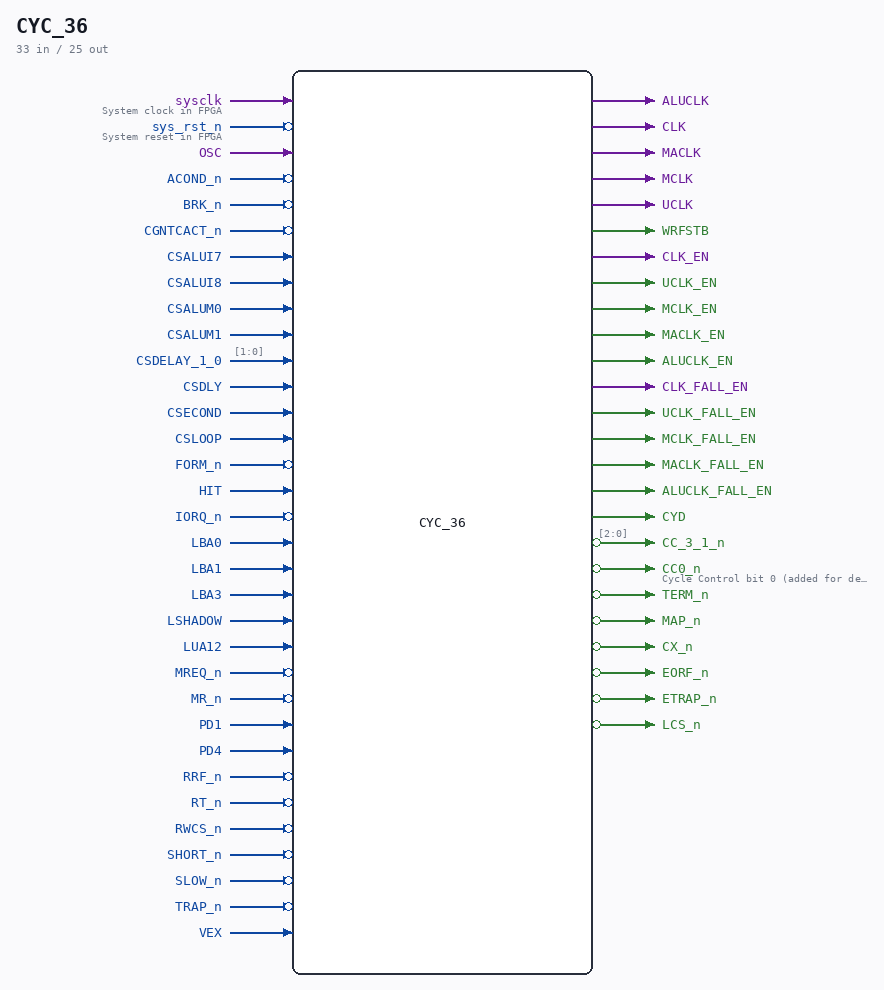

# CYC_36

Source: `/mnt/e/Dev/Repos/Ronny/nd-120/Verilog/CPU-BOARD-3202/circuit/CYC_36.v`

> Generated by `Verilog/tests/module_doc.py` from the `//!`
> comments in the source. Do not edit by hand - edit the RTL comments and regenerate.

## Description

ND120 CPU, MM&M
CYC
CYCLE CONTROL
SHEET 36 of 50
Last reviewed: 9-NOVEMBER-2024
Ronny Hansen

## Ports

| Direction | Width | Name | Description |
|---|---|---|---|
| input | `1` | `sysclk` | System clock in FPGA |
| input | `1` | `sys_rst_n` *(active low)* | System reset in FPGA |
| input | `1` | `OSC` |  |
| input | `1` | `ACOND_n` *(active low)* |  |
| input | `1` | `BRK_n` *(active low)* |  |
| input | `1` | `CGNTCACT_n` *(active low)* |  |
| input | `1` | `CSALUI7` |  |
| input | `1` | `CSALUI8` |  |
| input | `1` | `CSALUM0` |  |
| input | `1` | `CSALUM1` |  |
| input | `[1:0]` | `CSDELAY_1_0` |  |
| input | `1` | `CSDLY` |  |
| input | `1` | `CSECOND` |  |
| input | `1` | `CSLOOP` |  |
| input | `1` | `FORM_n` *(active low)* |  |
| input | `1` | `HIT` |  |
| input | `1` | `IORQ_n` *(active low)* |  |
| input | `1` | `LBA0` |  |
| input | `1` | `LBA1` |  |
| input | `1` | `LBA3` |  |
| input | `1` | `LSHADOW` |  |
| input | `1` | `LUA12` |  |
| input | `1` | `MREQ_n` *(active low)* |  |
| input | `1` | `MR_n` *(active low)* |  |
| input | `1` | `PD1` |  |
| input | `1` | `PD4` |  |
| input | `1` | `RRF_n` *(active low)* |  |
| input | `1` | `RT_n` *(active low)* |  |
| input | `1` | `RWCS_n` *(active low)* |  |
| input | `1` | `SHORT_n` *(active low)* |  |
| input | `1` | `SLOW_n` *(active low)* |  |
| input | `1` | `TRAP_n` *(active low)* |  |
| input | `1` | `VEX` |  |
| output | `1` | `ALUCLK` |  |
| output | `1` | `CLK` |  |
| output | `1` | `MACLK` |  |
| output | `1` | `MCLK` |  |
| output | `1` | `UCLK` |  |
| output | `1` | `WRFSTB` |  |
| output | `1` | `CLK_EN` |  |
| output | `1` | `UCLK_EN` |  |
| output | `1` | `MCLK_EN` |  |
| output | `1` | `MACLK_EN` |  |
| output | `1` | `ALUCLK_EN` |  |
| output | `1` | `CLK_FALL_EN` |  |
| output | `1` | `UCLK_FALL_EN` |  |
| output | `1` | `MCLK_FALL_EN` |  |
| output | `1` | `MACLK_FALL_EN` |  |
| output | `1` | `ALUCLK_FALL_EN` |  |
| output | `1` | `CYD` |  |
| output | `[2:0]` | `CC_3_1_n` *(active low)* |  |
| output | `1` | `CC0_n` *(active low)* | Cycle Control bit 0 (added for debug) |
| output | `1` | `TERM_n` *(active low)* |  |
| output | `1` | `MAP_n` *(active low)* |  |
| output | `1` | `CX_n` *(active low)* |  |
| output | `1` | `EORF_n` *(active low)* |  |
| output | `1` | `ETRAP_n` *(active low)* |  |
| output | `1` | `LCS_n` *(active low)* |  |
