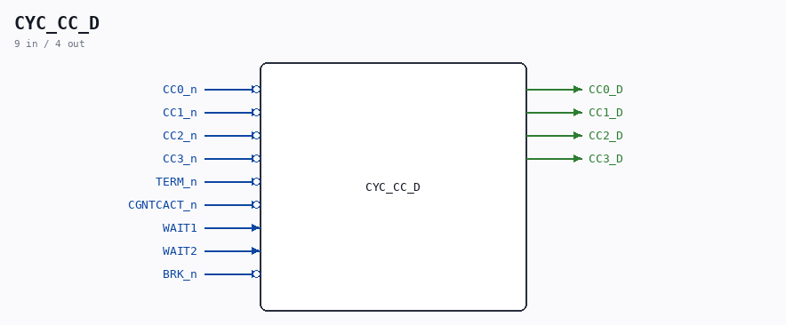

# CYC_CC_D

Source: `/mnt/e/Dev/Repos/Ronny/nd-120/Verilog/CPU-BOARD-3202/circuit/CYC_CC_D.v`

> Generated by `Verilog/tests/module_doc.py` from the `//!`
> comments in the source. Do not edit by hand - edit the RTL comments and regenerate.

## Description

ND120 CPU, MM&M
CYC_CC_D
Combinational NEXT-state of the Cycle Controller CC3..CC0 counter.
MIRROR of the CC0_reg/CC1_reg/CC2_reg/CC3_reg next-state logic inside
PAL_44601B (the CYCFSM, sheet 36). PAL_44601B stays the golden
source; this module reproduces only its CC D-inputs so CYC_36 can
compute the NEXT cycle-control state and, via a second (combinational)
PAL_44307C fed that next-state, build phase-accurate sysclk enables
for MCLK / MACLK / UCLK. See docs/clock-enable-refactor.md.
The equations below are the "flat" product-term forms the PAL author
documented in comments (PAL_44601B.v CC3 132-138, CC2 159-166,
CC1 188-195, CC0 216-223), which equal the implemented if/else next-
state. DO NOT let this diverge from PAL_44601B: it is validated
EXHAUSTIVELY against the real PAL by CYC_CC_D_tb.v (all 16 CC states x
2 TERM x the CC-relevant input combos). Re-run if PAL_44601B changes.
Last reviewed: 5-JULY-2026
Ronny Hansen

## Ports

| Direction | Width | Name | Description |
|---|---|---|---|
| input | `1` | `CC0_n` *(active low)* |  |
| input | `1` | `CC1_n` *(active low)* |  |
| input | `1` | `CC2_n` *(active low)* |  |
| input | `1` | `CC3_n` *(active low)* |  |
| input | `1` | `TERM_n` *(active low)* |  |
| input | `1` | `CGNTCACT_n` *(active low)* |  |
| input | `1` | `WAIT1` |  |
| input | `1` | `WAIT2` |  |
| input | `1` | `BRK_n` *(active low)* |  |
| output | `1` | `CC0_D` |  |
| output | `1` | `CC1_D` |  |
| output | `1` | `CC2_D` |  |
| output | `1` | `CC3_D` |  |
