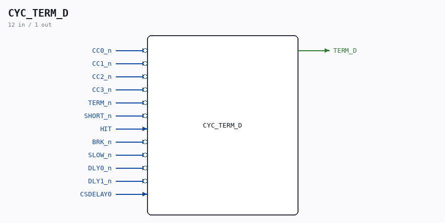

# CYC_TERM_D

Source: `/mnt/e/Dev/Repos/Ronny/nd-120/Verilog/CPU-BOARD-3202/circuit/CYC_TERM_D.v`

> Generated by `Verilog/tests/module_doc.py` from the `//!`
> comments in the source. Do not edit by hand - edit the RTL comments and regenerate.

## Description

ND120 CPU, MM&M
CYC_TERM_D
Combinational NEXT-state of the Cycle Controller TERM register.
This is a MIRROR of the TERM_reg next-state logic inside PAL_44601B
(the CYCFSM, sheet 36). PAL_44601B stays the golden source; this
module reproduces only its TERM D-input so CYC_36 can build a
phase-accurate, sysclk-synchronous clock-enable that fires on the
SAME edge posedge ALUCLK (~(TERM_n|LCS)) would have, instead of one
sysclk late. See docs/clock-enable-refactor.md.
DO NOT let this diverge from PAL_44601B. It is validated EXHAUSTIVELY
against the real PAL by CYC_TERM_D_tb.v (all 16 CC states x all
terminate-input combinations). If PAL_44601B.v changes, re-run that
testbench.
Last reviewed: 5-JULY-2026
Ronny Hansen

## Ports

| Direction | Width | Name | Description |
|---|---|---|---|
| input | `1` | `CC0_n` *(active low)* |  |
| input | `1` | `CC1_n` *(active low)* |  |
| input | `1` | `CC2_n` *(active low)* |  |
| input | `1` | `CC3_n` *(active low)* |  |
| input | `1` | `TERM_n` *(active low)* |  |
| input | `1` | `SHORT_n` *(active low)* |  |
| input | `1` | `HIT` |  |
| input | `1` | `BRK_n` *(active low)* |  |
| input | `1` | `SLOW_n` *(active low)* |  |
| input | `1` | `DLY0_n` *(active low)* |  |
| input | `1` | `DLY1_n` *(active low)* |  |
| input | `1` | `CSDELAY0` |  |
| output | `1` | `TERM_D` |  |
