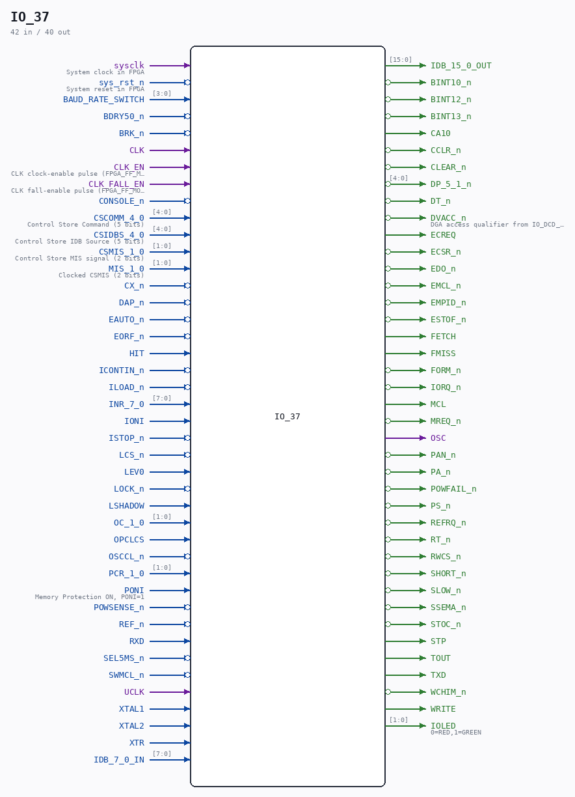

# IO_37

Source: `/mnt/e/Dev/Repos/Ronny/nd-120/Verilog/CPU-BOARD-3202/circuit/IO_37.v`

> Generated by `Verilog/tests/module_doc.py` from the `//!`
> comments in the source. Do not edit by hand - edit the RTL comments and regenerate.

## Description

ND120 CPU, MM&M
IO
IO TOP LEVEL
SHEET 37 of 50
Last reviewed: 22-MAR-2025
Ronny Hansen

## Ports

| Direction | Width | Name | Description |
|---|---|---|---|
| input | `1` | `sysclk` | System clock in FPGA |
| input | `1` | `sys_rst_n` *(active low)* | System reset in FPGA |
| input | `[3:0]` | `BAUD_RATE_SWITCH` |  |
| input | `1` | `BDRY50_n` *(active low)* |  |
| input | `1` | `BRK_n` *(active low)* |  |
| input | `1` | `CLK` |  |
| input | `1` | `CLK_EN` | CLK clock-enable pulse (FPGA_FF_MODE, else 0) |
| input | `1` | `CLK_FALL_EN` | CLK fall-enable pulse (FPGA_FF_MODE, else 0) |
| input | `1` | `CONSOLE_n` *(active low)* |  |
| input | `[4:0]` | `CSCOMM_4_0` | Control Store Command (5 bits) |
| input | `[4:0]` | `CSIDBS_4_0` | Control Store IDB Source (5 bits) |
| input | `[1:0]` | `CSMIS_1_0` | Control Store MIS signal (2 bits) |
| input | `[1:0]` | `MIS_1_0` | Clocked CSMIS (2 bits) |
| input | `1` | `CX_n` *(active low)* |  |
| input | `1` | `DAP_n` *(active low)* |  |
| input | `1` | `EAUTO_n` *(active low)* |  |
| input | `1` | `EORF_n` *(active low)* |  |
| input | `1` | `HIT` |  |
| input | `1` | `ICONTIN_n` *(active low)* |  |
| input | `1` | `ILOAD_n` *(active low)* |  |
| input | `[7:0]` | `INR_7_0` |  |
| input | `1` | `IONI` |  |
| input | `1` | `ISTOP_n` *(active low)* |  |
| input | `1` | `LCS_n` *(active low)* |  |
| input | `1` | `LEV0` |  |
| input | `1` | `LOCK_n` *(active low)* |  |
| input | `1` | `LSHADOW` |  |
| input | `[1:0]` | `OC_1_0` |  |
| input | `1` | `OPCLCS` |  |
| input | `1` | `OSCCL_n` *(active low)* |  |
| input | `[1:0]` | `PCR_1_0` |  |
| input | `1` | `PONI` | Memory Protection ON, PONI=1 |
| input | `1` | `POWSENSE_n` *(active low)* |  |
| input | `1` | `REF_n` *(active low)* |  |
| input | `1` | `RXD` |  |
| input | `1` | `SEL5MS_n` *(active low)* |  |
| input | `1` | `SWMCL_n` *(active low)* |  |
| input | `1` | `UCLK` |  |
| input | `1` | `XTAL1` |  |
| input | `1` | `XTAL2` |  |
| input | `1` | `XTR` |  |
| input | `[7:0]` | `IDB_7_0_IN` |  |
| output | `[15:0]` | `IDB_15_0_OUT` |  |
| output | `1` | `BINT10_n` *(active low)* |  |
| output | `1` | `BINT12_n` *(active low)* |  |
| output | `1` | `BINT13_n` *(active low)* |  |
| output | `1` | `CA10` |  |
| output | `1` | `CCLR_n` *(active low)* |  |
| output | `1` | `CLEAR_n` *(active low)* |  |
| output | `[4:0]` | `DP_5_1_n` *(active low)* |  |
| output | `1` | `DT_n` *(active low)* |  |
| output | `1` | `DVACC_n` *(active low)* | DGA access qualifier from IO_DCD_38, on towards CPU_15/CPU_MMU_24 - not the CGA's VACC |
| output | `1` | `ECREQ` |  |
| output | `1` | `ECSR_n` *(active low)* |  |
| output | `1` | `EDO_n` *(active low)* |  |
| output | `1` | `EMCL_n` *(active low)* |  |
| output | `1` | `EMPID_n` *(active low)* |  |
| output | `1` | `ESTOF_n` *(active low)* |  |
| output | `1` | `FETCH` |  |
| output | `1` | `FMISS` |  |
| output | `1` | `FORM_n` *(active low)* |  |
| output | `1` | `IORQ_n` *(active low)* |  |
| output | `1` | `MCL` |  |
| output | `1` | `MREQ_n` *(active low)* |  |
| output | `1` | `OSC` |  |
| output | `1` | `PAN_n` *(active low)* |  |
| output | `1` | `PA_n` *(active low)* |  |
| output | `1` | `POWFAIL_n` *(active low)* |  |
| output | `1` | `PS_n` *(active low)* |  |
| output | `1` | `REFRQ_n` *(active low)* |  |
| output | `1` | `RT_n` *(active low)* |  |
| output | `1` | `RWCS_n` *(active low)* |  |
| output | `1` | `SHORT_n` *(active low)* |  |
| output | `1` | `SLOW_n` *(active low)* |  |
| output | `1` | `SSEMA_n` *(active low)* |  |
| output | `1` | `STOC_n` *(active low)* |  |
| output | `1` | `STP` |  |
| output | `1` | `TOUT` |  |
| output | `1` | `TXD` |  |
| output | `1` | `WCHIM_n` *(active low)* |  |
| output | `1` | `WRITE` |  |
| output | `[1:0]` | `IOLED` | 0=RED,1=GREEN |
